# Linux 服务器管理

> 原文：<https://linkedin.github.io/school-of-sre/level101/linux_basics/linux_server_administration/>

在本课程中，将尝试涵盖 linux 服务器管理员执行的一些常见任务。我们将首先尝试理解一个特定的命令做什么，然后尝试使用例子来理解这些命令。请记住，自己练习 Linux 命令是非常重要的。

## 实验室环境设置

*   在你的系统上安装 docker-[https://docs.docker.com/engine/install/](https://docs.docker.com/engine/install/)

*   我们将在 Red Hat Enterprise Linux (RHEL) 8 系统上运行所有命令。

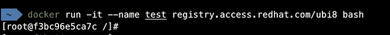

*   我们将在上面的 Docker 容器中运行本模块中使用的大多数命令。

## 多用户操作系统

如果一个操作系统允许多人/用户使用一台计算机，并且不影响彼此的文件和首选项，则该操作系统被认为是多用户的。基于 Linux 的操作系统本质上是多用户的，因为它允许多个用户同时访问系统。典型的计算机只有一个键盘和显示器，但是如果计算机连接到网络，多个用户可以通过 SSH 登录。我们将在后面介绍更多关于 SSH 的内容。

作为服务器管理员，我们最关心的是离我们很远的 Linux 服务器。我们可以借助 SSH 之类的远程登录方法连接到这些服务器。

由于 Linux 支持多用户，我们需要一种方法来保护用户之间的相互保护。一个用户不应该能够访问和修改其他用户的文件

## 用户/组管理

*   Linux 中的用户有一个关联的用户 ID，称为 UID。

*   用户还有一个主目录和一个与之相关联的登录 shell。

*   组是一个或多个用户的集合。组使得在一组用户之间共享权限变得更加容易。

*   每个组都有一个与之关联的名为 GID 的组 ID。

### id 命令

`id`命令可用于查找与用户相关联的 uid 和 gid。它还列出了用户所属的组。

与 root 用户关联的 uid 和 gid 为 0。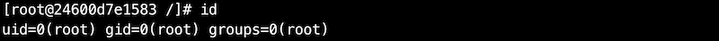

在 Linux 中找出当前用户的一个好方法是使用 whoami 命令。

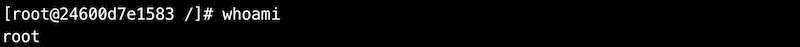

**“root”用户或超级用户是最有特权的用户，拥有** **对系统上所有资源的无限制访问权。它有 UID 0**

### 与用户/组相关的重要文件

| /etc/密码 | 存储用户名、uid、gid、主目录、登录外壳等 |
| --- | --- |
| /etc/影子 | 存储与用户相关联的密码 |
| /etc/group | 存储系统中不同组的信息 |

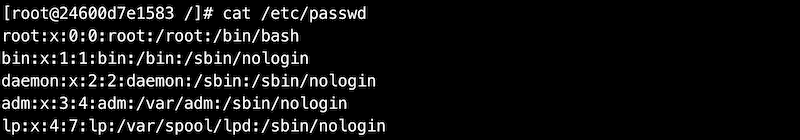

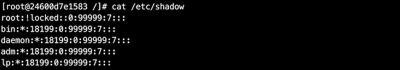

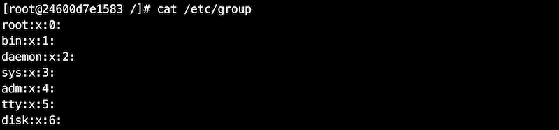

如果您想了解上述输出中讨论的每个字段，可以浏览以下链接:

*   [https://tldp . org/LDP/LAME/LAME/Linux-admin-made-easy/shadow-file-formats . html](https://tldp.org/LDP/lame/LAME/linux-admin-made-easy/shadow-file-formats.html)

*   [https://tldp.org/HOWTO/User-Authentication-HOWTO/x71.html](https://tldp.org/HOWTO/User-Authentication-HOWTO/x71.html)

## 管理用户的重要命令

下面是一些常用于管理 Linux 上的用户/组的命令:

*   `useradd` -创建新用户

*   `passwd` -添加或修改用户密码

*   `usermod` -修改用户的属性

*   `userdel` -删除用户

### useradd

useradd 命令在 Linux 中添加新用户。

我们将创建一个新用户“shivam”。我们还将通过在/etc/passwd 文件后面添加后缀来验证用户是否已经创建。对于新创建的用户，uid 和 gid 是 1000。分配给用户的主目录是/home/shivam，分配给用户的登录 shell 是/bin/bash。请注意，稍后可以修改用户主目录和登录 shell。

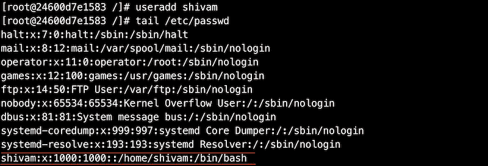

如果我们没有为主目录或登录 shell 之类的属性指定任何值，默认值将被分配给用户。我们也可以在创建新用户时覆盖这些默认值。

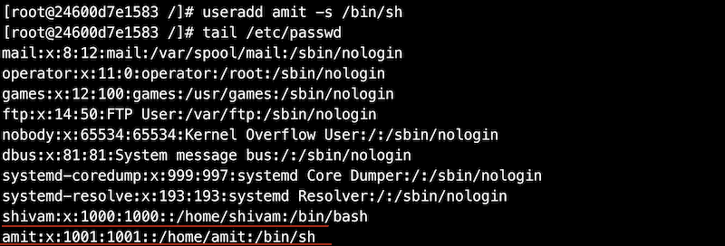

### 密码

passwd 命令用于为用户创建或修改密码。

在上面的例子中，我们在创建用户“shivam”或“amit”时没有为他们分配任何密码。

"!!"在阴影中的帐户条目意味着用户的帐户已经创建，但还没有给出密码。

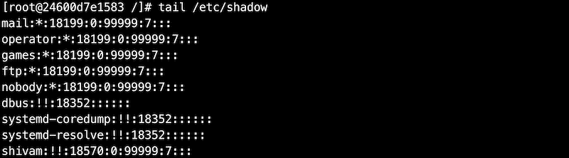

现在让我们尝试为用户“shivam”创建一个密码。

请记住密码，因为我们将在后面使用有用的示例。

另外，现在让我们更改 root 用户的密码。当我们从普通用户切换到根用户时，它会要求您输入密码。此外，当您使用 root 用户登录时，将会询问密码。

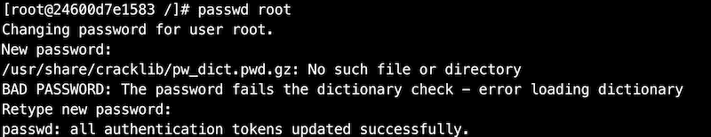

### usermod

usermod 命令用于修改用户的属性，如主目录或 shell。

我们试着将用户“amit”的登录 shell 修改为“/bin/bash”。

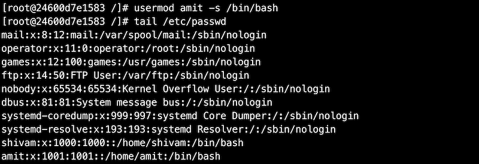

同样，您也可以修改用户的许多其他属性。请尝试“usermod -h”以获得您可以修改的属性列表。

### 你是谁

userdel 命令用于删除 Linux 上的用户。一旦我们删除用户，所有与该用户相关的信息都将被删除。

让我们试着删除用户“amit”。删除用户后，您将不会在“/etc/passwd”或“/etc/shadow”文件中找到该用户的条目。

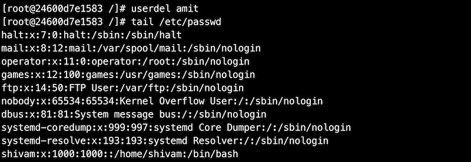

## 管理组的重要命令

管理组的命令与管理用户的命令非常相似。这里不详细解释每个命令，因为它们非常相似。您可以尝试在您的系统上运行这些命令。

| `groupadd <group_name>` | 创建一个新组 |
| --- | --- |
| `groupmod <group_name>` | 修改组的属性 |
| `groupdel <group_name>` | 删除一个组 |
| `gpasswd <group_name>` | 修改组的密码 |

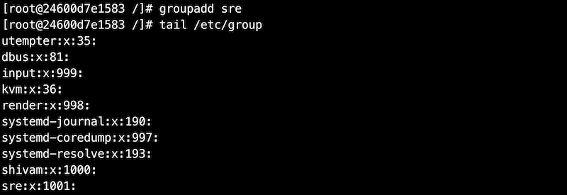

我们现在将尝试将用户“shivam”添加到我们上面创建的组中。

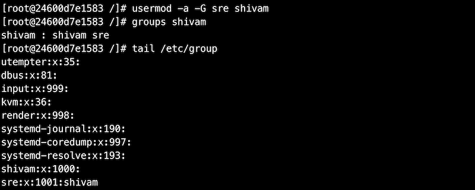

## 成为超级用户

**在运行以下命令之前，请确保您已经使用上述 passwd 命令为用户“shivam”和用户“root”设置了密码。**

su 命令可用于在 Linux 中切换用户。现在让我们尝试切换到用户“shivam”。

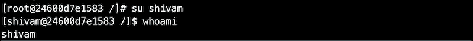

现在让我们尝试打开“/etc/shadow”文件。

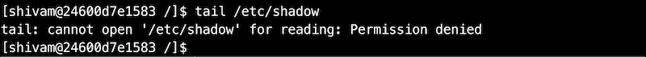

操作系统不允许用户“shivam”读取“/etc/shadow”文件的内容。这是 Linux 中的一个重要文件，它存储了用户的密码。该文件只能由 root 用户或拥有超级用户权限的用户访问。

**sudo 命令允许** **用户以根用户的安全权限运行命令。**请记住，root 用户拥有系统的所有权限。我们也可以使用 su 命令切换到 root 用户并打开上面的文件，但是这样做需要 root 用户的密码。另一种在大多数现代操作系统上首选的方法是使用 sudo 命令成为超级用户。使用这种方式，用户必须输入他/她的密码，并且他们需要成为 sudo 组的一部分。

如何向其他用户提供超级权限？

让我们首先使用 su 命令切换到 root 用户。请注意，使用下面的命令需要您输入 root 用户的密码。

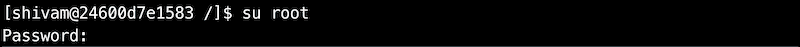

如果您忘记了为 root 用户设置密码，请键入“exit ”,您将作为 root 用户返回。现在，使用 passwd 命令设置密码。

文件/etc/sudoers 保存了被允许调用 sudo 的用户的名字。在 redhat 操作系统中，默认情况下不存在该文件。我们需要安装 sudo。

我们将在后面的小节中详细讨论 yum 命令。

尝试打开系统上的“/etc/sudoers”文件。这个文件有很多信息。这个文件存储了用户在运行 sudo 命令时必须遵守的规则。例如，允许 root 从任何地方运行任何命令。

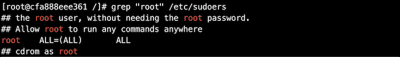

向用户提供 root 访问权限的一个简单方法是将他们添加到有权运行所有命令的组中。“wheel”是 redhat Linux 中拥有此类权限的组。

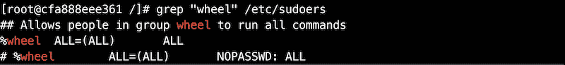

让我们将用户“shivam”添加到这个组，这样它也拥有 sudo 特权。

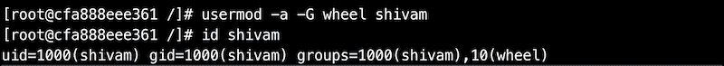

现在让我们切换回用户“shivam”并尝试访问“/etc/shadow”文件。

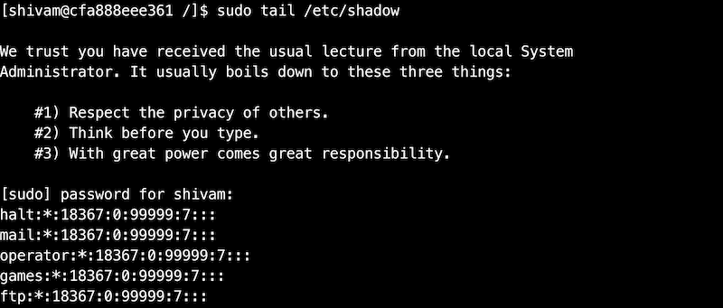

我们需要在运行该命令之前使用 sudo，因为它只能用 sudo 特权来访问。我们已经通过将用户“shivam”添加到组“wheel”中，授予了他 sudo 权限。

## 文件权限

在 Linux 操作系统上，每个文件和目录都被分配给文件所有者、一组相关用户的成员以及其他所有人的访问权限。这是为了确保不允许一个用户访问另一个用户的文件和资源。

要查看文件的权限，我们可以使用 ls 命令。我们来看看/etc/passwd 文件的权限。

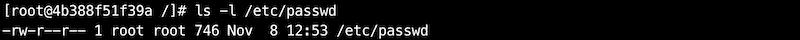

让我们看一下输出中与文件权限相关的一些重要字段。

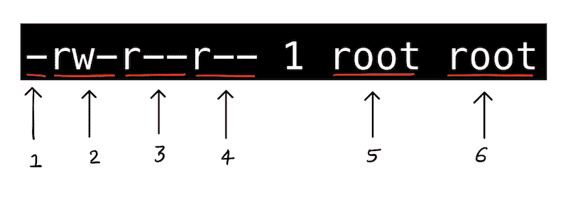

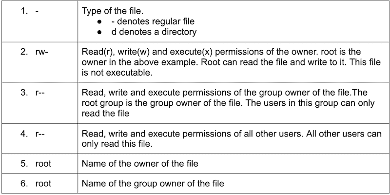

### Chmod 命令

chmod 命令用于修改 Linux 中的文件和目录权限。

chmod 命令接受中的权限作为数字参数。我们可以把权限想象成一系列的位，1 代表真或允许，0 代表假或不允许。

| 许可 | rwx | 二进制的 | 小数 |
| --- | --- | --- | --- |
| 读取、写入和执行 | rwx | One hundred and eleven | seven |
| 直读式记录 | rw- | One hundred and ten | six |
| 阅读并执行 | r-x | One hundred and one | five |
| 只读 | r - | One hundred | four |
| 编写并执行 | -wx | 011 | three |
| 只写 | -w- | 010 | Two |
| 仅执行 | ［加在以-u 结尾的法语词源的名词之后构成复数］ | 001 | one |
| 没有人 | - | 000 | Zero |

我们现在将创建一个新文件，并检查该文件的权限。

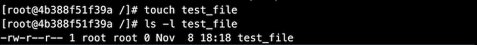

群组拥有者没有权限写入这个档案。让我们使用 chmod 命令向组所有者或 root 用户授予写权限。

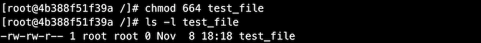

Chmod 命令也可以用来以类似的方式改变目录的权限。

### Chown 命令

chown 命令用于在 Linux 中更改文件或目录的所有者。

命令语法:`chown <new_owner> <file_name>`

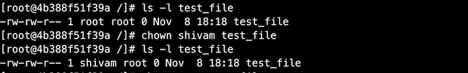

**如果我们没有 sudo 权限，我们需要使用 sudo 命令**。让我们切换到用户“shivam”并尝试更改所有者。在运行下面的命令之前，我们还将文件的所有者更改为 root。

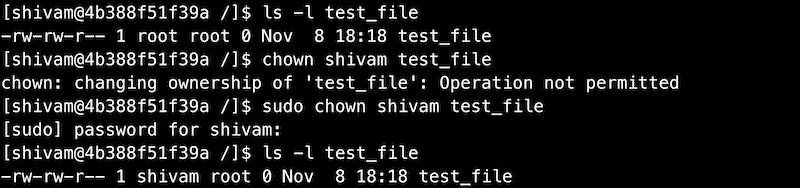

Chown 命令也可以用来以类似的方式改变目录的所有者。

### Chgrp 命令

chgrp 命令可用于在 Linux 中更改文件或目录的组所有权。语法与 chown 命令非常相似。

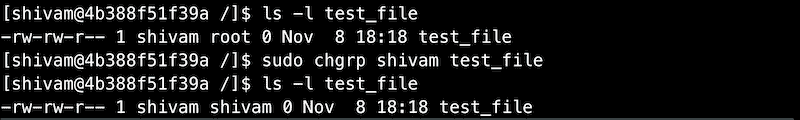

Chgrp 命令也可以用来以类似的方式更改目录的所有者。

## SSH 命令

ssh 命令用于登录远程系统、在系统之间传输文件以及在远程机器上执行命令。SSH 代表 secure shell，用于通过不安全的网络(如互联网)在两台主机之间提供加密的安全连接。

参考:[https://www.ssh.com/ssh/command/](https://www.ssh.com/ssh/command/)

我们现在将讨论无密码认证，这种认证是安全的，并且最常用于 ssh 认证。

### 使用 SSH 的无密码认证

使用这种方法，我们可以在不输入密码的情况下 ssh 到主机。当我们希望一些脚本执行 ssh 相关的任务时，这种方法也很有用。

无密码身份验证需要使用公钥和私钥对。顾名思义，公钥可以与任何人共享，但私钥应该是私有的。让我们不要进入这个认证如何工作的细节。你可以在这里了解更多信息

使用远程主机设置无密码身份验证的步骤:

1.  生成公钥-私钥对

    如果我们已经在\~/中存储了一个密钥对。ssh 目录中，我们将不再需要生成密钥。

    安装 openssh 包，其中包含所有与 ssh 相关的命令。

    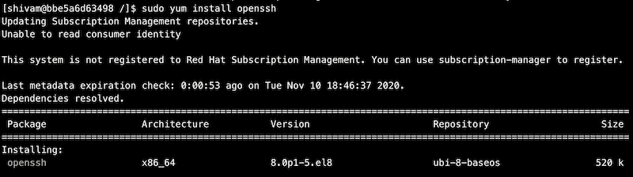

    使用 ssh-keygen 命令生成一个密钥对。用户可以选择所有提示的默认值。

    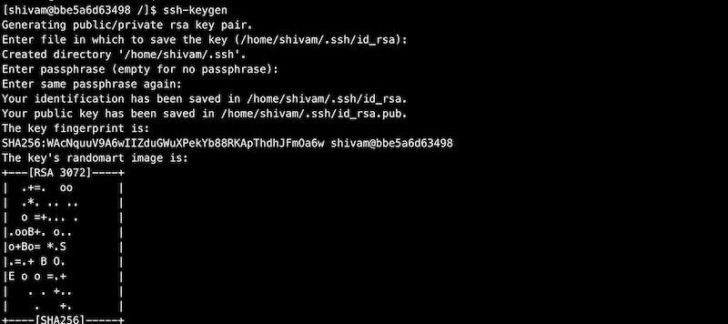

    成功运行 ssh-keygen 命令后，我们应该在\~/中看到两个密钥。ssh 目录。Id_rsa 是私钥，id_rsa.pub 是公钥。请注意，私钥只能由您读取和修改。

    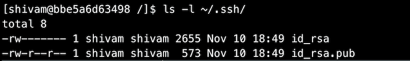

2.  将公钥传送到远程主机

    有多种方法可以将公钥传输到远程服务器。我们将研究使用 ssh-copy-id 命令来完成这项工作的最常见的方法之一。

    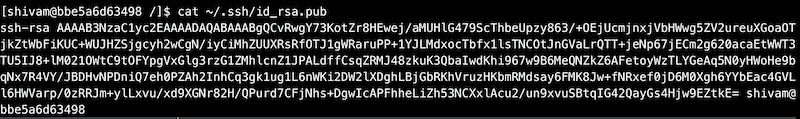

    安装 openssh-clients 包以使用 ssh-copy-id 命令。

    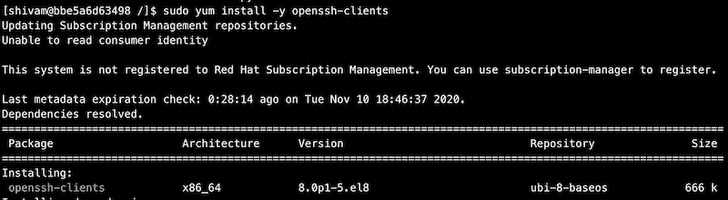

    使用 ssh-copy-id 命令将您的公钥复制到远程主机。

    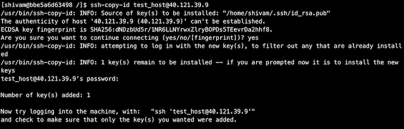

    现在，ssh 使用密码认证进入远程主机。

    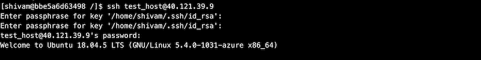

    我们的公钥应该在\~/中。ssh/authorized_keys now。

    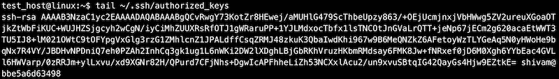

    \~/.ssh/authorized_key 包含一个公钥列表。与这些公钥相关联的用户可以通过 ssh 访问远程主机。

### 如何在远程主机上运行命令？

通用语法:`ssh <user>@<hostname> <command>`

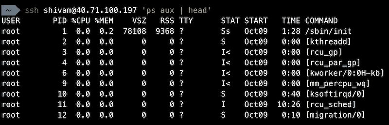

### 如何将文件从一台主机传输到另一台主机？

一般语法:`scp  <source> <destination>`

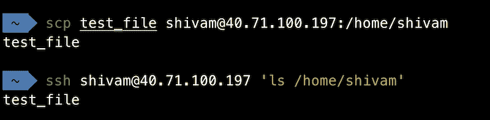

## 包装管理

软件包管理是在系统上安装和管理软件的过程。我们可以从 Linux 包发行商那里安装我们需要的包。不同的分销商使用不同的包装系统。

| 包装系统 | 分布 |
| --- | --- |
| Debian 风格(。deb) | Debian，Ubuntu |
| 红帽风格(。rpm) | Fedora、CentOS、Red Hat Enterprise Linux |

**Linux 中流行的打包系统**

| 命令 | 描述 |
| --- | --- |
| `yum install <package_name>` | 在您的系统上安装软件包 |
| `yum upudate <package_name>` | 将软件包更新到最新的可用版本 |
| `yum remove <package_name>` | 从系统中删除软件包 |
| `yum search` | 搜索特定的关键字 |

DNF 是 YUM 的继承者，现在在 Fedora 中用于安装和管理软件包。DNF 将来可能会在所有基于 RPM 的 Linux 发行版上取代 YUM。

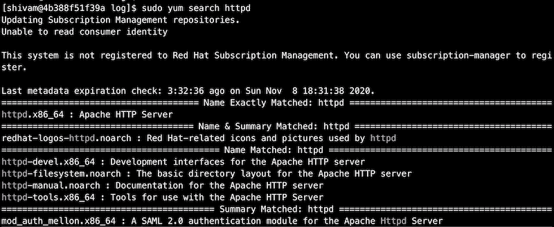

当我们使用 yum search 命令进行搜索时，确实找到了关键字 httpd 的精确匹配。现在让我们安装 httpd 包。

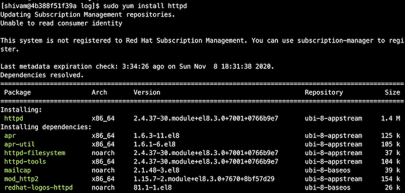

安装 httpd 后，我们将使用 yum remove 命令删除 httpd 包。

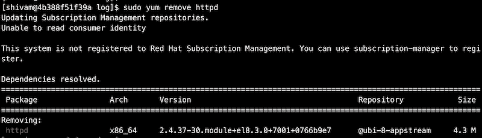

## 进程管理

在这一节中，我们将学习一些有用的命令，它们可以用来监视 Linux 系统上的进程。

### ps(流程状态)

ps 命令用于了解进程或进程列表的信息。

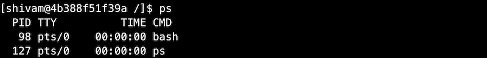

如果在运行 ps 命令时出现错误“ps 命令未找到”，请安装 **procps** 包。

没有任何参数的 ps 用处不大。让我们尝试使用下面的命令列出系统中的所有进程。

参考:[https://UNIX . stack exchange . com/questions/106847/what-does-aux-mean-in-PS-aux](https://unix.stackexchange.com/questions/106847/what-does-aux-mean-in-ps-aux)

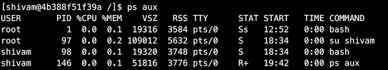

我们可以在 ps 命令中使用一个附加参数来列出带有特定进程 ID 的进程的信息。

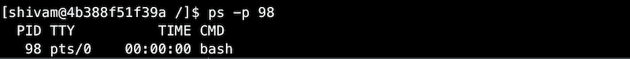

我们可以结合使用 grep 和 ps 命令来仅列出特定进程。

### 顶端

top 命令用于实时显示系统上运行的 Linux 进程的信息。它还显示系统信息的摘要。

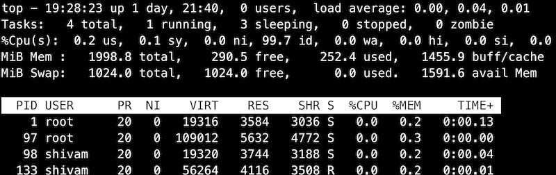

对于每个进程，top 列出了进程 ID、所有者、优先级、状态、cpu 利用率、内存利用率和更多信息。它还列出了整个系统的内存利用率和 cpu 利用率，以及系统正常运行时间和 cpu 平均负载。

## 内存管理

在本节中，我们将学习一些有用的命令，这些命令可用于查看系统内存的信息。

### 自由的

free 命令用于显示系统的内存使用情况。该命令显示 RAM 中可用的总空闲空间和已用空间，以及缓存/缓冲区占用的空间。

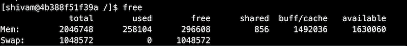

默认情况下，free 命令以千字节为单位显示内存使用情况。我们可以使用一个额外的参数来获取人类可读格式的数据。

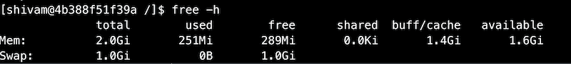

### vmstat

vmstat 命令可用于显示内存使用情况以及关于 io 和 cpu 使用情况的附加信息。

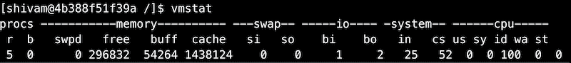

## 检查磁盘空间

在这一节中，我们将学习一些有用的命令，它们可以用来在 Linux 上查看磁盘空间。

### 磁盘空闲

df 命令用于显示每个已装载文件系统的可用空间。

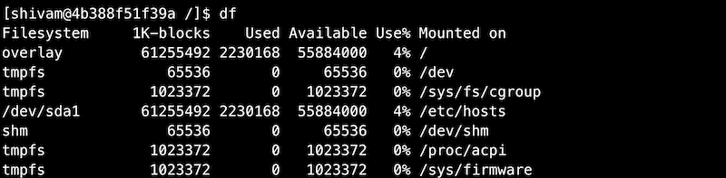

### 磁盘使用情况(du)

du 命令用于显示系统中文件和目录的磁盘使用情况。

以下命令可用于显示根目录中前 5 个最大的目录。

## 守护进程

作为后台进程运行的计算机程序称为守护程序。传统上，守护进程的名称以 d - sshd、httpd 等结尾。我们不能与后台进程交互，因为它们在后台运行。

服务和守护进程大部分时间都可以互换使用。

## 系统

Systemd 是 Linux 操作系统的系统和服务管理器。Systemd 单元是 systemd 的构造块。这些单元由单元配置文件表示。

以下示例显示了/usr/lib/systemd/system 中的单元配置文件，这些文件由安装的 RPM 软件包分发。我们对以 service 结尾的配置文件更感兴趣，因为这些是服务单元。

### 管理系统服务

服务单位以结尾。服务文件扩展名。Systemctl 命令可用于启动/停止/重新启动由 systemd 管理的服务。

| 命令 | 描述 |
| --- | --- |
| systemctl 启动名称. service | 启动服务 |
| 系统停止名称.服务 | 停止服务 |
| systemctl 重新启动名称。服务 | 重新启动服务 |
| systemctl 状态名称.服务 | 检查服务的状态 |
| systemctl 重新加载 name.service | 重新加载服务的配置 |

## 日志

在这一节中，我们将讨论一些重要的文件和目录，它们对于在 Linux 中查看系统日志和应用程序日志非常有用。当您对系统进行故障诊断时，这些日志非常有用。

