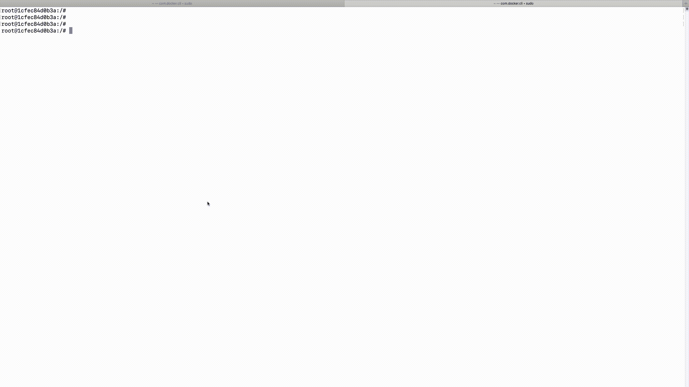

# IP 路由和数据链路层

> 原文：<https://linkedin.github.io/school-of-sre/level101/linux_networking/ipr/>

我们将探究离开客户端的数据包如何到达服务器，反之亦然。当数据包到达 IP 层时，传输层填充源端口、目的端口。IP/网络层填充目的地 IP(从 DNS 发现),然后在路由表中查找到目的地 IP 的路由。

```sh
#Linux route -n command gives the default routing table
route -n 
```

```sh
Kernel IP routing table
Destination     Gateway         Genmask         Flags Metric Ref    Use Iface
0.0.0.0         172.17.0.1      0.0.0.0         UG    0      0        0 eth0
172.17.0.0      0.0.0.0         255.255.0.0     U     0      0        0 eth0 
```

这里，目的地 IP 与 Genmask 进行逐位 AND 运算，如果答案是表中的目的地部分，则选择该网关和接口进行路由。这里 linkedin.com 的 is 108.174.10.0 与 255.255.255.0 进行 AND 运算，我们得到的答案是 108.174.10.0，它与路由表中的任何目的地都不匹配。然后 Linux 用 0.0.0.0 对目的 IP 进行 AND 运算，我们得到 0.0.0.0。此答案与默认行匹配

路由表按照 genmask 中设置的 1 的多个八位位组的顺序进行处理，如果没有匹配项，genmask 0.0.0.0 是默认路由。在此操作结束时，Linux 发现数据包必须通过 eth0 发送到下一跳 172.17.0.1。数据包的源 IP 将被设置为接口 eth0 的 IP。现在，要将数据包发送到 172.17.0.1，linux 必须计算出 172.17.0.1 的 MAC 地址。MAC 地址是通过查看存储 IP 地址和 MAC 地址之间转换的内部 arp 缓存来计算的。如果存在缓存未命中，Linux 会在内部网络中广播 ARP 请求，询问谁拥有 172.17.0.1。IP 的所有者发送一个 ARP 响应，该响应由内核缓存，内核通过将源 mac 地址设置为 eth0 的 mac 地址和我们刚才获得的目的 mac 地址 172.17.0.1，将数据包发送到网关。在每一跳中都遵循类似的路由查找过程，直到分组到达实际的服务器。传输层及其上层仅在终端服务器上发挥作用。仅在中间跳跃期间，直到涉及 IP/网络层。



我们在路由表中看到的一个奇怪的网关是 0.0.0.0。这个网关意味着发送数据包不需要第 3 层(网络层)跳。源和目的都在同一个网络中。内核必须计算出目的地的 mac，并适当地填充源 mac 和目的地 MAC，然后将数据包发送出去，以便它到达目的地时中间没有任何第 3 层跳

正如我们在其他模块中所做的那样，让我们用 SRE 使用案例来结束本次会议

## SRE 角色中的应用

1.  一般来说，路由表是由 DHCP 填充的，随意摆弄并不是一个好习惯。可能有这样的原因，人们不得不绕开路由表，但只有在绝对必要时才选择那条路径
2.  更好地理解错误消息，如“没有到主机的路由”错误可能意味着找不到目的主机的 mac 地址，也可能意味着目的主机关闭
3.  在极少数情况下，查看 ARP 表可以帮助我们了解是否存在 IP 冲突，即错误地将相同的 IP 分配给两台主机，从而导致意外行为