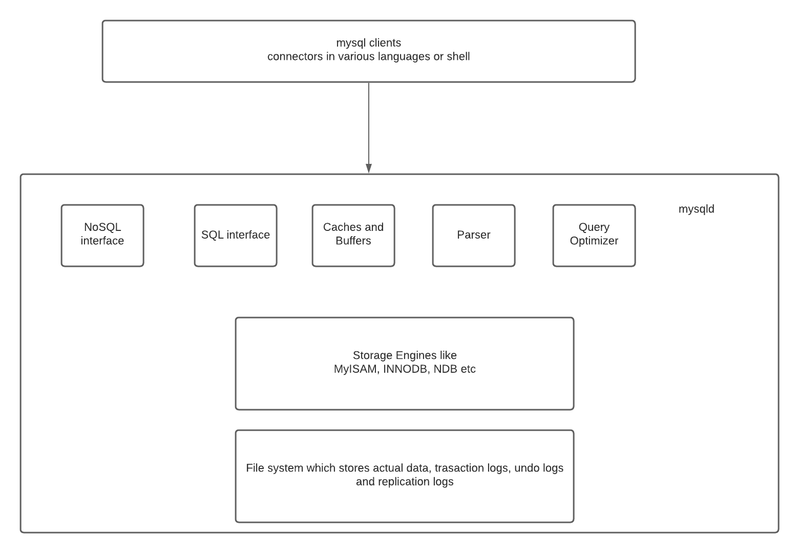

# 关系型数据库

> 原文：<https://linkedin.github.io/school-of-sre/level101/databases_sql/mysql/>

### MySQL 架构

MySQL 架构使您能够根据自己的需求选择合适的存储引擎，并从最终用户(应用工程师和 DBA)那里抽象出所有的实现细节，他们只需要知道一个一致稳定的 API。

应用层:

*   连接处理-每个客户端获得其自己的连接，该连接在访问期间被缓存)
*   认证-服务器检查客户端的信息(用户名、密码、主机)并允许/拒绝连接
*   安全性:服务器确定客户机是否有权限执行每个查询(用 *show privileges* 命令检查)

服务器层:

*   服务和实用程序-备份/恢复、复制、集群等
*   SQL 接口——客户端运行查询进行数据访问和操作
*   SQL 解析器——根据查询创建解析树(词汇/语法/语义分析和代码生成)
*   optimizer——使用各种算法和可用数据(表级统计数据)优化查询，修改查询、扫描顺序、要使用的索引等。(使用解释命令检查)
*   缓存和缓冲区——缓存存储查询结果，缓冲池(InnoDB)以 [LRU](https://en.wikipedia.org/wiki/Cache_replacement_policies#Least_recently_used_(LRU)) 的方式存储表和索引数据

存储引擎选项:

*   InnoDB:使用最广泛，事务支持，符合 ACID，支持行级锁定，崩溃恢复和多版本并发控制。MySQL 5.5+以后默认。
*   MyISAM:速度快，不支持事务，提供表级锁定，非常适合读取繁重的工作负载，主要是在 web 和数据仓库中。默认升级到 MySQL 5.1。
*   存档:针对高速插入进行了优化，在插入时压缩数据，不支持事务，非常适合存储和检索大量很少引用的历史存档数据
*   内存:内存中的表。最快的引擎，支持表级锁定，不支持事务，非常适合创建临时表或快速查找，关闭后数据会丢失
*   CSV:将数据存储在 CSV 文件中，非常适合集成到使用这种格式的其他应用中
*   …等等。

可以从一个存储引擎迁移到另一个存储引擎。但是这种迁移锁定了所有操作的表，并且不是在线的，因为它改变了数据的物理布局。耗时较长，一般不推荐。因此，在开始时选择正确的存储引擎非常重要。

一般原则是使用 InnoDB，除非您对其他存储引擎有特殊需求。

运行`mysql> SHOW ENGINES;`会显示 MySQL 服务器上支持的引擎。