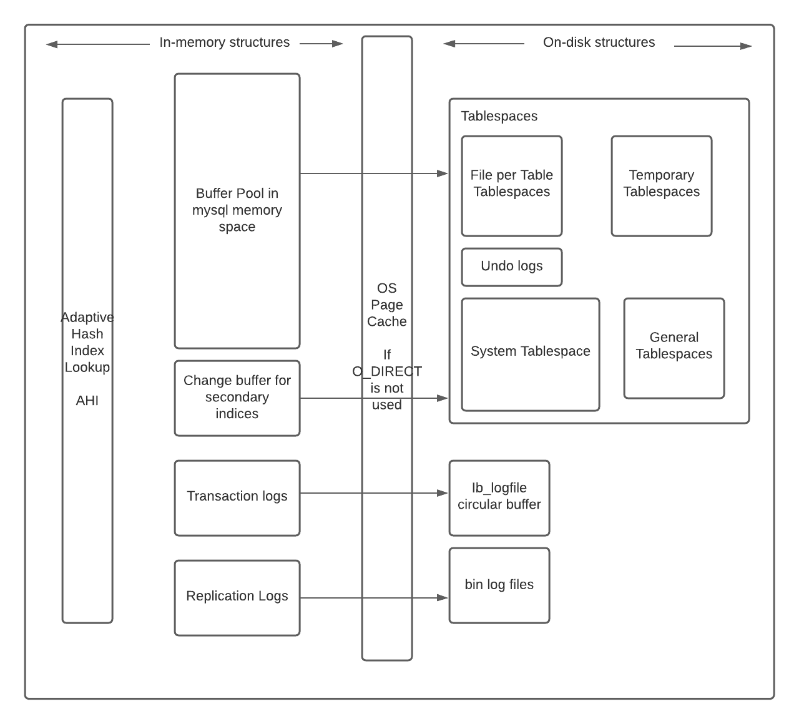

# InnoDB

> 原文：<https://linkedin.github.io/school-of-sre/level101/databases_sql/innodb/>

### 为什么要用这个？

通用、行级锁定、ACID 支持、事务、崩溃恢复和多版本并发控制等。

### 体系结构

### 关键组件:

*   内存:

    *   缓冲池:直接从内存中处理频繁使用的数据(表和索引)的 LRU 缓存，这加快了处理速度。这对调优性能很重要。
    *   Change buffer:当二级索引页不在缓冲池中时，缓存对这些页的更改，并在获取这些页时将其合并。合并可能需要很长时间，并且会影响实时查询。它还会占用部分缓冲池。避免读取辅助索引的额外 I/O。
    *   自适应散列索引:用像缓存一样的快速散列查找表补充 InnoDB 的 B 树索引。未命中的轻微性能损失，也增加了更新它的维护开销。哈希冲突会导致大型数据库的 AHI 重建。
    *   日志缓冲区:在刷新到磁盘之前保存日志数据。

        上述每个内存的大小都是可配置的，并且对性能有很大影响。需要仔细分析工作负载、可用资源、基准测试和优化以获得最佳性能。

*   磁盘:

    *   表格:在行和列中存储数据。
    *   索引:帮助快速查找具有特定列值的行，避免全表扫描。
    *   重做日志:所有事务都被写入其中，在崩溃后，恢复过程会更正由未完成的事务写入的数据，并重放任何未完成的事务。
    *   撤消日志:与单个事务相关的记录，包含有关如何撤消事务的最新更改的信息。