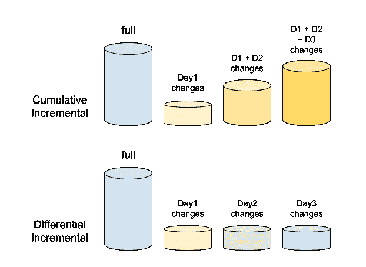

# 备份和恢复

> 原文：<https://linkedin.github.io/school-of-sre/level101/databases_sql/backup_recovery/>

### 备份和恢复

备份是任何数据库设置中非常重要的一部分。它们通常是数据的副本，可用于在数据库出现任何重大或轻微危机时重建数据。一般来说，备份有两种类型:-

*   **物理备份** -磁盘上的数据目录
*   **逻辑备份** -表格结构和其中的记录

MySQL 使用不同的工具支持以上两种备份。SRE 的工作是确定什么时候应该使用哪一个。

#### Mysqldump

MySQL 安装中提供了该实用程序。它有助于获得数据库的逻辑备份。它输出一组 SQL 语句来重建数据。不建议对大型表使用 mysqldump，因为这可能会花费很多时间，并且文件会很大。然而，对于小桌子来说，这是最好和最快的选择。

`mysqldump [options] > dump_output.sql`

mysqldump 可以使用某些选项来获得适当的数据库转储。

转储所有数据库

`mysqldump -u<user> -p<pwd> --all-databases > all_dbs.sql`

转储特定数据库

`mysqldump -u<user> -p<pwd> --databases db1 db2 db3 > dbs.sql`

转储单个数据库`mysqldump -u<user> -p<pwd> --databases db1 > db1.sql`

运筹学

`mysqldump -u<user> -p<pwd> db1 > db1.sql`

以上两个命令的区别在于，后一个命令在备份输出中不包含 **CREATE DATABASE** 命令。

转储数据库中的特定表

`mysqldump -u<user> -p<pwd> db1 table1 table2 > db1_tables.sql`

只转储表结构而不转储数据

`mysqldump -u<user> -p<pwd> --no-data db1 > db1_structure.sql`

只转储表数据而不转储 CREATE 语句

`mysqldump -u<user> -p<pwd> --no-create-info db1 > db1_data.sql`

仅转储表中的特定记录

`mysqldump -u<user> -p<pwd> --no-create-info db1 table1 --where=”salary>80000” > db1_table1_80000.sql`

Mysqldump 还可以提供 CSV、其他带分隔符的文本或 XML 格式的输出，以支持任何用例。mysqldump 实用程序的备份是离线的，即当备份完成时，它将不会对数据库进行备份时所做的更改。例如，如果备份在下午 3 点开始，在下午 4 点结束，则在下午 3 点到 4 点之间不会对数据库进行更改。

**从 mysqldump 恢复**可以通过以下两种方式完成:-

来自 shell

`mysql -u<user> -p<pwd> < all_dbs.sql`

运筹学

如果已经创建了数据库，则从 shell

`mysql -u<user> -p<pwd> db1 < db1.sql`

从 MySQL shell 内部

`mysql> source all_dbs.sql`

#### Percona Xtrabackup

这个工具与 MySQL 服务器分开安装，并且是开源的，由 Percona 提供。它有助于获得数据库的完整或部分物理备份。它提供了数据库的在线备份，也就是说，如前一节末尾所述，在备份过程中会对数据库进行更改。

*   **完整备份** -数据库的完整备份。
*   **部分备份** -增量备份
*   **累积** -一次完整备份后，下一次备份将在完整备份后发生更改。例如，我们在周日进行了一次完整备份，从周一开始，每次备份在周日之后都会有变化；因此，星期二的备份也会有星期一的更改，星期三的备份也会有星期一和星期二的更改，依此类推。
*   **差异** -在一次完整备份之后，下一次备份将在之前的增量备份之后发生更改。例如，我们在周日进行了完整备份，在周日之后对周一进行了更改，在周一之后对周二进行了更改，依此类推。



Percona xtrabackup 允许我们根据需要进行完整备份和增量备份。但是，增量备份占用的空间比完整备份少(如果每天进行一次)，但是增量备份的恢复时间比完整备份长。

**创建完整备份**

`xtrabackup --defaults-file=<location to my.cnf> --user=<mysql user> --password=<mysql password> --backup --target-dir=<location of target directory>`

例子

`xtrabackup --defaults-file=/etc/my.cnf --user=some_user --password=XXXX --backup --target-dir=/mnt/data/backup/`

一些其他选项

*   `--stream` -可用于将备份文件以指定格式流式输出到标准输出。xbstream 是目前唯一的选择。
*   `--tmp-dir` -将此设置为备份时用于临时文件的 tmp 目录。
*   `--parallel` -将此设置为可用于将数据文件并行复制到目标目录的线程数量。
*   `--compress` -默认情况下-使用 quicklz。设定此项以压缩格式备份。每个文件都是一个. qp 压缩文件，可以由 qpress 文件归档程序提取。
*   `--decompress` -解压缩所有使用。qp 扩展。它不会删除。解压缩后的 qp 文件。为此，使用`--remove-original`和这个。请注意，解压缩选项应该与使用压缩选项的 xtrabackup 命令分开运行。

**准备备份**

使用- backup 选项完成备份后，我们需要准备它以便恢复它。这样做是为了使数据文件与时间点一致。在执行备份时，可能有一些事务正在进行，这些事务已经更改了数据文件。当我们准备备份时，所有这些事务都应用于数据文件。

`xtrabackup --prepare --target-dir=<where backup is taken>`

例子

`xtrabackup --prepare --target-dir=/mnt/data/backup/`

不建议暂停正在准备备份的进程，因为这可能会导致数据文件损坏，并且备份无法进一步使用。必须再次进行备份。

**恢复完整备份**

要恢复通过上述命令创建和准备的备份，只需将所有内容从备份目标目录复制到 mysql 服务器的数据目录，将所有文件的所有权更改为 mysql 用户(MySQL 服务器使用的 linux 用户)并启动 MySQL。

或者也可以使用下面的命令，

`xtrabackup --defaults-file=/etc/my.cnf --copy-back --target-dir=/mnt/data/backups/`

**注意** -为了恢复备份，必须准备好备份。

**创建增量备份**

Percona Xtrabackup 有助于创建增量备份，即只能备份自上次备份以来的更改。每个 InnoDB 页面都包含一个日志序列号或 LSN，它也是备份和准备命令的最后一行。

```sh
xtrabackup: Transaction log of lsn <LSN> to <LSN> was copied. 
```

运筹学

```sh
InnoDB: Shutdown completed; log sequence number <LSN>
<timestamp> completed OK! 
```

这表明在提到日志序列号之前，已经进行了备份。这是理解增量备份和实现自动化备份的关键信息。增量备份不会比较数据文件的变化，而是浏览 InnoDB 页面，并将它们的 LSN 与上次备份的 LSN 进行比较。因此，如果没有一次完整备份，增量备份将毫无用处。

xtrabackup 命令创建 xtrabackup_checkpoint 文件，该文件包含有关备份 LSN 的信息。以下是该文件的主要内容

```sh
backup_type = full-backuped | incremental
from_lsn = 0 (full backup) | to_lsn of last backup <LSN>
to_lsn = <LSN>
last_lsn = <LSN> 
```

**to_lsn** 和 **last_lsn** 是有区别的。当**的 last_lsn** 大于 **to_lsn** 时，这意味着有在我们进行备份时运行的事务尚未应用。这就是- prepare 的用途。

要进行增量备份，首先，我们需要一个完整备份。

`xtrabackup --defaults-file=/etc/my.cnf --user=some_user --password=XXXX --backup --target-dir=/mnt/data/backup/full/`

让我们假设 xtrabackup_checkpoint 文件的内容如下。

```sh
backup_type = full-backuped
from_lsn = 0
to_lsn = 1000
last_lsn = 1000 
```

现在我们有了一个完整备份，我们可以有一个增量备份来进行更改。我们将采用差异增量备份。

`xtrabackup --defaults-file=/etc/my.cnf --user=some_user --password=XXXX --backup --target-dir=/mnt/data/backup/incr1/ --incremental-basedir=/mnt/data/backup/full/`

在 incr1 目录中创建了 delta 文件，如， **ibdata1.delta** ， **db1/tbl1.ibd.delta** 与完整目录的变化。xtrabackup_checkpoint 文件将包含以下内容。

```sh
backup_type = incremental
from_lsn = 1000
to_lsn = 1500
last_lsn = 1500 
```

因此，这里的 **from_lsn** 等于最后一次备份的 **to_lsn** 或者为增量备份提供的 basedir。对于下一次增量备份，我们可以将该增量备份用作基本目录。

`xtrabackup --defaults-file=/etc/my.cnf --user=some_user --password=XXXX --backup --target-dir=/mnt/data/backup/incr2/ --incremental-basedir=/mnt/data/backup/incr1/`

xtrabackup_checkpoint 文件将包含以下内容。

```sh
backup_type = incremental
from_lsn = 1500
to_lsn = 2000
last_lsn = 2200 
```

**准备增量备份**

准备增量备份不同于准备完整备份。当准备运行时，执行两个操作- *提交的事务应用于数据文件*和*未提交的事务回滚*。在准备增量备份时，我们必须跳过未提交事务的回滚，因为它们可能会在下一次增量备份中提交。如果我们回滚未提交的事务，则无法应用进一步的增量备份。

我们使用 **- apply-log-only** 选项和 **- prepare** 来避免回滚阶段。

在上一节中，我们有了以下带有完整备份的目录

```sh
/mnt/data/backup/full
/mnt/data/backup/incr1
/mnt/data/backup/incr2 
```

首先，我们准备完整备份，但仅使用- apply-log-only 选项。

`xtrabackup --prepare --apply-log-only --target-dir=/mnt/data/backup/full`

该命令的输出将在末尾包含以下内容。

```sh
InnoDB: Shutdown complete; log sequence number 1000
<timestamp> Completed OK! 
```

注意:结尾提到的 LSN 与为完整备份创建的 xtrabackup_checkpoint 中的 to_lsn 相同。

接下来，我们将第一次增量备份中的更改应用于完整备份。

`xtrabackup --prepare --apply-log-only --target-dir=/mnt/data/backup/full --incremental-dir=/mnt/data/backup/incr1`

这会将增量目录中的增量文件应用到完整备份目录。它将完整备份目录中的数据文件前滚到增量备份时，并照常应用重做日志。

最后，我们应用最后一次增量备份，与前一次备份相同，只是做了一点小小的更改。

`xtrabackup --prepare --target-dir=/mnt/data/backup/full --incremental-dir=/mnt/data/backup/incr1`

我们不必使用 **- apply-log-only** 选项。它将 *incr2 delta 文件*应用于完整备份数据文件，将它们向前推进，对它们应用重做日志，最后回滚未提交的事务以产生最终结果。现在，完整备份目录中的数据可用于恢复。

**注意** -要创建累积增量备份，增量 basedir 应该始终是每个增量备份的完整备份目录。在准备过程中，我们可以使用- apply-log-only 选项从完整备份开始，并将最后一次增量备份用于最终准备，因为它包含自完整备份以来的所有更改。

**恢复增量备份**

完成上述所有步骤后，恢复与完整备份相同。

#### 进一步阅读

*   [MySQL 时间点恢复](https://dev.mysql.com/doc/refman/8.0/en/point-in-time-recovery.html)
*   [另一款 MySQL 备份工具——MySQL pump](https://dev.mysql.com/doc/refman/8.0/en/mysqlpump.html)
*   [另一款 MySQL 备份工具——my dumper](https://github.com/maxbube/mydumper/tree/master/docs)
*   【mysqldump、mysqlpump 和 mydumper 的比较
*   [备份最佳实践](https://www.percona.com/blog/2020/05/27/best-practices-for-mysql-backups/)