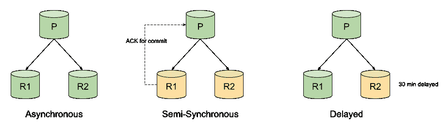
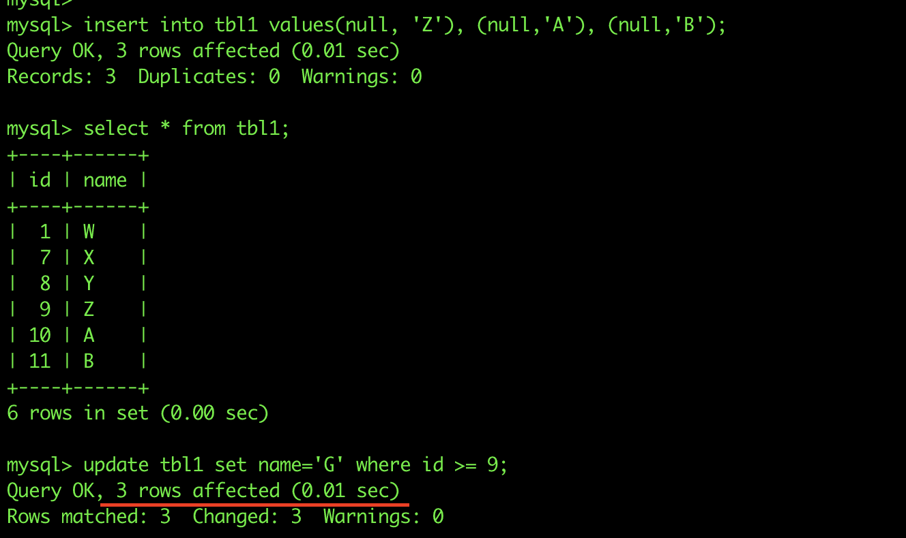
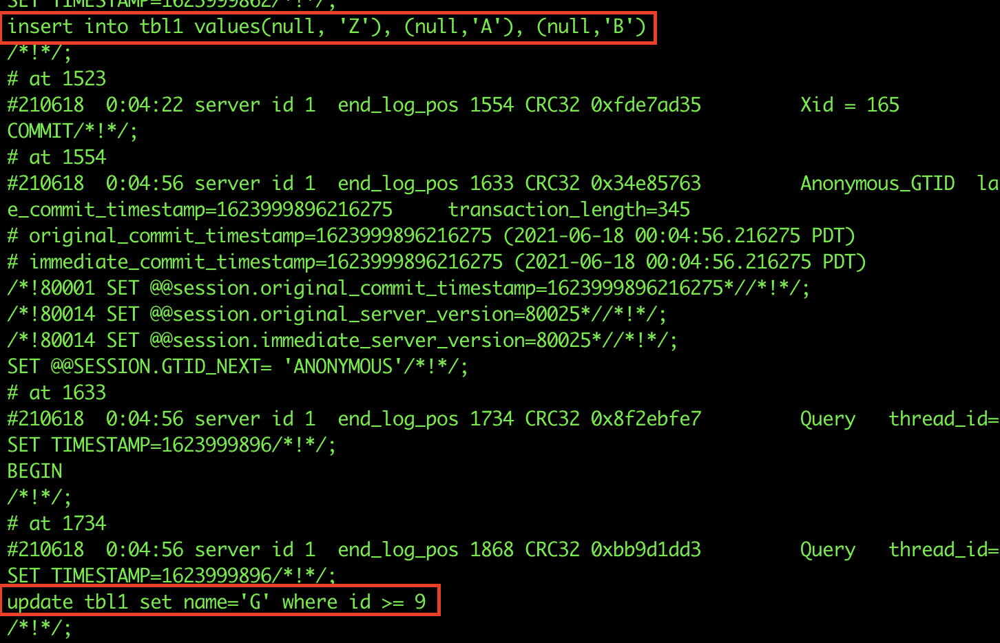
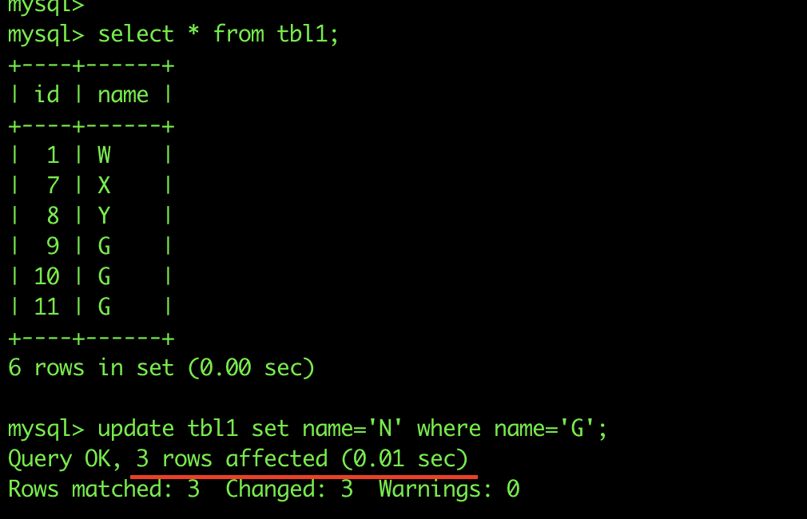
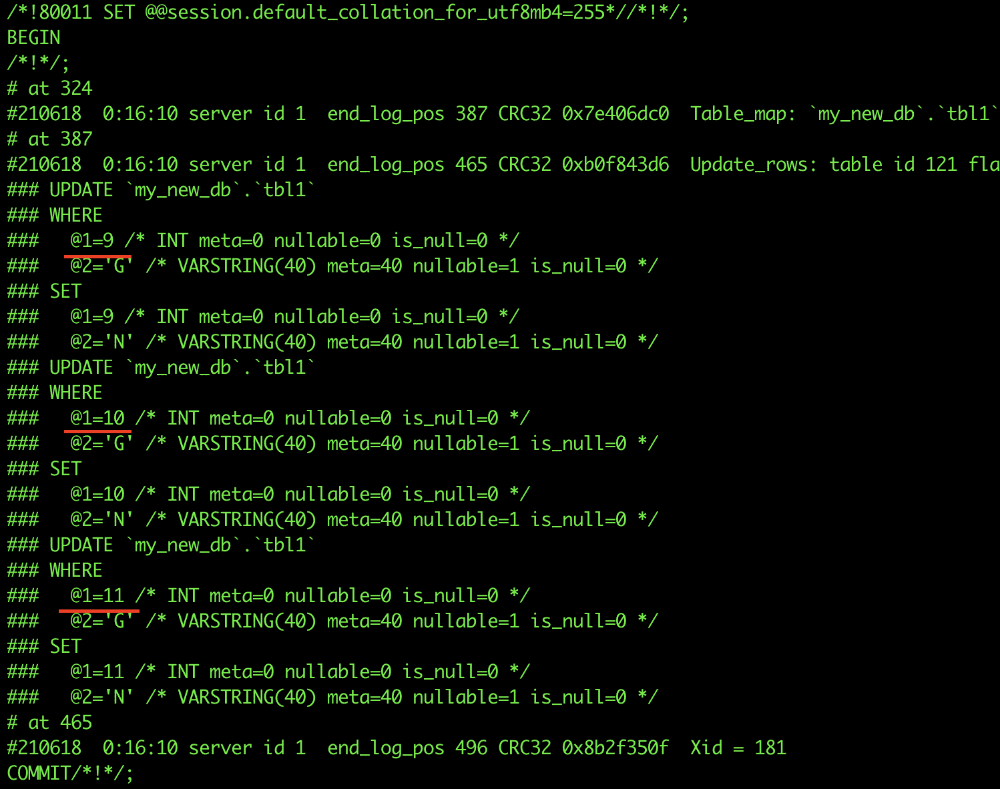
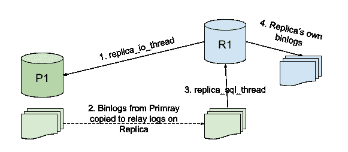

# MySQL 复制

> 原文：<https://linkedin.github.io/school-of-sre/level101/databases_sql/replication/>

### MySQL 复制

复制使数据能够从一台 MySQL 主机(称为主主机)复制到另一台 MySQL 主机(称为副本主机)。默认情况下，MySQL 复制本质上是异步的，但在某些配置下，可以将其更改为半同步。

MySQL 复制的一些常见应用有:-

*   **读取扩展** -由于多个主机可以从单个主要主机复制数据，我们可以根据需要设置尽可能多的副本，并通过它们扩展读取，即应用写入将进入单个主要主机，读取可以在那里的所有副本之间平衡。这种设置还可以提高写入性能，因为主节点仅用于更新，而不用于读取。
*   **使用副本进行备份** -备份过程有时会有点繁重。但是，如果我们配置了副本，那么我们可以使用其中一个副本来获得备份，而完全不会影响主数据。
*   **灾难恢复** -其他地理区域中的副本为配置灾难恢复铺平了道路。

MySQL 也支持不同类型的同步

*   **异步** -这是默认的同步方法。它是单向的，即一台主机作为主主机，一台或多台主机作为副本主机。我们将在整个复制主题中讨论这种方法。



*   **半同步** -在这种类型的同步中，在主要主机上执行的提交将被阻止，直到至少有一个副本主机对其进行确认。在任何一个复制副本发出确认后，控制权将返回到执行该事务的会话。这确保了很强的一致性，但是复制比异步慢。
*   **延迟**——我们可以在典型的 MySQL 复制中故意将副本延迟用例所需的秒数。这种类型的复制可以防止在主服务器上删除或损坏数据的严重人为错误，例如，在上面的延迟复制图表中，如果在主服务器上错误地执行了删除数据库，我们仍然有 30 分钟的时间从 R2 恢复数据，因为该命令尚未在 R2 上复制。

**先决条件**

在我们开始设置复制之前，我们应该了解二进制日志。二进制日志在 MySQL 复制中起着非常重要的作用。二进制日志，或者通常称为*二进制日志*包含关于对数据库所做的更改的事件，比如表结构更改、通过 DML 操作的数据更改等。它们不用于记录 SELECT 语句。对于复制，主服务器使用其二进制日志向副本服务器发送有关数据库更改的信息，副本服务器进行相同的数据更改。

关于 MySQL 复制，二进制日志格式可以是两种类型，这两种类型决定了主要的复制类型:？基于语句的复制或 SBR？基于行的复制或 RBR

**基于语句的 Binlog 格式**

最初，MySQL 中的复制基于从主服务器复制 SQL 语句并在副本服务器上执行。这称为基于语句的日志记录。binlog 包含会话运行的确切 SQL 语句。



因此，如果我们运行上述语句，在一个 update 语句中插入 3 条记录和 update 3，它们将被记录为与我们执行它们时完全相同的日志。



**基于行的 Binlog 格式**

在最新的 MySQL 版本中，基于行是默认的。这与语句格式有很大不同，因为这里记录的是行事件，而不是语句。我们的意思是，在上面的例子中，一条 update 语句影响了 3 条记录，但是 binlog 只有一条 update 语句；如果是基于行的格式，binlog 将为每个更新的记录生成一个事件。





**基于语句的 v/s 基于行的二进制日志**

让我们看看基于语句和基于行的二进制日志之间的操作差异。

| 基于语句 | 基于行 |
| --- | --- |
| 记录执行的 SQL 语句 | 基于执行的 SQL 语句记录行事件 |
| 占用较少的磁盘空间 | 占用更多磁盘空间 |
| 使用二进制日志恢复速度更快 | 使用二进制日志恢复速度较慢 |
| 当用于复制时，如果任何语句有一个预定义的函数，该函数有自己的值，如 sysdate()、uuid()等，则副本上的输出可能会不同，从而导致不一致。 | 无论执行什么都会变成一个带有值的行事件，所以如果在 SQL 语句中使用这样的函数就不会有问题。 |
| 只记录语句，因此不会生成其他行事件。 | 当使用 INSERT INTO SELECT 将一个表复制到另一个表中时，会生成许多事件。 |

**注意**——还有一种叫做**混合**的 binlog 格式。对于混合日志记录，默认情况下使用基于语句，但在某些情况下会切换到基于行。如果 MySQL 不能保证基于语句的日志记录对于执行的语句是安全的，它会发出警告，并切换到基于行的日志记录。

我们将使用二进制日志格式作为整个复制主题的行。

**运动中的复制**



上图显示了典型的 MySQL 复制是如何工作的。

1.  Replica_IO_Thread 负责将二进制日志事件从主二进制日志提取到副本
2.  在副本主机上，创建的中继日志是二进制日志的精确副本。如果主服务器上的二进制日志是行格式，则中继日志将是相同的。
3.  Replica_SQL_Thread 在副本 MySQL 服务器上应用中继日志。
4.  如果在副本服务器上启用了 log-bin，那么副本服务器也将拥有自己的二进制日志。如果启用了 log-slave-updates，那么它也会将主服务器的更新记录到二进制日志中。

#### 设置复制

在本节中，我们将设置一个简单的异步复制。二进制日志将采用基于行的格式。复制将在两个没有先前数据的新主机上设置。有两种不同的方法可以设置复制。

*   **基于二进制日志的** -每个副本都记录了主二进制日志上的二进制日志坐标和二进制日志中的位置，直到它被读取和处理。因此，在同一时间，不同的副本可能会读取同一个 binlog 的不同部分。
*   **基于 GTID 的** -每个交易都有一个标识符，称为全局交易标识符或 GTID。不需要保留 binlog 坐标的记录，只要副本拥有在主服务器上执行的所有 GTIDs，它就与主服务器保持一致。典型的 GTID 是 server_uuid:#正整数。

我们将在下一节中设置一个基于 GTID 的复制，但也将讨论基于 binlog 的复制设置。

**主要主机配置**

在设置基于 GTID 的复制时，主要 my.cnf 文件中应该包含以下配置参数。

```sh
server-id - a unique ID for the mysql server
log-bin - the binlog location
binlog-format - ROW | STATEMENT (we will use ROW)
gtid-mode - ON
enforce-gtid-consistency - ON (allows execution of only those statements which can be logged using GTIDs) 
```

**副本主机配置**

设置复制时，副本 my.cnf 文件中应包含以下配置参数。

```sh
server-id - different than the primary host
log-bin - (optional, if you want replica to log its own changes as well)
binlog-format - depends on the above
gtid-mode - ON
enforce-gtid-consistency - ON
log-slave-updates - ON (if binlog is enabled, then we can enable this. This enables the replica to log the changes coming from the primary along with its own changes. Helps in setting up chain replication) 
```

**复制用户**

每个副本都使用 mysql 用户连接到主服务器进行复制。因此在主要主机上必须有一个相同的 mysql 用户帐户。只要拥有复制从属权限，任何用户都可以用于此目的。如果唯一的目的是复制，那么我们可以让用户只拥有所需的权限。

在主要主机上

```sh
mysql> create user repl_user@<replica_IP> identified by 'xxxxx';

mysql> grant replication slave on *.* to repl_user@'<replica_IP>'; 
```

**从主节点获取起始位置**

在主要主机上运行以下命令

```sh
mysql> show master status\G
*************************** 1\. row ***************************
             File: mysql-bin.000001
         Position: 73
     Binlog_Do_DB:
 Binlog_Ignore_DB:
Executed_Gtid_Set: e17d0920-d00e-11eb-a3e6-000d3aa00f87:1-3
1 row in set (0.00 sec) 
```

如果我们使用基于二进制日志的复制，最上面的两行输出是最重要的。它告诉主主机上的当前二进制日志，以及它已经写入的位置。对于新主机，我们知道没有数据写入，因此我们可以使用第一个 binlog 文件和位置 4 直接设置复制。如果我们从备份中设置复制，那么这将改变我们获取起始位置的方式。对于 gtid，executed_gtid_set 是 primary 当前所在的值。同样，对于新的设置，我们不必指定任何关于起始点的内容，它将从事务 id 1 开始，但是当我们从备份设置时，备份将包含 GTID 位置，直到进行备份的位置。

**设置副本**

复制设置必须知道主要主机、要连接的用户和密码、binlog 坐标(对于基于 binlog 的复制)或 GTID 自动定位参数。以下命令用于设置

```sh
change master to
master_host = '<primary host IP>',
master_port = <primary host port - default=3306>,
master_user = 'repl_user',
master_password = 'xxxxx',
master_auto_position = 1; 
```

**注意** -从 Mysql 8.0.23 开始，*将主服务器更改为*命令已被替换为*将复制源更改为*，所有*主服务器*和*从服务器*关键字也被替换为*源*和*副本*。

如果是基于二进制日志的复制，那么我们需要指定二进制日志坐标，而不是 master_auto_position。

```sh
master_log_file = 'mysql-bin.000001',
master_log_pos = 4 
```

**开始复制并检查状态**

现在一切都配置好了，我们只需要通过以下命令在副本上启动复制

`start slave;`

或者从 MySQL 8.0.23 开始，

`start replica;`

复制是否成功运行，我们可以通过运行以下命令来确定

`show slave status\G`

或者从 MySQL 8.0.23 开始，

`show replica status\G`

```sh
mysql> show replica status\G
*************************** 1\. row ***************************
             Replica_IO_State: Waiting for master to send event
                  Source_Host: <primary IP>
                  Source_User: repl_user
                  Source_Port: <primary port>
                Connect_Retry: 60
              Source_Log_File: mysql-bin.000001
          Read_Source_Log_Pos: 852
               Relay_Log_File: mysql-relay-bin.000002
                Relay_Log_Pos: 1067
        Relay_Source_Log_File: mysql-bin.000001
           Replica_IO_Running: Yes
          Replica_SQL_Running: Yes
              Replicate_Do_DB:
          Replicate_Ignore_DB:
           Replicate_Do_Table:
       Replicate_Ignore_Table:
      Replicate_Wild_Do_Table:
  Replicate_Wild_Ignore_Table:
                   Last_Errno: 0
                   Last_Error:
                 Skip_Counter: 0
          Exec_Source_Log_Pos: 852
              Relay_Log_Space: 1283
              Until_Condition: None
               Until_Log_File:
                Until_Log_Pos: 0
           Source_SSL_Allowed: No
           Source_SSL_CA_File:
           Source_SSL_CA_Path:
              Source_SSL_Cert:
            Source_SSL_Cipher:
               Source_SSL_Key:
        Seconds_Behind_Source: 0
Source_SSL_Verify_Server_Cert: No
                Last_IO_Errno: 0
                Last_IO_Error:
               Last_SQL_Errno: 0
               Last_SQL_Error:
  Replicate_Ignore_Server_Ids:
             Source_Server_Id: 1
                  Source_UUID: e17d0920-d00e-11eb-a3e6-000d3aa00f87
             Source_Info_File: mysql.slave_master_info
                    SQL_Delay: 0
          SQL_Remaining_Delay: NULL
    Replica_SQL_Running_State: Slave has read all relay log; waiting for more updates
           Source_Retry_Count: 86400
                  Source_Bind:
      Last_IO_Error_Timestamp:
     Last_SQL_Error_Timestamp:
               Source_SSL_Crl:
           Source_SSL_Crlpath:
           Retrieved_Gtid_Set: e17d0920-d00e-11eb-a3e6-000d3aa00f87:1-3
            Executed_Gtid_Set: e17d0920-d00e-11eb-a3e6-000d3aa00f87:1-3
                Auto_Position: 1
         Replicate_Rewrite_DB:
                 Channel_Name:
           Source_TLS_Version:
       Source_public_key_path:
        Get_Source_public_key: 0
            Network_Namespace:
1 row in set (0.00 sec) 
```

一些参数解释如下

*   **Relay_Source_Log_File** -副本当前正在读取的主服务器的文件
*   **Execute_Source_Log_Pos** -对于上述文件，副本当前从哪个位置读取。当使用基于 binlog 的复制时，这两个参数至关重要。
*   **副本 IO 运行** -副本 IO 线程是否运行
*   **副本 _SQL_Running** -副本的 SQL 线程是否正在运行
*   **Seconds_Behind_Source** -在主服务器上执行语句和在副本服务器上执行语句的时间差。这表明有多少复制延迟。
*   **源 _UUID** -主要主机的 UUID
*   **Retrieved_Gtid_Set** -要执行的副本从主要主机获取的 Gtid。
*   **Executed_Gtid_Set** -在副本上执行的 Gtid。如果副本同步，则该设置在整个集群中保持不变。
*   **Auto_Position** -它指示复制品自动获取下一个 GTID

**为已经设置好的集群创建一个副本**

上一节中讨论的步骤讨论了在两台新主机上设置复制。当我们必须为已经在为应用提供服务的主机设置复制副本时，将使用主主机的备份，或者为复制副本创建新的备份(仅当它提供的流量较少时才应这样做)，或者使用最近创建的备份。

如果 MySQL 主服务器上的数据库很小，建议小于 100G，那么可以使用 mysqldump 和以下选项进行备份。

`mysqldump -uroot -p -hhost_ip -P3306 --all-databases --single-transaction --master-data=1 > primary_host.bkp`

*   `--single-transaction` -该选项在进行备份之前启动事务，以确保事务的一致性。由于事务相互隔离，因此不会有其他写入影响备份。
*   `--master-data` -如果希望设置基于 binlog 的复制，则需要此选项。它包括二进制日志文件和日志文件在备份文件中的位置。

当 GTID 模式被启用并且 **mysqldump** 被执行时，它包括被执行用于在备份位置之后启动副本的 GTID。mysqldump 输出文件的内容如下


建议在恢复之前对这些进行注释，否则它们可能会引发错误。此外，使用 master-data=2 将自动注释 master_log_file 行。

同样，当使用 **xtrabackup** 对主机进行备份时，文件 *xtrabckup_info* file 包含 binlog 文件和文件位置的信息，以及 GTID 执行集。

```sh
server_version = 8.0.25
start_time = 2021-06-22 03:45:17
end_time = 2021-06-22 03:45:20
lock_time = 0
binlog_pos = filename 'mysql-bin.000007', position '196', GTID of the last change 'e17d0920-d00e-11eb-a3e6-000d3aa00f87:1-5'
innodb_from_lsn = 0
innodb_to_lsn = 18153149
partial = N
incremental = N
format = file
compressed = N
encrypted = N 
```

现在，在所需的主机上设置 MySQL 服务器后，恢复从上述任何一种方法获得的备份。如果计划的方式是基于二进制日志的复制，则在以下命令中使用二进制日志文件和位置信息

```sh
change Replication Source to 
source_host = ‘primary_ip’,
source_port = 3306,
source_user = ‘repl_user’,
source_password = ‘xxxxx’,
source_log_file = ‘mysql-bin.000007’,
source_log_pos = ‘196’; 
```

如果需要通过 GITDs 设置复制，那么运行下面的命令告诉副本关于已经执行的 GTIDs。在副本主机上，运行以下命令

```sh
reset master;

set global gtid_purged = ‘e17d0920-d00e-11eb-a3e6-000d3aa00f87:1-5’

change replication source to
source_host = ‘primary_ip’,
source_port = 3306,
source_user = ‘repl_user’,
source_password = ‘xxxxx’,
source_auto_position = 1 
```

reset master 命令将二进制日志的位置重置为初始位置。如果主机是新安装的 MySQL，可以跳过它，但我们恢复了一个备份，所以它是必要的。gtid_purged 全局变量让副本知道已经执行的 gtid，以便复制可以在那之后开始。然后在 change source 命令中，我们将 auto-position 设置为 1，这将自动获取下一个 GTID 以继续。

#### 进一步阅读

*   [复制的更多应用](https://dev.mysql.com/doc/refman/8.0/en/replication-solutions.html)
*   [使用 MySQL Orchestrator 实现自动故障转移](https://github.com/openark/orchestrator/tree/master/docs)