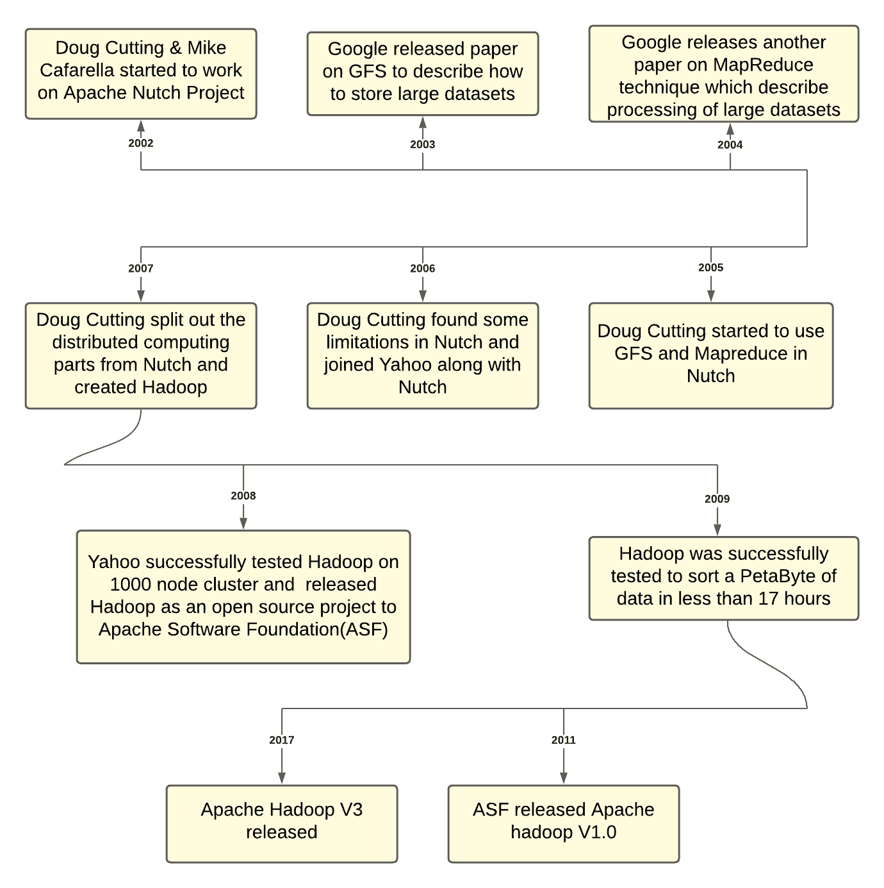
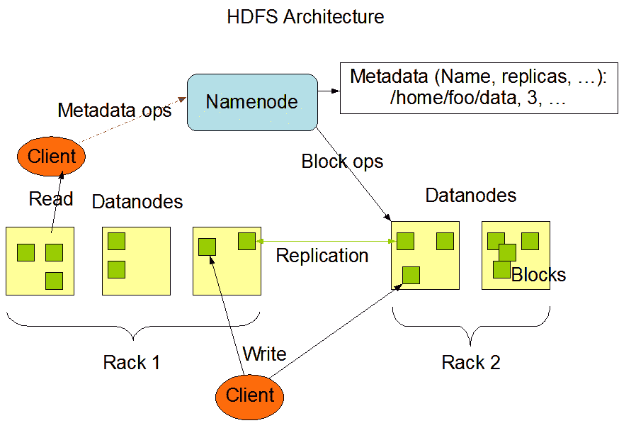
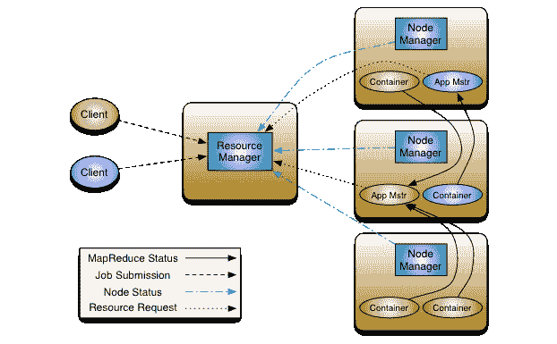
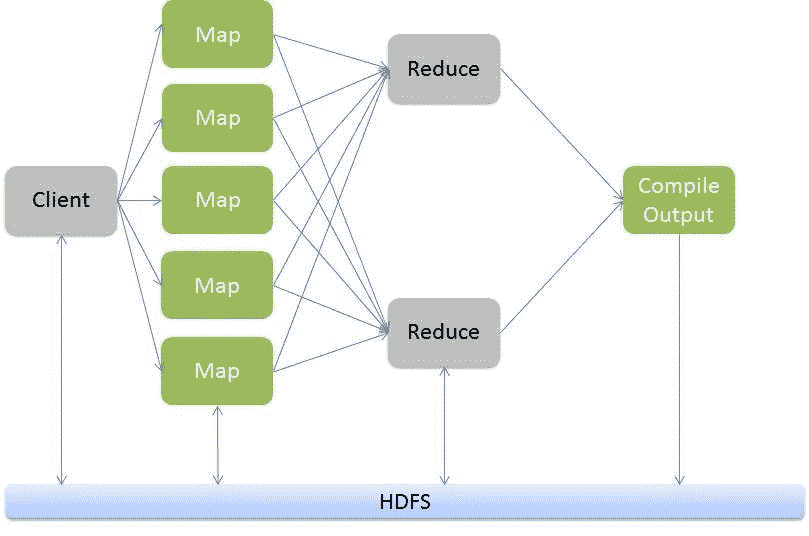
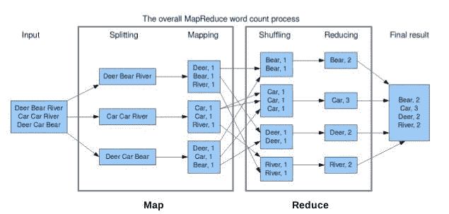
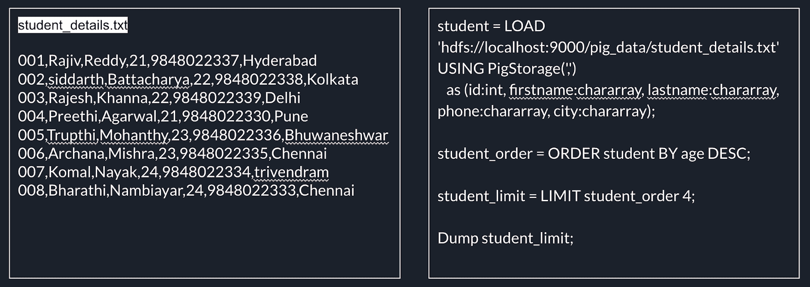

# Hadoop 的发展

> 原文：<https://linkedin.github.io/school-of-sre/level101/big_data/evolution/>

# Hadoop 的架构

1.  **HDFS**

    1.  Hadoop 分布式文件系统(HDFS)是一个分布式文件系统，旨在运行在商用硬件上。它与现有的分布式文件系统有许多相似之处。然而，与其他分布式文件系统的区别是显著的。
    2.  HDFS 具有高度容错能力，旨在部署在低成本硬件上。HDFS 提供对应用数据的高吞吐量访问，适用于具有大型数据集的应用。
    3.  HDFS 是 Apache Hadoop 核心项目 T1 的一部分。

    

    HDFS 的主要成分包括:1 .NameNode:是集群中文件命名空间的仲裁器和中央存储库。NameNode 执行打开、关闭和重命名文件和目录等操作。2.DataNode:管理连接到运行它的节点的存储。它负责处理所有的读写请求。它对 NameNode 上的指令执行操作，例如创建、删除和复制块。3.客户端:负责从 namenode 获取所需的元数据，然后与 datanodes 通信以进行读取和写入。

2.  YARN 代表“又一个资源谈判者”。它是在 Hadoop 2.0 中引入的，以消除 Hadoop 1.0 中存在的作业跟踪器的瓶颈。YARN 在推出时被描述为“重新设计的资源管理器”，但现在它已经发展成为一个用于大数据处理的大规模分布式操作系统。

    

    纱线结构的主要组成部分包括:1 .客户机:它向资源管理器提交 map-reduce(MR)作业。2.资源管理器:它是 YARN 的主守护进程，负责所有应用之间的资源分配和管理。每当它接收到一个处理请求时，它就将其转发给相应的节点管理器，并相应地分配资源以完成该请求。它有两个主要组成部分:1 .调度程序:它根据分配的应用和可用资源执行调度。它是一个纯粹的调度程序，这意味着它不执行其他任务，如监视或跟踪，也不保证在任务失败时重新启动。YARN scheduler 支持容量调度器和公平调度器等插件来划分集群资源。2.应用管理器:它负责接受应用并协商来自资源管理器的第一个容器。如果任务失败，它还会重新启动应用管理器容器。3.节点管理器:它负责 Hadoop 集群上的各个节点，并管理应用和工作流以及特定的节点。它的主要工作是跟上节点管理器。它监视资源使用情况，执行日志管理，并根据资源管理器的指示终止容器。它还负责创建容器进程，并在应用主机的请求下启动它。4.应用主程序:应用是提交给框架的单个作业。应用管理器负责与资源管理器协商资源，跟踪状态，并监视单个应用的进度。应用主机通过发送容器启动上下文(CLC)向节点管理器请求容器，该上下文包括应用运行所需的一切。一旦应用启动，它会不时地向资源管理器发送健康报告。5.容器:它是一个物理资源的集合，例如单个节点上的 RAM、CPU 内核和磁盘。容器由容器启动上下文(CLC)调用，CLC 是包含诸如环境变量、安全令牌、依赖性等信息的记录。

# MapReduce 框架

1.  术语 MapReduce 代表 Hadoop 程序执行的两个独立且不同的任务——映射作业和简化作业。地图作业将数据集作为输入，并对其进行处理以生成键值对。Reduce job 获取地图作业的输出，即键值对，并聚合它们以生成所需的结果。
2.  Hadoop MapReduce(Hadoop Map/Reduce)是一个在计算集群上分布式处理大型数据集的软件框架。Mapreduce 有助于将输入数据集分割成多个部分，同时并行运行所有数据部分的程序。
3.  请查找以下字数示例，演示 MapReduce 框架的用法:

# 围绕 Hadoop 的其他工具

1.  [**鼠标**](https://hive.apache.org/)
    1.  使用一种叫做 HQL 的语言，它非常像 SQL。让非程序员能够在 Hadoop 中查询和分析数据。基本上是 map-reduce 之上的一个抽象层。
    2.  《出埃及记》HQL 质问:
        1.  *SELECT pet.name，评论来自(pet.name = event.name)上的宠物加入活动；*
    3.  在 mysql 中:
        1.  *SELECT pet.name，评论来自 pet，event 其中 pet . name = event . name；*
2.  [**猪**](https://pig.apache.org/)

    1.  使用一种称为 Pig Latin 的脚本语言，这种语言更受工作流驱动。不需要成为专业的 Java 程序员，但需要一些编码技能。也是 map-reduce 之上的一个抽象层。
    2.  这里有一个简单的问题:针对下图中左栏中的数据运行右栏中的 pig 查询的输出是什么？

    

    输出:`7,Komal,Nayak,24,9848022334,trivendram 8,Bharathi,Nambiayar,24,9848022333,Chennai 5,Trupthi,Mohanthy,23,9848022336,Bhuwaneshwar 6,Archana,Mishra,23,9848022335,Chennai`

3.  [**火花**](https://spark.apache.org/)

    1.  Spark 为内存集群计算提供了原语，允许用户程序将数据加载到集群的内存中并重复查询，使其非常适合机器学习算法。
4.  [**转眼间**](https://prestodb.io/)
    1.  Presto 是一个针对大数据的高性能分布式 SQL 查询引擎。
    2.  其架构允许用户查询各种数据源，如 Hadoop、AWS S3、Alluxio、MySQL、Cassandra、Kafka 和 MongoDB。
    3.  示例快速查询:`use studentDB; show tables; SELECT roll_no, name FROM studentDB.studentDetails where section=’A’ limit 5;`

# 数据序列化和存储

1.  为了在网络上传输数据或存储在一些永久存储器上，我们使用将数据结构或对象状态转换成二进制或文本形式的过程。我们称这个过程为序列化..
2.  Avro 数据存储在容器文件(. avro 文件)中，其模式(。avsc 文件)与数据文件一起存储。
3.  Apache Hive 支持将表存储为 Avro，并且还可以查询这种序列化格式的数据。