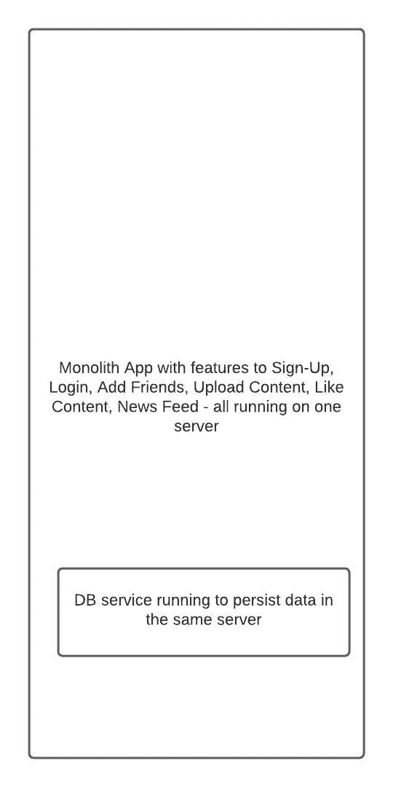

# 系统设计

> 原文：<https://linkedin.github.io/school-of-sre/level101/systems_design/intro/>

## 先决条件

常用软件系统组件的基础:

*   [Linux 基础知识](https://linkedin.github.io/school-of-sre/level101/linux_basics/intro/)
*   [Linux 联网](https://linkedin.github.io/school-of-sre/level101/linux_networking/intro/)
*   数据库 RDBMS
*   [NoSQL 概念](https://linkedin.github.io/school-of-sre/level101/databases_nosql/intro/)

## 从本课程中可以期待什么

考虑和设计大型软件系统的可伸缩性、可用性和可靠性。

## 本课程不包括哪些内容

单个软件组件的可伸缩性和可靠性问题，例如数据库，虽然可以应用相同的可伸缩性原则和思想，但这些单个组件在伸缩它们和考虑它们的可靠性时有它们自己的特定细微差别。

我们将更多地关注概念，而不是设置和配置负载平衡器等组件来实现系统的可伸缩性、可用性和可靠性

## 课程内容

*   [简介](https://linkedin.github.io/school-of-sre/level101/systems_design/intro/#backstory)
*   [可扩展性](https://linkedin.github.io/school-of-sre/level101/systems_design/scalability/)
*   [高可用性](https://linkedin.github.io/school-of-sre/level101/systems_design/availability/)
*   [容错](https://linkedin.github.io/school-of-sre/level101/systems_design/fault-tolerance/)

## 介绍

那么，你如何着手学习设计一个系统呢？

像大多数伟大的问题一样，这个问题表现出惊人的天真。我能给出的唯一简短的答案是，从本质上讲，你通过设计系统并找出什么可行，什么不可行，学会了如何设计一个系统。”Jim Waldo，Sun Microsystems，关于系统设计

由于软件和硬件系统有多个移动部分，我们需要考虑这些部分将如何增长，它们的故障模式，它们的相互依赖性，它将如何影响用户和业务。

学习或做系统设计没有一蹴而就的方法或途径，我们只有通过设计和迭代来学习设计系统。

本课程将是一个开端，使人们在系统设计过程中思考可伸缩性、可用性和容错性。

## 背景

让我们设计一个简单的内容共享应用，用户可以在我们的应用中共享他们的朋友喜欢的照片和媒体。让我们从应用的简单设计开始，并随着我们学习系统设计概念而发展它

