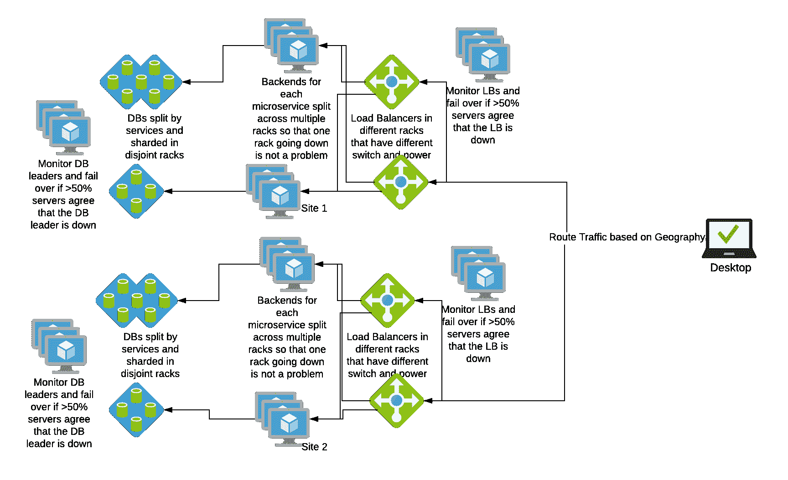

# 高可用性—可用性—常见的“9”

> 原文：<https://linkedin.github.io/school-of-sre/level101/systems_design/availability/>

可用性通常用“9”来表示，常见的“9”列举如下。

| 可用性% | 每年停机时间 | 每月停机时间 | 每周停机时间 | 每天停机时间 |
| --- | --- | --- | --- | --- |
| 99%(两个 9) | 3.65 天 | 7.31 小时 | 1.68 小时 | 14.40 分钟 |
| 99.5%(两个半九) | 1.83 天 | 3.65 小时 | 50.40 分钟 | 七点二十分钟 |
| 99.9%(三个九) | 8.77 小时 | 43.83 分钟 | 10.08 分钟 | 1.44 分钟 |
| 99.95%(三个半九) | 4.38 小时 | 21.92 分钟 | 5.04 分钟 | 43.20 秒 |
| 99.99%(四个九) | 52.60 分钟 | 4.38 分钟 | 1.01 分钟 | 8.64 秒 |
| 99.995%(四个半九) | 26.30 分钟 | 2.19 分钟 | 三十点二十四秒 | 4.32 秒 |
| 99.999%(五个九) | 5.26 分钟 | 26.30 秒 | 6.05 秒 | 864.0 毫秒 |

### 参考

*   https://en.wikipedia.org/wiki/High_availability#Percentage_calculation

## 高可用性系列组件

如果一个部件的故障导致组合变得不可操作，则带有部件的系统串联运行。

例如，如果我们架构中的 LB 失败，所有对应用层的访问都将失败。LB 和 app 层是串行连接的。

系统的综合可用性是单个部件可用性的乘积

A = Ax x Ay x …..

### 参考

*   http://www.eventhelix.com/RealtimeMantra/FaultHandling/system_reliability_availability.htm

## 高可用性并行组件

如果一个部件的故障导致另一个部件接管故障部件的操作，则具有部件的系统并行操作。

如果我们有一个以上的 LB，并且如果在一个 LB 出现故障时，其余的 LB 可以接管流量，那么 LB 是并行运行的

系统的综合可用性为

A = 1 - ( (1-Ax) x (1-Ax) x …..)

### 参考

*   http://www.eventhelix.com/RealtimeMantra/FaultHandling/system_reliability_availability.htm

## HA -核心原则

**消除单点故障(SPOF)** 这意味着为系统增加冗余，这样一个组件的故障并不意味着整个系统的故障。

**可靠的交叉**在冗余系统中，交叉点本身往往会成为单点故障。可靠的系统必须提供可靠的交叉。

**故障发生时的检测**如果遵守上述两个原则，用户可能永远也看不到故障

### 参考

*   https://en.wikipedia.org/wiki/High_availability#Principles

## 哈- SPOF

**什么:**从不实施，总是消除单点故障。

**何时使用:**在架构评审和新设计期间。

**如何使用:**在架构图上识别单个实例。争取主动/主动配置。至少我们应该有一个备用实例在活动实例失败时接管控制权。

**为什么:**通过多个实例实现可用性最大化。

**要点:**争取主动/主动解决方案，而不是主动/被动解决方案。使用负载平衡器来平衡服务实例之间的流量。对于需要单一实例的模式，使用带有主动/被动实例的控制服务。

## 高可用性可靠交叉

**内容:**确保系统组件故障转移时能够可靠地进行。

**何时使用:**在架构评审、故障建模和设计期间。

**如何使用:**确定交叉期间系统的可用性，并确保其在可接受的范围内。

**为什么:**最大化可用性并确保数据处理语义得到保留。

**关键要点:**争取主动/主动解决方案，而不是主动/被动解决方案，它们不可靠的风险更小。使用 LB 和正确的负载平衡方法来确保可靠的故障转移。建模并构建您的数据系统，以确保在交叉发生时数据得到正确处理。通常，数据库系统遵循主动/被动的写语义。主设备接受写入，当主设备停机时，从设备被提升为主设备(从被动变为主动)以接受写入。这里我们必须小心，切换永远不会引入一个以上的主设备。这个问题叫做裂脑。

## SRE 角色中的应用

1.  SRE 致力于决定一个可接受的 SLA，并确保系统可用于实现 SLA
2.  SRE 从建立数据中心开始就参与架构设计，以确保该站点不受网络交换机、硬件、电源或软件故障的影响
3.  SRE 还进行故障模拟演习，以观察系统在未知领域的表现，并在出现失误时提出改善可用性的计划。https://engineering . LinkedIn . com/blog/2017/11/resilience-engineering-at-LinkedIn-with-project-water bear

贴出我们对 HA 的理解，我们的架构图如下所示