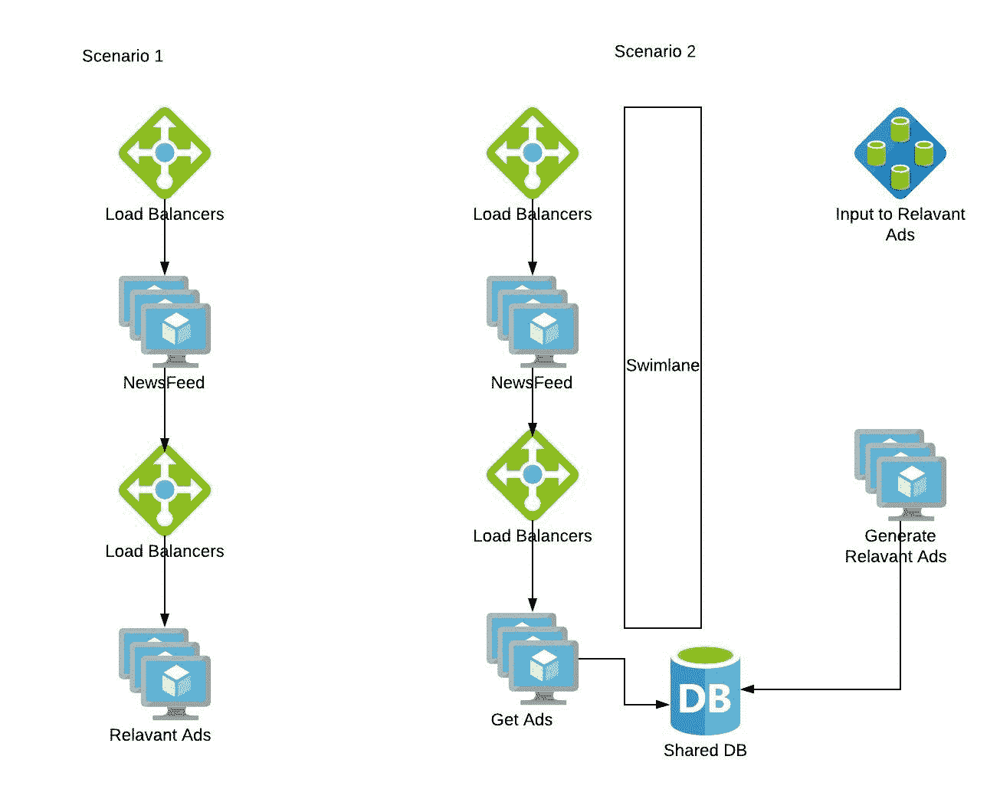
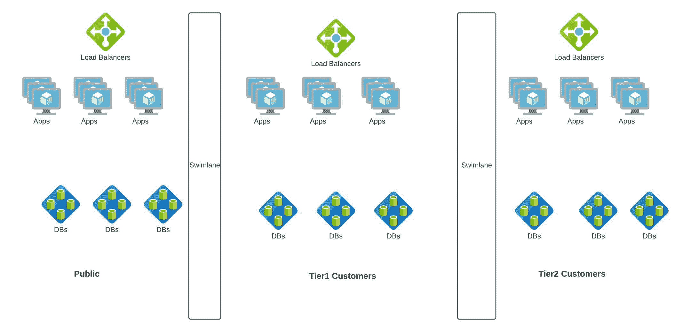

# 容错

> 原文：<https://linkedin.github.io/school-of-sre/level101/systems_design/fault-tolerance/>

在任何系统中，故障都是不可避免的，而且会一直发生，因此我们需要构建能够容忍故障或从故障中恢复的系统。

*   在系统中，失败是常态而不是例外。
*   “任何可能出错的事情都会出错”——墨菲定律
*   “复杂系统包含潜在的不断变化的故障组合”——复杂系统是如何失败的。

### 容错-故障度量

为任何系统测量和跟踪的常见故障指标。

**平均修复时间(MTTR):** 修复和恢复故障系统的平均时间。

**平均故障间隔时间(MTBF):** 一个设备故障或系统故障与下一个设备故障或系统故障之间的平均运行时间。

**平均无故障时间(MTTF):** 设备或系统在出现故障前预期运行的平均时间。

**平均检测时间(MTTD):** 从问题出现到组织检测到问题的平均时间。

**平均调查时间(MTTI):** 从发现事件到组织开始调查其原因和解决方案的平均时间。

**恢复服务的平均时间(MTRS):** 从检测到事件到受影响的系统或组件再次可供用户使用的平均时间。

**系统事件平均间隔时间(MTBSI):** 检测到两个连续事件之间的平均经过时间。MTBSI 可以通过将 MTBF 和 MTRS 相加来计算(MTBSI = MTBF + MTRS)。

**故障率:**另一个可靠性指标，衡量组件或系统发生故障的频率。它表示为单位时间内的失败次数。

#### 参考

*   https://www.splunk.com/en_us/data-insider/what-is-mean-time-to-repair.html

### 容错-故障隔离术语

系统应该有短路。比方说，在我们的内容共享系统中，如果“通知”不起作用，网站应该通过删除功能而不是关闭整个网站来优雅地处理这一故障。

泳道是常用的故障隔离方法之一。Swimlane 为该服务添加了一个来自其他服务的屏障，因此其中任何一个服务的故障都不会影响到另一个服务。假设我们在内容分享应用中推出了一项新功能“广告”。我们可以有两种架构

如果在每个新闻订阅源请求期间动态同步生成广告，则广告功能中的错误会传播到新闻订阅源功能。相反，如果我们将“广告生成”服务泳道化，并使用共享存储来填充 Newsfeed 应用，广告故障不会级联到 Newsfeed，最糟糕的情况是，如果广告不符合 SLA，我们可以拥有没有广告的 Newsfeed。

让我们再举一个例子，我们已经为我们的内容分享应用提出了一个新的模型。在这里，我们推出了一个企业内容共享应用，企业为服务付费，内容不应在企业外部共享。

### 泳道原则

**原则 1:** 什么都不分享(又称“尽量少分享”)。泳道内共享的越少，泳道的故障隔离性就越强。(如企业用例所示)

**原则 2:** 没有东西越过泳道边界。同步(通过预期请求而不是传输协议来定义)通信从不跨越泳道边界；如果有，则边界绘制不正确。(如广告特写所示)

### 泳道进场

**方法 1:** 泳道赚钱。永远不要让你的收银机受到其他系统的损害。(企业使用案例中的第 1 层与第 2 层)

**方法二:**泳道事件的最大来源。确定疼痛的重复原因并隔离它们。(如果广告功能处于黄色代码状态，游泳是最佳选择)

**方法三:**泳道天然屏障。顾客边界是很好的泳道。(公共与企业客户)

#### 参考

*   https://learning.oreilly.com/library/view/the-art-of/9780134031408/ch21.html#ch21

### SRE 角色中的应用

1.  与 DC 技术或云团队合作，通过在数据中心内创建故障区域来分布基础架构，使其不受交换机或电源故障的影响 https://docs . Microsoft . com/en-us/azure/virtual-machines/manage-avail ability # use-avail ability-zones-to-protect-from-Data Center-level-failures
2.  与合作伙伴一起工作，设计服务之间的交互，这样一个服务故障不会以级联方式扩大到所有上游