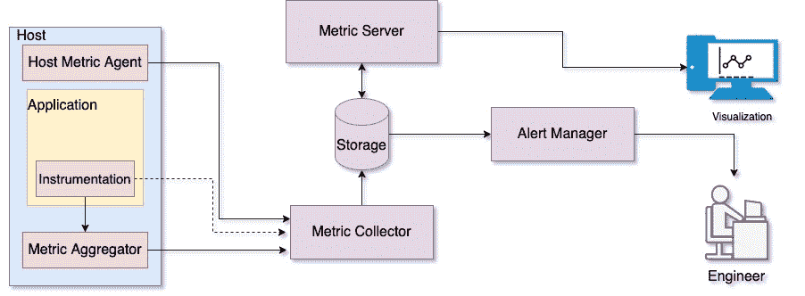

# 先决条件

> 原文：<https://linkedin.github.io/school-of-sre/level101/metrics_and_monitoring/introduction/>

## 

*   [Linux 基础知识](https://linkedin.github.io/school-of-sre/level101/linux_basics/intro/)

*   [Python 和 Web](https://linkedin.github.io/school-of-sre/level101/python_web/intro/)

*   [系统设计](https://linkedin.github.io/school-of-sre/level101/systems_design/intro/)

*   [Linux 网络基础知识](https://linkedin.github.io/school-of-sre/level101/linux_networking/intro/)

## 从本课程中可以期待什么

监控是任何系统不可或缺的一部分。作为一名 SRE，您需要对监控服务基础设施有一个基本的了解。本课程结束时，您将对以下主题有更好的理解:

*   什么是监控？

    *   需要衡量什么

    *   如何使用收集的指标来改进业务决策和整体可靠性

    *   带警报的主动监控

    *   日志处理及其重要性

*   什么是可观测性？

    *   分布式跟踪

    *   日志

    *   韵律学

## 本课程没有涵盖哪些内容

*   监控基础设施设置指南

*   深入研究不同的监控技术以及任何工具的基准测试或比较

## 课程内容

*   [简介](https://linkedin.github.io/school-of-sre/level101/metrics_and_monitoring/introduction/#introduction)

    *   [监控的四个黄金信号](https://linkedin.github.io/school-of-sre/level101/metrics_and_monitoring/introduction/#four-golden-signals-of-monitoring)

    *   [为什么监控很重要？](https://linkedin.github.io/school-of-sre/level101/metrics_and_monitoring/introduction/#why-is-monitoring-important)

*   [命令行工具](https://linkedin.github.io/school-of-sre/level101/metrics_and_monitoring/command-line_tools/)

*   [第三方监控](https://linkedin.github.io/school-of-sre/level101/metrics_and_monitoring/third-party_monitoring/)

*   [使用警报的主动监控](https://linkedin.github.io/school-of-sre/level101/metrics_and_monitoring/alerts/)

*   [监控的最佳实践](https://linkedin.github.io/school-of-sre/level101/metrics_and_monitoring/best_practices/)

*   [可观测性](https://linkedin.github.io/school-of-sre/level101/metrics_and_monitoring/observability/)

    *   [日志](https://linkedin.github.io/school-of-sre/level101/metrics_and_monitoring/observability/#logs)
    *   [追踪](https://linkedin.github.io/school-of-sre/level101/metrics_and_monitoring/bservability/#tracing)

[结论](https://linkedin.github.io/school-of-sre/level101/metrics_and_monitoring/conclusion/)

# 介绍

监控是从系统中收集实时性能指标、分析数据以获得有意义的信息，并将数据显示给用户的过程。简单地说，您定期测量各种指标以了解系统的状态，包括但不限于用户请求、延迟和错误率。*什么被测量，什么被固定* -如果你能测量什么，你就能推理它，理解它，讨论它，并自信地采取行动。

## 监控的四个黄金信号

为系统设置监控时，您需要决定测量什么。监控的四个黄金信号提供了对服务性能的良好理解，并为监控系统奠定了基础。这四个黄金信号是

*   交通

*   潜伏

*   错误

*   浸透

这些指标有助于您了解系统性能和瓶颈，并创建更好的最终用户体验。正如在[谷歌 SRE 的书](https://sre.google/sre-book/monitoring-distributed-systems/)中所讨论的，如果你只能衡量你的服务的四个指标，那么专注于这四个。让我们来看看这四个黄金信号。

*   **交通** - *交通*更好地了解服务需求。通常被称为*服务 QPS* (每秒查询数)，流量是服务所服务的请求的度量。该信号帮助您决定何时需要扩大服务规模以应对不断增长的客户需求，何时需要缩小规模以实现成本效益。

*   **延迟** - *延迟*是服务处理传入请求和发送响应所花费的时间。测量服务延迟有助于及早发现服务的缓慢下降。区分成功请求的延迟和失败请求的延迟非常重要。例如，由于失去与数据库或其他关键后端的连接而触发的 [HTTP 5XX 错误](https://developer.mozilla.org/en-US/docs/Web/HTTP/Status#server_error_responses)可能会很快得到处理。但是，因为 HTTP 500 错误表示请求失败，所以将 500 秒计入总延迟可能会导致误导性的计算。

*   **错误(速率)** - *错误*是对失败的客户端请求的度量。根据响应代码( [HTTP 5XX 错误](https://developer.mozilla.org/en-US/docs/Web/HTTP/Status#server_error_responses))可以很容易地识别这些故障。可能会出现由于错误的结果数据或违反策略而导致响应被视为错误的情况。例如，您可能得到一个 [HTTP 200](https://developer.mozilla.org/en-US/docs/Web/HTTP/Status/200) 响应，但是主体具有不完整的数据，或者响应时间超出了商定的 [SLA](https://en.wikipedia.org/wiki/Service-level_agreement) s。因此，您需要有其他机制(代码逻辑或[工具](https://en.wikipedia.org/wiki/Instrumentation_(computer_programming)))来捕获响应代码之外的错误。

*   **饱和度** - *饱和度*是服务对资源利用率的度量。这个信号告诉您服务资源的状态以及它们有多满。这些资源包括内存、计算、网络 I/O 等。甚至在资源利用率达到 100%之前，服务性能就会缓慢下降。因此，有一个利用率目标是很重要的。等待时间的增加是饱和的良好指示；测量潜伏期的第 99 百分位数有助于饱和的早期检测。

根据服务的类型，您可以用不同的方式测量这些信号。例如，您可以测量 web 服务器每秒处理的查询数。相比之下，对于数据库服务器，通过执行的事务和创建的数据库会话，您可以了解数据库服务器处理的流量。借助额外的代码逻辑(监控库和仪器)，您可以定期测量这些信号，并存储它们以供将来分析。尽管这些指标让您了解了服务端的性能，但是您还需要确保在客户端提供相同的用户体验。因此，您可能需要从服务基础设施之外监控服务，这将在第三方监控中讨论。

## 为什么监控很重要？

监控在服务的成功中起着关键的作用。如前所述，监控为理解服务健康状况提供了性能洞察。通过访问随时间收集的历史数据，您可以构建智能应用来满足特定需求。一些关键的使用案例如下:

*   **缩短解决问题的时间** -有了良好的监控基础设施，您可以快速发现问题并解决它们，从而减少问题造成的影响。

*   **业务决策** -在一段时间内收集的数据可以帮助您做出业务决策，例如确定产品发布周期、投资哪些功能以及关注哪些地理区域。基于长期数据的决策可以改善整体产品体验。

*   **资源规划** -通过分析历史数据，您可以预测服务计算资源需求，并合理分配资源。这有助于做出经济高效的决策，而不会影响最终用户体验。

在深入探讨监控之前，让我们先了解一些基本术语。

*   **指标**——指标是对特定系统属性的定测量量——例如，内存或 CPU

*   **节点或主机** -运行应用的物理服务器、虚拟机或容器

*   **QPS** - *每秒查询数*，这是一个衡量服务每秒处理的流量的指标

*   **延迟**——用户操作和服务器响应之间的时间间隔——例如，从向数据库发送查询到收到第一个响应位所花费的时间

*   **错误** **速率** -在特定时间段(通常是一秒钟)内观察到的错误数量

*   **图表** -在监控中，图表代表一段时间内收集的一个或多个指标值

*   **仪表板** -仪表板是一组图表的集合，提供系统健康状况的概述

*   **事件** -事件是指扰乱系统正常运行的事件

*   **MTTD** - *平均检测时间*是服务故障开始和检测到该故障之间的时间间隔

*   **MTTR** -平均解决时间是修复服务故障并使服务恢复正常状态所花费的时间

在讨论监控应用之前，让我们先来看看监控基础设施。下图是一个基本的监控系统。

图 1:监控基础设施的图示

图 1 显示了一个监控基础设施机制，用于在系统上聚集指标，并收集和存储数据以供显示。此外，监控基础设施包括警报子系统，用于在任何异常行为期间通知相关方。让我们看一下这些基础架构组件:

*   **主机指标代理-***主机指标代理*是运行在主机上的一个进程，它收集内存、CPU 和网络等主机子系统的性能统计数据。这些指标会定期传递给指标收集器进行存储和可视化。一些例子是 [collectd](https://collectd.org/) 、 [telegraf](https://www.influxdata.com/time-series-platform/telegraf/) 和 [metricbeat](https://www.elastic.co/beats/metricbeat) 。

*   **指标聚合器-***指标聚合器*是运行在主机上的进程。运行在主机上的应用使用[工具](https://en.wikipedia.org/wiki/Instrumentation_(computer_programming))收集服务指标。收集的指标将通过 API 发送到聚合器流程或直接发送到指标收集器(如果可用)。收到的指标会定期汇总，并成批转发给指标收集器。一个例子是 [StatsD](https://github.com/statsd/statsd) 。

*   **指标收集器-***指标收集器*进程从运行在多台主机上的指标聚合器收集所有指标。收集器负责解码并将这些数据存储在数据库中。度量收集和存储可能由一个单独的服务负责，比如我们接下来讨论的 [InfluxDB](https://www.influxdata.com/) 。一个例子是[碳守护进程](https://graphite.readthedocs.io/en/latest/carbon-daemons.html)。

*   **存储-** 时序数据库存储所有这些指标。例子有 [OpenTSDB](http://opentsdb.net/) 、 [Whisper](https://graphite.readthedocs.io/en/stable/whisper.html) 和 [InfluxDB](https://www.influxdata.com/) 。

*   **指标服务器-***指标服务器*可以像以图形方式呈现指标数据的 web 服务器一样简单。此外，度量服务器提供了聚合功能和 API，用于以编程方式获取度量数据。一些例子是 [Grafana](https://github.com/grafana/grafana) 和[石墨网](https://github.com/graphite-project/graphite-web)。

*   **警报管理器-***警报管理器*定期轮询可用的度量数据，如果检测到任何异常，就会通知您。每个警报都有一套识别此类异常的规则。如今，许多度量服务器，如 [Grafana](https://github.com/grafana/grafana) 都支持警报管理。我们将在稍后的中详细讨论报警[。例如](#proactive-monitoring-using-alerts) [Grafana](https://github.com/grafana/grafana) 和 [Icinga](https://icinga.com/) 。