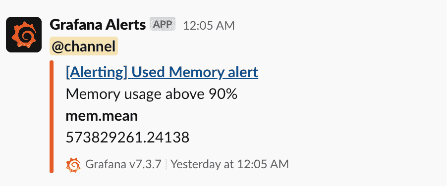

# 使用警报的主动监控

> 原文：<https://linkedin.github.io/school-of-sre/level101/metrics_and_monitoring/alerts/>

## 

前面我们讨论了从服务及其底层基础设施收集关键指标数据点的不同方法。这些数据让我们更好地了解服务的执行情况。监控的主要目标之一是尽早发现任何服务降级(减少平均检测时间)并通知利益相关方，以便避免或尽早解决问题，从而减少平均恢复时间(MTTR)。例如，如果服务的资源使用率超过 90%时通知您，您可以采取预防措施来避免由于资源短缺而导致的任何服务中断。另一方面，当服务由于某个问题而关闭时，及早发现和通知此类事件可以帮助您快速修复问题。

图 8:在松弛时间收到的警告通知

如今，大多数可用的监控服务都提供了一种机制，可以根据一个或多个指标设置警报，从而主动监控服务的健康状况。这些警报有一组已定义的规则或条件，当违反规则时，您会收到通知。这些规则可以简单到在指标值超过 n 时发出通知，也可以复杂到对一段时间内的标准偏差进行周与周(WoW)比较。监控工具会向您通知活动警报，其中大多数工具都支持即时消息(IM)平台、SMS、电子邮件或电话。图 8 显示了一个样例警报通知，当内存使用量超过主机上总 RAM 空间的 90%时，会在 Slack 上收到该通知。