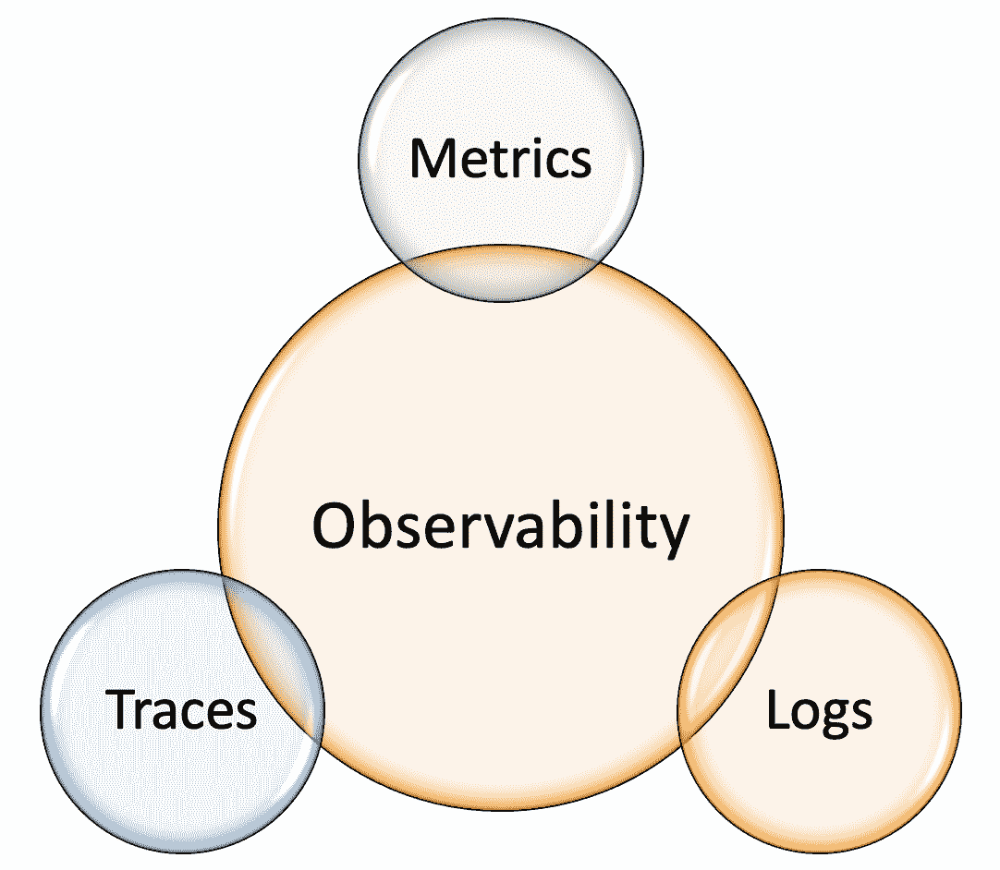
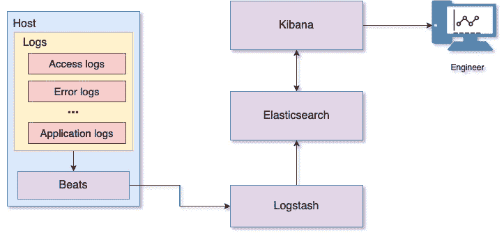
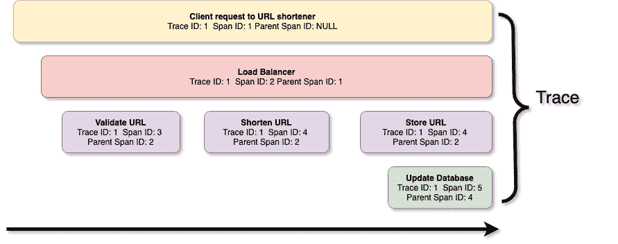
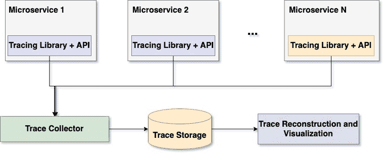

# 可观测性

> 原文：<https://linkedin.github.io/school-of-sre/level101/metrics_and_monitoring/observability/>

## 

当提到构建可靠的系统时，工程师经常使用可观测性。*可观测性*是一个源自控制理论的术语，它是一个衡量系统的内部状态可以从其外部输出的知识中推断出来的程度的指标。日常使用的服务基础设施变得越来越复杂；仅靠主动监控不足以快速解决导致应用故障的问题。通过监控，您可以防止已知的过去的故障再次发生，但是对于复杂的服务架构，许多未知的因素会导致潜在的问题。为了解决这种情况，您可以使服务变得可观测。一个可观测的系统提供了对隐含故障模式的高度精细的洞察。此外，一个可观测的系统提供了关于其内部工作的丰富背景，这开启了揭示更深层次的系统问题的能力。

监控使故障检测成为可能；可观测性有助于更好地理解系统。在工程师中，有一种普遍的误解，认为监控和可观测性是两回事。实际上，可观测性是监控的超集；也就是说，监控提高了服务的可观测性。可观测性的目标不仅是检测问题，而且是理解问题在哪里，是什么导致了问题。除了度量之外，可观测性还有两个支柱:日志和跟踪，如图 9 所示。尽管这三个组件并不能使系统 100%可观测，但它们是最重要和最强大的组件，可以让我们更好地理解系统。这些支柱中的每一个都有其缺陷，这些缺陷在[零答案的三个支柱](https://medium.com/lightstephq/three-pillars-with-zero-answers-2a98b36358b8)中有所描述。

图 9:可观测性的三个支柱

因为我们已经讨论了指标，所以让我们看看另外两个支柱(日志和跟踪)。

#### 日志

日志(通常称为*事件*)是服务在运行时执行的活动的记录，带有相应的时间戳。度量给出了关于系统降级的抽象信息，日志给出了导致这些降级的原因的详细视图。应用和基础架构组件创建的日志通过提供有关应用错误、异常和事件时间表的详细信息，有助于有效了解系统的行为。日志帮助您及时了解导致失败的事件。因此，检查日志对于排除系统故障至关重要。

日志处理包括来自单个应用的不同日志的聚合，以及随后将它们发送到中央存储。将日志移动到中央存储有助于保存日志，以防应用实例不可访问或者应用由于故障而崩溃。在中央位置提供日志后，您可以分析日志以从中获取有用的信息。出于审计和合规性目的，您可以将这些日志在中央存储上存档一段时间。日志分析器从日志行中获取有用的信息，比如请求用户信息、请求 URL(特性)、响应头(比如内容长度)和响应时间。这些信息基于这些属性进行分组，并通过可视化工具提供给您，以便快速理解。

您可能想知道这个日志信息有什么帮助。该信息给出了在所有涉及的实体上执行的活动的整体视图。例如，假设有人正在对 web 应用进行 DoS(拒绝服务)攻击。在日志处理的帮助下，您可以快速查看来自访问日志的顶级客户端 IP，并确定攻击来自何处。

同样，如果应用中的某个特性在使用特定的请求参数值访问时导致高错误率，日志分析的结果可以帮助您快速识别行为不当的参数值，并采取进一步的措施。

图 10:使用 ELK 堆栈的日志处理和分析

图 10 展示了一个使用 ELK (Elasticsearch，Logstash，Kibana)的日志处理平台，它提供了集中式的日志处理。Beats 是一个轻量级数据发送器的集合，可以通过网络发送日志、审计数据、网络数据等等。在这个用例中，我们使用 filebeat 作为日志发送器。Filebeat 监视服务日志文件，并将日志数据发送到 Logstash。Logstash 解析这些日志并转换数据，准备存储在 Elasticsearch 上。转换后的日志数据存储在 Elasticsearch 上，并编制索引以便快速检索。Kibana 搜索并显示存储在 Elasticsearch 上的日志数据。Kibana 还提供了一组可视化工具，用于图形化显示从日志数据中获得的摘要。

存储日志非常昂贵。并且服务器上每个事件的大量日志记录是昂贵的，并且占用更多的存储空间。随着服务数量的增加，这一成本会与服务数量成比例增加。

#### 描摹

到目前为止，我们已经讨论了度量和日志记录的重要性。度量给出了系统的抽象概述，日志给出了所发生事件的记录。想象一个有多个微服务的复杂分布式系统，其中一个用户请求由系统中的多个微服务处理。度量和日志记录为您提供了一些关于系统如何处理这些请求的信息，但它们无法提供所有微服务的详细信息以及它们如何影响特定的客户端请求。如果缓慢的下游微服务导致响应时间增加，您需要详细了解所有涉及的微服务，以识别此类微服务。这种需求的答案是请求跟踪机制。

跟踪是一系列跨度，其中每个跨度是由不同微服务执行以服务于客户端请求的事件的记录。简而言之，跟踪是来自不同物理机器上的各种微服务的客户端请求服务的日志。每个 span 包括 span 元数据，如跟踪 ID 和 span ID，以及上下文，其中包括有关执行的事务的信息。

图 11:URL 缩写请求的跟踪和跨度

图 11 是我们之前在学习 Python 时提到的[URL shorter](https://linkedin.github.io/school-of-sre/level101/python_web/url-shorten-app/)例子中捕获的轨迹的图形表示。

与监视类似，跟踪基础结构包含一些用于收集、存储和访问跟踪的模块。每个微服务运行一个跟踪库，该库在后台收集跟踪，创建内存中的批处理，并提交跟踪后端。跟踪后端对接收到的跟踪数据进行规范化，并将其存储在持久性存储上。追踪数据来自多个不同的微服务；因此，跟踪存储通常被组织为增量存储数据，并通过跟踪标识符进行索引。这种组织有助于跟踪数据的重建和可视化。图 12 展示了分布式系统的结构。

图 12:分布式跟踪的剖析

今天，有一组工具和框架可用于构建分布式跟踪解决方案。以下是一些流行的工具:

*   [OpenTelemetry](https://opentelemetry.io/) :云原生软件的可观测性框架

*   Jaeger :开源分布式追踪解决方案

*   Zipkin :开源分布式追踪解决方案