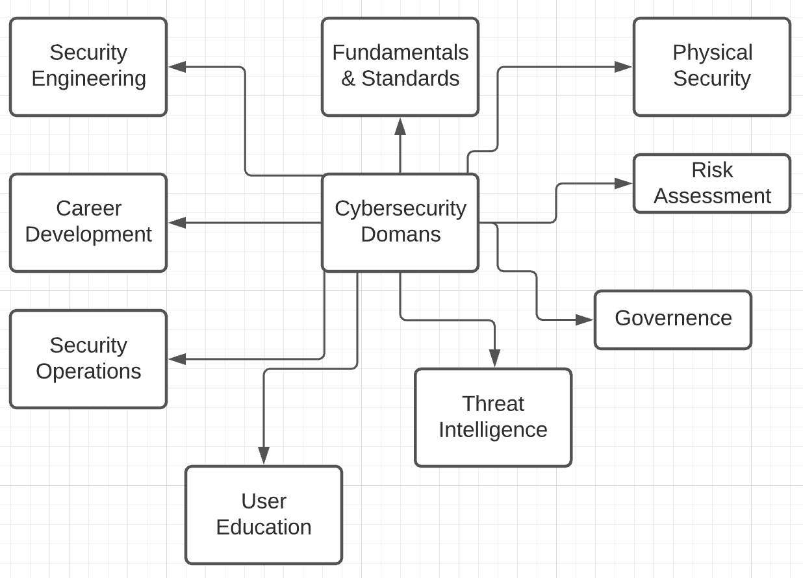
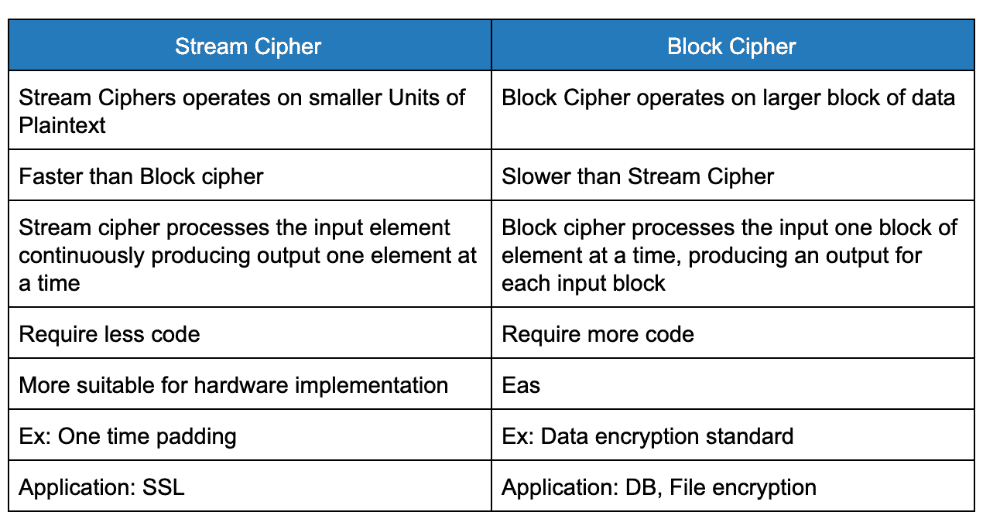
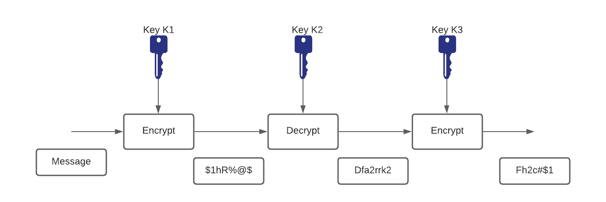
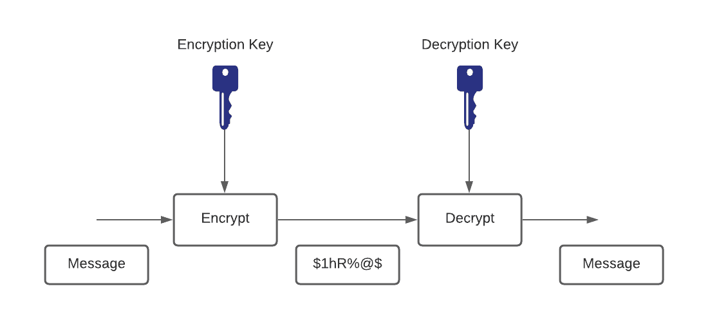
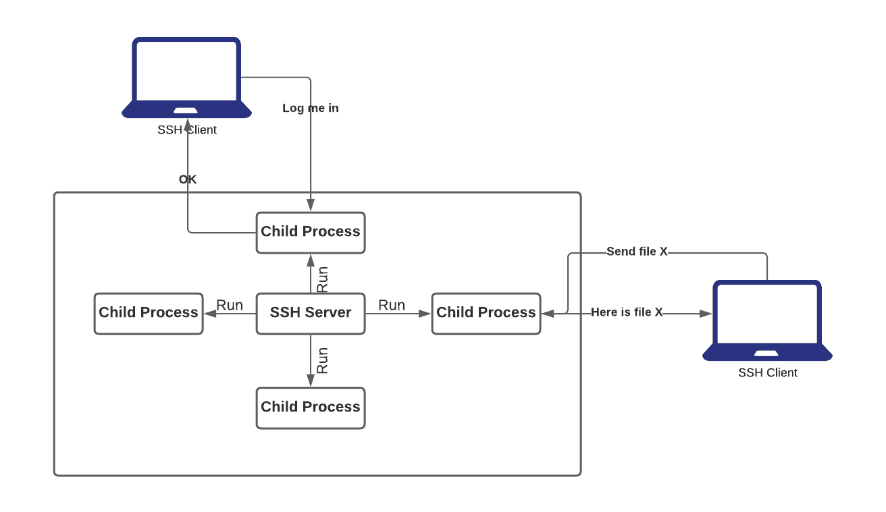
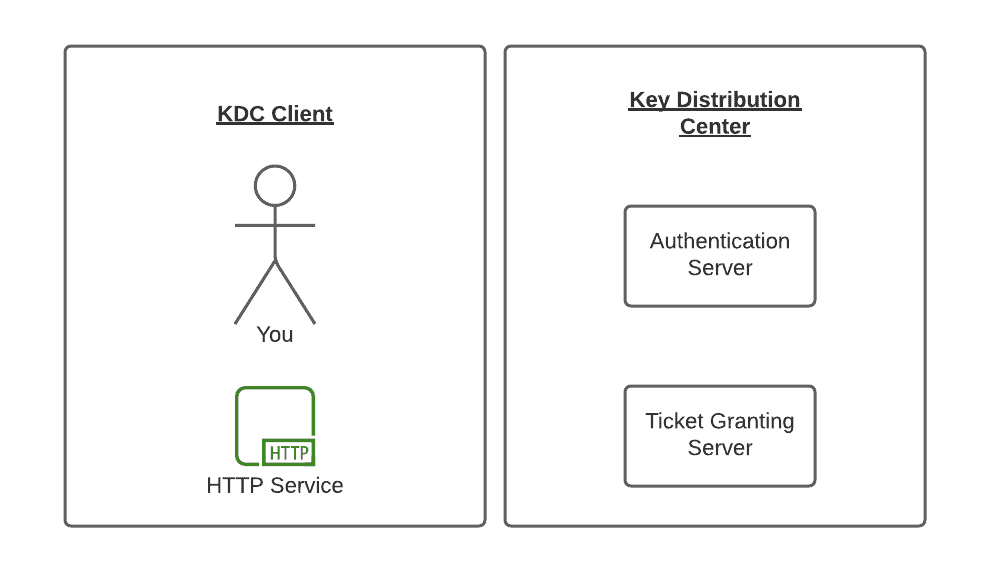
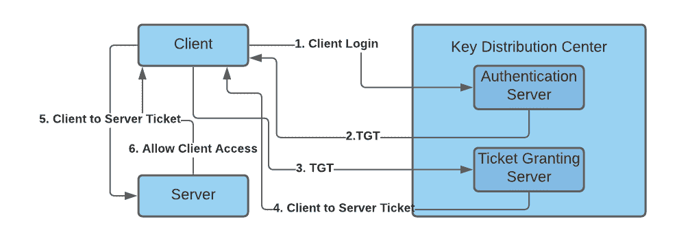
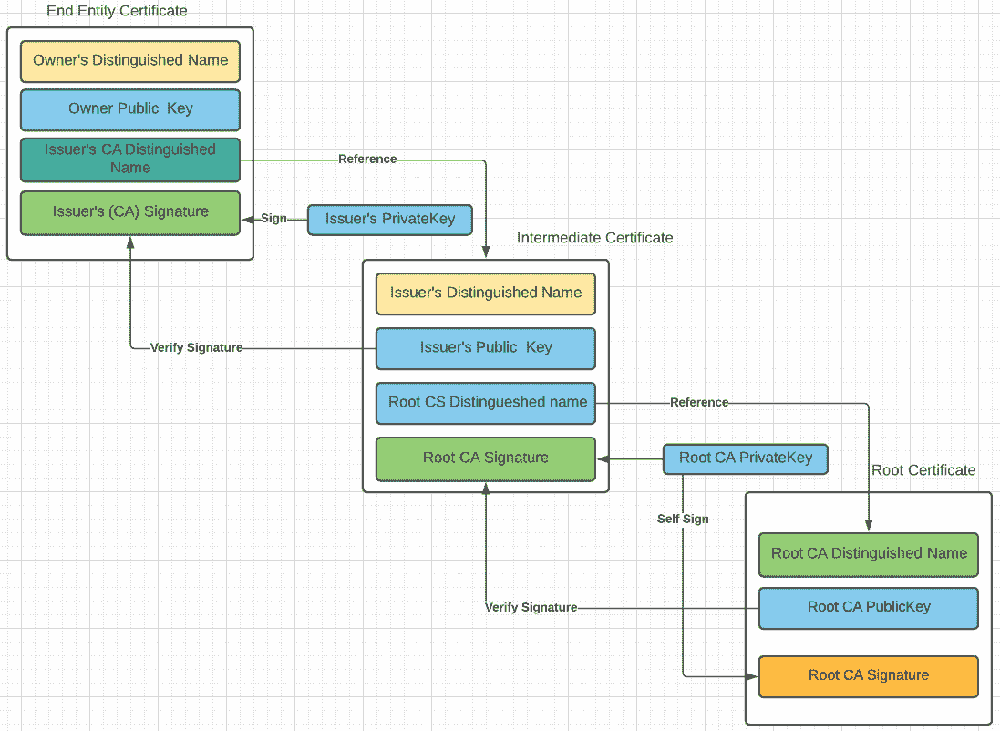

# 第一部分:基础知识

> 原文：<https://linkedin.github.io/school-of-sre/level101/security/fundamentals/>

## SRE 安全概述介绍

*   如果你仔细观察，站点可靠性工程和安全工程都与保持系统可用有关。
*   像不完整的发布、容量短缺和错误配置这样的问题会使系统不可用(至少暂时不可用)。
*   破坏用户信任的安全或隐私事件也会破坏系统的有用性。
*   因此，系统安全性应该是 SREs 最关心的问题。



*   SREs 应该参与重要的设计讨论和实际的系统变更。
*   它们在系统设计中有相当大的作用&因此有时是第一道防线。
*   SRE 帮助防止会影响基础设施整体安全性的不良设计和实施。
*   成功地设计、实现和维护系统需要对整个系统生命周期的承诺。只有当安全性和可靠性成为系统架构的核心要素时，这种承诺才有可能实现。
*   信息安全的核心支柱:
*   **保密性**–只允许用户访问被允许访问的数据
*   **完整性**–确保数据不被未授权用户篡改或更改
*   **可用性**–确保授权用户在需要时可以使用系统和数据

*   像安全工程师一样思考

*   启动新的应用程序或重构现有应用程序时，您应该考虑每个功能特性，并考虑:

    *   围绕此功能的过程是否尽可能安全？换句话说，这是一个有缺陷的过程吗？
    *   如果我是邪恶的，我会如何滥用这个特性？或者更具体地说，未能解决一个特性如何被滥用会导致设计缺陷。
    *   该功能是否需要默认开启？如果是，是否有限制或选项可以帮助降低此功能带来的风险？
*   OWASP(开放网络应用安全项目)的安全原则

*   最小化攻击表面积:
    *   添加到应用程序中的每个功能都会给整个应用程序增加一定的风险。安全开发的目的是通过减少攻击面来降低整体风险。
    *   例如，web 应用程序通过搜索功能实现在线帮助。搜索功能可能容易受到 SQL 注入攻击。如果帮助功能仅限于授权用户，攻击的可能性就会降低。如果帮助功能的搜索功能是通过集中式数据验证例程实现的，那么执行 SQL 注入的能力就会大大降低。然而，如果帮助功能被重写以消除搜索功能(例如，通过更好的用户界面)，这几乎消除了攻击表面区域，即使帮助功能在互联网上普遍可用。
*   建立安全默认值:
    *   有许多方法可以为用户提供“开箱即用”的体验。然而，默认情况下，体验应该是安全的，如果允许的话，应该由用户决定降低他们的安全性。
    *   例如，默认情况下，应该启用密码老化和复杂性。用户可能被允许关闭这两个功能，以简化他们对应用程序的使用，并增加他们的风险。
    *   路由器、物联网设备的默认密码应该更改
*   最小特权原则
    *   最小特权原则建议帐户拥有执行其业务流程所需的最小特权。这包括用户权限、资源权限(如 CPU 限制)、内存、网络和文件系统权限。
    *   例如，如果一个中间件服务器只需要访问网络、读取数据库表以及写入日志的能力，那么这就描述了应该授予的所有权限。在任何情况下都不应该授予中间件管理特权。
*   纵深防御原则
    *   深度防御原则表明，在一种控制措施合理的情况下，以不同方式应对风险的更多控制措施会更好。当深入使用控制时，可以使严重的漏洞变得非常难以利用，因此不太可能发生。
    *   对于安全编码，这可能采取基于层的验证、集中审计控制以及要求用户登录所有页面的形式。
    *   例如，如果一个有缺陷的管理界面能够正确地控制对生产管理网络的访问、检查管理用户授权并记录所有访问，那么它就不太可能容易受到匿名攻击。
*   安全失败

    *   由于多种原因，应用程序经常无法处理事务。它们如何失败可以决定应用程序是否安全。

    ```sh

    is _ admin = true 请尝试{ code _ which _ may _ faile()；is _ admin = is _ user _ assigned _ role(" Adminstrator ")；} catch(Exception err){ log . error(err . tostring())；}

    ` ` `-如果 codeWhichMayFail()或 isUserInRole 失败或抛出异常，默认情况下，用户是管理员。这显然是一个安全隐患。

*   不要相信服务

    *   许多组织利用第三方合作伙伴的处理能力，这些合作伙伴很可能具有与您不同的安全策略和状态。你不太可能影响或控制任何外部第三方，无论他们是家庭用户还是主要供应商或合作伙伴。
    *   因此，对外部运行系统的隐式信任是没有保证的。所有外部系统都应该被类似地对待。
    *   例如，忠诚计划提供商提供网上银行使用的数据，提供奖励点数和潜在兑换项目的小列表。但是，应该检查数据，以确保向最终用户显示是安全的，并且奖励积分是正数，而不是不可能的大。
*   职责分离
    *   欺诈控制的关键是职责分离。例如，请求计算机的人不能签收，也不应该直接收到计算机。这防止了用户请求许多计算机并声称它们从未到达。
    *   某些角色具有不同于普通用户的信任级别。特别是管理员不同于普通用户。通常，管理员不应该是应用程序的用户。
    *   例如，管理员应该能够打开或关闭系统，设置密码策略，但不应该能够作为超级特权用户登录店面，例如能够代表其他用户“购买”商品。
*   通过模糊来避免安全
    *   通过模糊实现的安全性是一种弱的安全控制，当它是唯一的控制时，几乎总是失败。这并不是说保守秘密是个坏主意，它只是意味着系统的安全性不应该依赖于隐藏细节。
    *   例如，应用程序的安全性不应该依赖于对保密源代码的了解。安全性应依赖于许多其他因素，包括合理的密码策略、纵深防御、业务交易限制、稳固的网络架构、欺诈和审计控制。
    *   一个实际的例子是 Linux。Linux 的源代码随处可得，但是如果保护得当，Linux 是一个安全且健壮的操作系统。
*   保持简单的安全性
    *   攻击表面积和简单性是相辅相成的。某些软件工程实践更喜欢过于复杂的方法，而不是相对简单明了的设计。
    *   当更简单的方法会更快更简单时，开发人员应该避免使用双重否定和复杂的架构。
    *   例如，尽管在一个单独的中间件服务器上运行大量的单例实体 beans 可能很流行，但是简单地使用带有适当互斥机制的全局变量来防止竞争情况会更安全、更快。
*   正确修复安全问题
    *   一旦确定了安全问题，就必须对其进行测试，并了解问题的根本原因。当使用设计模式时，安全问题可能在所有代码库中普遍存在，因此开发正确的修复方法而不引入回归是至关重要的。
    *   例如，一个用户发现他们可以通过调整他们的 cookie 来查看另一个用户的余额。修复看起来相对简单，但是由于 cookie 处理代码是在所有应用程序之间共享的，所以对一个应用程序的更改会渗透到所有其他应用程序。因此，必须在所有受影响的应用程序上测试该修复程序。
*   可靠性和安全性
    *   可靠性和安全性都是真正可信的系统的重要组成部分，但是构建既可靠又安全的系统是很困难的。虽然对可靠性和安全性的要求有许多共同的属性，但它们也需要不同的设计考虑。人们很容易忽略可靠性和安全性之间微妙的相互作用，这可能会导致意想不到的结果
    *   例如:密码管理应用程序故障是由可靠性问题触发的，即负载平衡和减载策略不佳，其恢复后来因多种措施而变得复杂(HSM 机制需要插入服务器机架，作为一种身份验证& HSM 令牌应该锁在箱子里..&问题可以进一步拉长)设计来增加系统的安全性。

* * *

## 身份验证与授权

*   **认证**是验证用户就是他们所声称的那个人的行为。密码是最常见的身份验证因素，如果用户输入正确的密码，系统会认为身份有效并授予访问权限。
*   其他技术，如一次性 pin 码、认证应用程序，甚至生物识别技术也可以用于身份认证。在某些情况下，系统要求在授予访问权限之前成功验证多个因素。这种多因素身份验证(MFA)要求通常用于提高安全性，而不仅仅是密码。
*   **系统安全中的授权**是给予用户访问特定资源或功能的许可的过程。该术语通常与访问控制或客户端权限互换使用。授予某人在服务器上下载特定文件的权限，或者为单个用户提供对应用程序的管理访问权限都是很好的例子。在安全环境中，授权必须总是在身份验证之后，用户应该首先证明他们的身份是真实的，然后组织的管理员才能授予他们访问所请求的资源的权限。

### 通用认证流程(本地认证)

*   用户使用用户名/电子邮件/手机等标识符进行注册
*   应用程序将用户凭据存储在数据库中
*   应用程序发送验证电子邮件/消息来验证注册
*   注册成功后，用户输入登录凭证
*   身份验证成功后，用户就可以访问特定的资源

### OpenID/OAuth

***OpenID*** 是一种认证协议，允许我们在不使用本地认证系统的情况下认证用户。在这种情况下，用户必须向 OpenID 提供者注册，并且同一个提供者应该与您的应用程序的身份验证流集成在一起。为了验证细节，我们必须将身份验证请求转发给提供者。身份验证成功后，我们会收到一条成功消息和/或配置文件详细信息，我们可以使用这些信息执行必要的流程。

***OAuth*** 是一种授权机制，允许你的应用用户访问某个提供商(Gmail/脸书/Instagram/etc)。成功响应后，我们(您的应用程序)会收到一个令牌，应用程序可以用它来代表用户访问某些 API。如果您的业务用例需要某些面向用户的 API，比如访问 Google Drive 或代表您发送 tweets，那么 OAuth 非常方便。大多数 OAuth 2.0 提供者可以用于伪认证。话虽如此，如果您在本地身份验证系统之上使用多个 OAuth 提供者来验证用户，事情会变得相当复杂。

* * *

## 密码系统

*   它是一门隐藏任何文本的科学和研究，只有预定的接收者或授权的人才能阅读它，任何文本甚至可以使用诸如隐形墨水或过去的机械密码术机器之类的东西。

*   密码术对于保护关键或专有信息是必要的，并且用于通过将一些明文转换成密文来对私人数据消息进行编码。其核心是，有两种方法可以做到这一点，更先进的方法都是建立在。

### 密码

*   密码是密码学的基石。密码是对消息执行加密或解密的一组算法。加密算法(E)采用密钥(k)和消息(m)并产生密文(c)。类似地，解密算法(D)采用秘密密钥(K)和先前产生的密文(C)。它们表示如下:

```
 E(k,m) = c
D(k,c) = m 
```sh

*   这也意味着要成为一个密码，它必须满足如下的一致性等式，这样才有可能解密。

```
 D(k,E(k,m)) = m 
```

流密码:

*   消息被分成字符或比特，并用与明文比特流一样长的密钥或密钥流(应该是随机的并且独立于消息流生成)进行加密。
*   如果密钥流是随机的，这个方案将是不可破解的，除非密钥流被获取，使得它是无条件安全的。密钥流必须以安全的方式提供给双方以防止其泄露。

分组密码:

*   块密码—处理块中的消息，然后对每个块进行加密或解密。
*   分组密码是一种对称密码，其中明文块被视为一个整体，并用于生成密文块。块密码采用 b 位长的块，并将它们加密成 b 位长的块。块大小通常为 64 或 128 位长。

     

加密

*   **密钥(对称密钥)**:同一密钥用于加密和解密
*   **公钥(非对称密钥)**在非对称中，加密密钥和解密密钥不同但相关。加密密钥称为公钥，解密密钥称为私钥。公钥和私钥被称为密钥对。

对称密钥加密

是吗

*   数据加密标准(DES)长期以来一直是世界范围的加密标准。IBM 在 1975 年开发了 DES，它在多年的密码分析中表现出色。DES 是一种对称加密算法，密钥长度固定为 56 位。算法还是不错的，但是因为密钥长度短，容易受到资源充足的蛮力攻击。

*   DES 通常以块模式工作，以 64 位块加密数据。加密和解密使用相同的算法和密钥。

*   因为 DES 是基于简单的数学函数，所以很容易在硬件中实现和加速。

三重 DES

*   随着计算机处理能力的提高，最初的 56 位 DES 密钥变得太短，以至于无法抵御预算有限的攻击者。增加 DES 的有效密钥长度而不改变经过充分分析的算法本身的一种方法是连续几次使用不同密钥的相同算法。

*   将 DES 连续三次应用到纯文本块的技术称为三重 DES (3DES)。3DES 技术如图所示。今天，对 3DES 的暴力攻击被认为是不可行的。因为基本算法已经在现场测试了超过 25 年，所以被认为比它的前辈更值得信赖。

俄歇电子能谱

*   2000 年 10 月 2 日，美国国家标准和技术研究所(NIST)宣布选择 Rijndael 密码作为 AES 算法。琼·代蒙和文森特·里门开发的这种密码具有可变的分组长度和密钥长度。该算法目前规定了如何使用长度为 128、192 或 256 位的密钥来加密长度为 128、192 或 256 位的块(密钥长度和块长度的所有九种组合都是可能的)。块和密钥长度都可以轻松扩展到 32 位的倍数。

*   之所以选择 AES 来取代 DES 和 3DES，是因为它们要么太弱(DES，就密钥长度而言)，要么太慢(3DES)，无法在现代高效的硬件上运行。在相同的硬件上，AES 的效率更高，速度更快，通常是 DES 的 5 倍。AES 也更适合高吞吐量，尤其是在使用纯软件加密的情况下。然而，AES 是一个相对年轻的算法，正如密码学的黄金法则所说，“一个更成熟的算法总是更受信任。”

非对称密钥算法



*   在对称密钥系统中，Alice 首先将秘密消息放入一个盒子中，然后使用她有钥匙的锁将盒子挂锁。然后她通过普通邮件把盒子寄给鲍勃。当 Bob 收到盒子时，他使用 Alice 的密钥(他先前已经获得)的相同副本来打开盒子并阅读消息。

*   在非对称密钥系统中，Bob 不是在收到盒子时打开它，而是简单地将他自己的个人锁添加到盒子中，并通过公共邮件将盒子返回给 Alice。爱丽丝用她的钥匙打开锁，把盒子还给鲍勃，鲍勃的锁还在。最后，鲍勃用他的钥匙打开了锁，并阅读了爱丽丝发来的信息。

*   非对称系统的关键优势在于 Alice 从不需要向 Bob 发送其密钥的副本。这降低了第三方(例如，不道德的邮局主管)在密钥传输给 Bob 的过程中复制密钥的可能性，从而允许第三方监视 Alice 将来发送的所有消息。此外，如果 Bob 粗心大意，允许其他人复制他的密钥，Alice 给 Bob 的消息就会泄露，但是 Alice 给其他人的消息仍然是保密的

**注**:在 TLS 密钥交换方面，这是常见的做法。

迪菲-赫尔曼

*   该协议有两个系统参数 p 和 g，它们都是公开的，可以被任何人使用。参数 p 是一个素数，参数 g(通常称为生成元)是一个小于 p 的整数，但具有以下性质:对于 1 到 p–1 之间的每个数 n，都有一个 g 的幂 k，使得 n = gk mod p。
*   Diffie Hellman 算法是一种非对称算法，用于为对称密钥算法建立共享机密。现在大多数人使用混合密码系统，即对称和非对称加密的组合。非对称加密被用作密钥交换机制中的一种技术来共享秘密密钥，并且在发送方和接收方之间共享密钥之后，通信将使用对称加密来进行。共享密钥将用于加密通信。
*   参考:[https://medium . com/@ akhigbemanuel/what-is-the-diffie-hellman-key-exchange-algorithm-84d 60025 a30d](https://medium.com/@akhigbemmanuel/what-is-the-diffie-hellman-key-exchange-algorithm-84d60025a30d)

南非共和国(Republic of South Africa)

*   RSA 算法非常灵活，具有可变的密钥长度，如果需要，可以用速度换取算法的安全级别。RSA 密钥通常是 512 到 2048 位长。RSA 经受住了多年的广泛密码分析。虽然那些年既没有证明也没有否定 RSA 的安全性，但它们证明了该算法的可信度。RSA 安全性基于分解非常大的数字的困难性。如果发现了分解这些大数的简单方法，RSA 的有效性将被破坏。
*   参考:[https://medium . com/curiositypapers/a-complete-explain-of-RSA-asymmetric-encryption-742 c 5971 e0f](https://medium.com/curiositypapers/a-complete-explanation-of-rsa-asymmetric-encryption-742c5971e0f)

    **注意** : RSA 密钥可以像 Diffie Hellman 一样用于密钥交换

哈希算法

*   哈希是用于保证数据完整性的机制之一。哈希基于单向数学函数，相对容易计算，但很难逆转。

*   哈希函数，是一种单向函数，用于输入数据以生成输出数据的固定长度摘要(指纹)。摘要在加密上是强的；也就是说，不可能从摘要中恢复输入数据。如果输入数据变化很小，摘要(指纹)就会发生很大的变化，这就是所谓的雪崩效应。

*   更多:

*   [https://medium . com/@ Raul Jordan/the-state-of-hashing-algorithms-the-why-the-how-and-the-future-b21 D5 c 0440 de](https://medium.com/@rauljordan/the-state-of-hashing-algorithms-the-why-the-how-and-the-future-b21d5c0440de)
*   [https://medium . com/@ Stevie cellis/the-beautiful-hash-algorithm-f18d 9 D2 b 84 FB](https://medium.com/@StevieCEllis/the-beautiful-hash-algorithm-f18d9d2b84fb)

讯息摘要 5

*   MD5 是一种单向函数，利用它可以很容易地从给定的输入数据中计算出散列值，但是如果只给定一个散列值，则计算输入数据是不可行的。

SHA-1

*   MD5 被认为不如 SHA-1 安全，因为 MD5 有一些弱点。
*   HA-1 还使用更强的 160 位摘要，这使得 MD5 成为散列方法的第二选择。
*   该算法接收长度小于 264 位的消息，并生成 160 位的消息摘要。该算法比 MD5 稍慢。

**注意** : SHA-1 最近也被证明是被打破的，目前的最低建议是 SHA-256

数字证书

*   数字签名提供了一种对设备和个人用户进行数字身份验证的方法。在诸如 RSA 加密系统之类的公钥加密系统中，每个用户都有一个包含公钥和私钥的密钥对。密钥作为补充，用其中一个密钥加密的任何东西都可以用另一个密钥解密。简单地说，当数据用用户的私钥加密时，就形成了签名。接收者通过用发送者的公钥解密消息来验证签名。

*   密钥管理通常被认为是设计和实现加密系统中最困难的任务。企业可以通过使用公钥基础设施(PKI)来简化安全数据通信中遇到的一些部署和管理问题。因为公司经常通过 Internet 移动安全敏感的通信，所以必须实施有效的机制来保护敏感信息免受 Internet 上的威胁。

*   PKI 为管理数字安全属性提供了一个分层框架。每个 PKI 参与者都持有由 CA(公共或私人)颁发的数字证书。证书包含几个在各方协商安全连接时使用的属性。这些属性必须包括证书有效期、终端主机身份信息、将用于安全通信的加密密钥以及颁发 CA 的签名。根据 PKI 的要求和能力，可以包括可选的属性。

*   CA 可以是受信任的第三方，如 VeriSign 或 Entrust，也可以是您在组织内建立的私有(内部)CA。
*   可以使用发送者的公钥解密消息的事实意味着私钥的持有者创建了消息。这个过程依赖于接收方拥有发送方公钥的副本，并且非常确定地知道它确实属于发送方，而不是某个冒充发送方的人。
*   为了验证 CA 的签名，接收者必须知道 CA 的公钥。通常，这是在带外处理的，或者通过在证书安装期间执行的操作来处理。例如，默认情况下，大多数 web 浏览器都配置了几个 ca 的根证书。

CA 注册过程

1.  终端主机生成一个私钥-公钥对。
2.  终端主机生成一个证书请求，并将其转发给 CA。
3.  需要人工干预来批准注册请求，注册请求由 CA 接收。
4.  CA 操作员批准请求后，CA 用其私钥签署证书请求，并将完成的证书返回给终端主机。
5.  终端主机将证书写入非易失性存储区域(PC 硬盘或 Cisco 路由器上的 NVRAM)。

**参见**:[https://www . ssh . com/manuals/server-zos-product/55/ch 06s 03s 01 . html](https://www.ssh.com/manuals/server-zos-product/55/ch06s03s01.html)

## 登录安全性

### 嘘

*   安全 Shell SSH 是一种流行的、强大的、基于软件的网络安全方法。
*   每当计算机向网络发送数据时，SSH 会自动加密(加密)数据。然后，当数据到达预期的接收者时，SSH 会自动解密(解码)它。
*   结果是透明加密:用户可以正常工作，不知道他们的通信在网络上被安全加密。此外，SSH 可以使用基于其配置方式的现代安全加密算法，并且在大公司的任务关键型应用程序中非常有效。
*   SSH 有一个客户机/服务器架构
*   SSH 服务器程序通常由系统管理员安装和运行，接受或拒绝到其主机的传入连接。然后，用户通常在其他计算机上运行 SSH 客户端程序，向 SSH 服务器发出请求，例如“请让我登录”、“请给我发送一个文件”或“请执行这个命令”客户端和服务器之间的所有通信都经过安全加密，不会被修改。



SSH 不是什么:

*   尽管 SSH 代表安全 shell，但它并不是 Unix Bourne shell 和 C shell 意义上的真正 Shell。它不是命令解释器，也不提供通配符扩展、命令历史等等。相反，SSH 创建了一个在远程计算机上运行 shell 的通道，在两个系统之间进行端到端的加密。

SSH 协议的主要特性和保证是:

*   通过高度加密保护您的数据隐私
*   通信的完整性，保证它们没有被改变
*   认证，即发送者和接收者的身份证明
*   授权，即账户的访问控制
*   转发或隧道来加密其他基于 TCP/IP 的会话

### 麻省理工学院开发的安全认证系统

*   根据希腊神话，Kerberos (Cerberus)是一种巨大的三头狗，它守卫着冥界的大门，防止死者离开。
*   因此，当谈到计算机科学时，Kerberos 是一种网络身份验证协议，并且是当前 Microsoft Active Directory 使用的默认身份验证技术，用于在局域网内对用户的服务进行身份验证。

*   Kerberos 使用对称密钥加密，并需要可信的第三方身份验证服务来验证用户身份。因此，他们将 Kerberos 的名称用于他们的计算机网络身份验证协议，因为 Kerberos 的三个头代表:

*   客户端:用户/服务
*   服务器:受 Kerberos 保护的主机驻留在

     -密钥分发中心(KDC)，充当可信的第三方认证服务。

KDC 包括以下两台服务器:

*   身份验证服务器(AS ),执行初始身份验证并为用户颁发票证授予票证(TGT)。
*   票证授予服务器(TGS)，它根据初始票证授予票证(TGT)颁发服务票证。

    

### 证书链

OpenSSL 命令输出的第一部分显示了编号为 0、1 和 2(不再是 2)的三个证书。每个证书都有一个主题 s 和一个颁发者 I。第一个证书编号为 0，称为终端实体证书。主题行告诉我们它对 google.com 的任何子域都有效，因为它的主题被设置为*.google.com

`$ openssl s_client -connect www.google.com:443 -CApath /etc/ssl/certs CONNECTED(00000005) depth=2 OU = GlobalSign Root CA - R2, O = GlobalSign, CN = GlobalSign verify return:1 depth=1 C = US, O = Google Trust Services, CN = GTS CA 1O1 verify return:1 depth=0 C = US, ST = California, L = Mountain View, O = Google LLC, CN = www.google.com verify return:1``--- Certificate chain 0 s:/C=US/ST=California/L=Mountain View/O=Google LLC/CN=www.google.com i:/C=US/O=Google Trust Services/CN=GTS CA 1O1 1 s:/C=US/O=Google Trust Services/CN=GTS CA 1O1 i:/OU=GlobalSign Root CA - R2/O=GlobalSign/CN=GlobalSign ---`T2】

*   issuer 行表明它是由 Google Internet Authority G2 发布的，这也是第二个证书(编号 1)的主题
*   OpenSSL 命令行在这里没有显示的是信任存储，它包含运行 OpenSSL 的系统所信任的 CA 证书列表。
*   GlobalSign Authority 的公共证书必须存在于系统的信任存储中，才能关闭验证链。这被称为信任链，下图概括了它的高层次行为。

    

*   应用于验证网站真实性的信任链概念的高级视图。Firefox 信任存储中的根 CA 提供初始信任来验证整个链并信任终端实体证书。

### TLS 握手

1.  客户端向服务器发送一条 HELLO 消息，其中包含它支持的协议和算法列表。
2.  服务器回应你好并发送它的证书链。基于客户端的能力，服务器选择一个密码套件。
3.  如果密码套件支持临时密钥交换，如 ECDHE(ECDHE 是一种被称为椭圆曲线 Diffie-Hellman 交换的算法)，服务器和客户端将使用 Diffie-Hellman 算法协商预主密钥。预主密钥从不通过网络发送。
4.  客户端和服务器创建一个会话密钥，用于加密通过连接传输的数据。

握手结束时，双方都拥有一个秘密的会话密钥，用于为连接的其余部分加密数据。这就是 OpenSSL 所说的万能钥匙

**注**

*   TLS 有 3 个版本，TLS 1.0、1.1 和 1.2
*   TLS 1.0 发布于 1999 年，是一个有近 20 年历史的协议。众所周知，它容易受到攻击，如 BEAST 和 POODLE，多年来，除了支持薄弱的加密技术，不能保持现代连接足够安全。
*   TLS 1.1 是被遗忘的“老二”。和它的弟弟一样，它也有糟糕的加密技术。在大多数软件中，它被 TLS 1.2 所超越，很少看到 TLS 1.1 被使用。

### “完美”前向保密

*   密钥交换中的术语“短暂的”提供了一个重要的安全特征，它被错误地命名为完美前向保密(PFS)或简称为“前向保密”。
*   在非临时密钥交换中，客户端通过使用服务器的公钥对预主密钥进行加密，将其发送给服务器。然后，服务器用其私钥解密预主密钥。如果在稍后的某个时间点，服务器的私钥被泄露，攻击者可以回到这个握手，解密预主密钥，获得会话密钥，并解密整个流量。非短暂的密钥交换容易受到将来可能发生在记录的流量上的攻击。因为人们很少改变他们的密码，解密过去的数据对攻击者来说仍然是有价值的。
*   像 DHE 或它在椭圆曲线上的变体 ECDHE 这样的短暂密钥交换通过不在网络上传输预主密钥来解决这个问题。相反，预主密钥是由客户端和服务器使用公开交换的非敏感信息单独计算的。因为预主密钥以后不能被攻击者解密，所以会话密钥不会受到将来的攻击:因此，术语“完美前向保密”是安全的。
*   沿着流每隔 X 个块改变一次密钥。这就防止了攻击者简单地嗅探数据流并使用暴力破解整个系统。“前向保密”意味着仅仅因为我可以解密块 M，并不意味着我可以解密块 Q
*   缺点:
*   PFS 的缺点是所有这些额外的计算步骤会导致握手延迟，降低用户速度。为了避免在每次连接时重复这项昂贵的工作，双方都通过一种称为会话恢复的技术缓存会话密钥以备将来使用。这就是 session-ID 和 TLS 票证的用途:它们允许共享一个会话 ID 的客户机和服务器跳过会话密钥的协商，因为它们之前已经同意了一个会话密钥，并直接安全地交换数据。