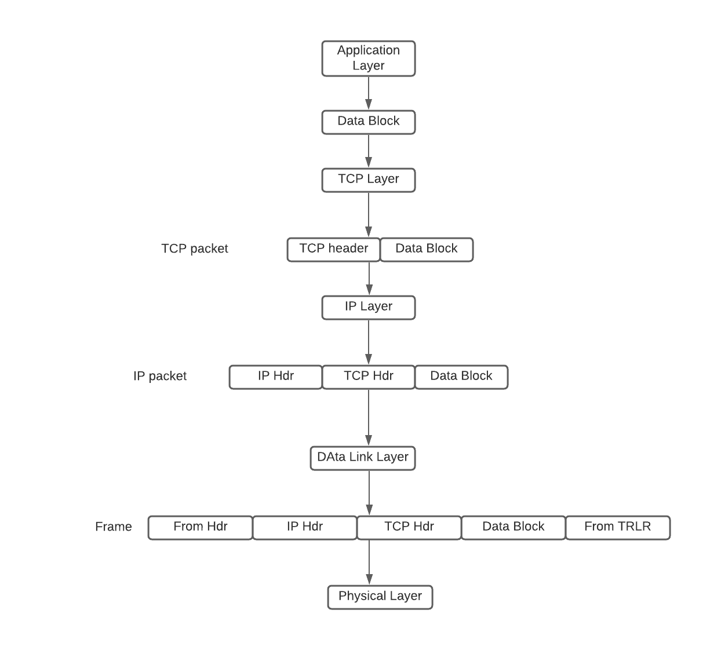
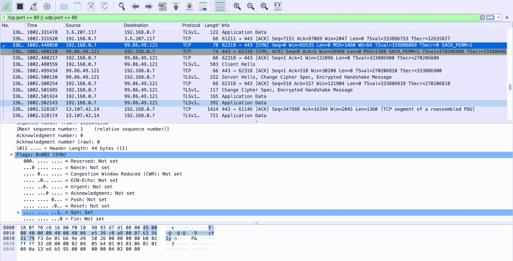
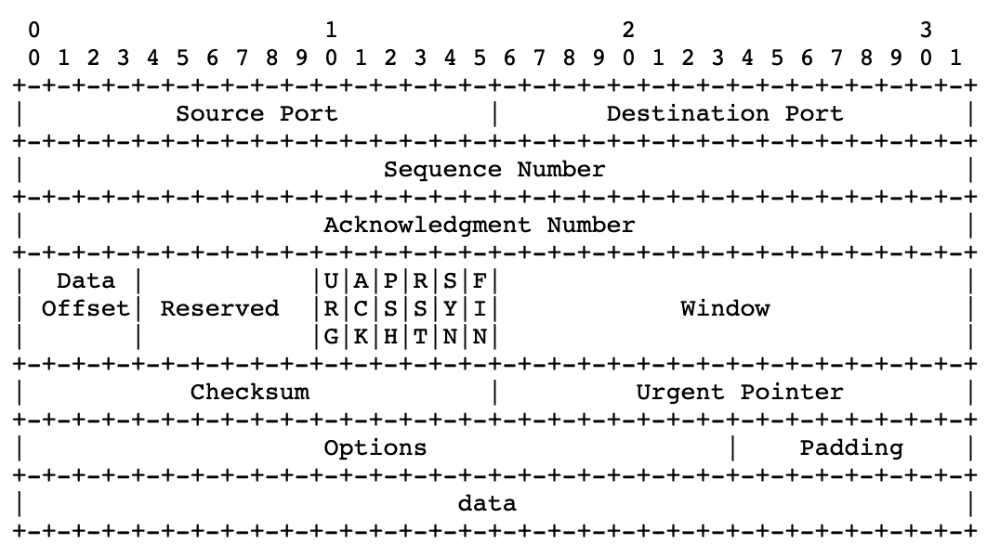
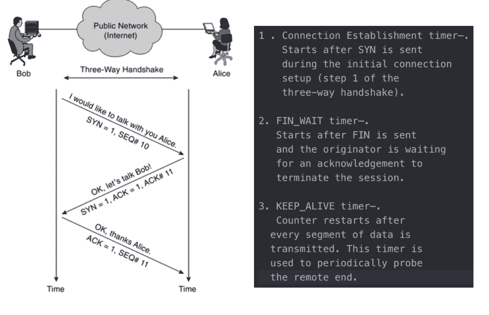

# 第二部分:网络安全

> 原文：<https://linkedin.github.io/school-of-sre/level101/security/network_security/>

## 介绍

*   TCP/IP 是当今占主导地位的网络技术。它是一个五层架构。这些层从上到下依次是应用层、传输层(TCP)、网络层(IP)、数据链路层和物理层。除了 TCP/IP，还有其他网络技术。为了方便起见，我们使用 OSI 网络模型来表示非 TCP/IP 网络技术。不同的网络通过网关相互连接。网关可以放在任何一层。
*   OSI 模型是一个七层体系结构。OSI 体系结构类似于 TCP/IP 体系结构，只是 OSI 模型在 TCP/IP 体系结构的应用层和传输层之间指定了两个附加层。这两层是表示层和会话层。图 5.1 显示了 TCP/IP 层和 OSI 层之间的关系。TCP/IP 中的应用层对应于 OSI 中的应用层和表示层。TCP/IP 中的传输层对应于 OSI 中的会话层和传输层。TCP/IP 体系结构中的其余三层与 OSI 模型中的其余三层一一对应。

    TCP/IP 体系结构和 OSI 模型各层之间的对应关系。还示出了网络层中加密算法的布局，其中虚线箭头表示加密算法的实际通信

OSI 各层的功能简述如下:

1.  应用层是应用和网络程序之间的接口。它支持应用和最终用户处理。常见的应用层程序包括远程登录、文件传输、电子邮件和 Web 浏览。
2.  表示层负责处理不同形式的数据。该协议层允许位于具有不同平台的通信信道的不同端的应用层程序理解彼此的数据格式，而不管它们是如何呈现的。
3.  会话层负责创建、管理和关闭通信连接。
4.  传输层负责提供可靠的连接，如数据包排序、流量控制和拥塞控制。
5.  网络层负责将与设备无关的数据包从当前跳路由到下一跳。
6.  数据链路层负责将设备无关的数据包封装到设备相关的数据帧中。它有两个子层:逻辑链路控制和媒体访问控制。
7.  物理层负责通过某些物理介质传输设备相关的帧。

8.  从应用层开始，应用生成的数据逐层传递到物理层。来自前一层的数据被包含在当前层的新信封中，其中来自前一层的数据也只是包含来自前一层的数据的信封。这类似于将一个较小的信封装入一个较大的信封。每层添加的信封包含足够的信息来处理数据包。应用层数据被分成足够小的块，以便在下一层封装在信封中。

9.  根据以下基本步骤，应用数据块在 TCP/IP 体系结构中被“修饰”。在发送端，当应用数据块被向下传递到 TCP 层时，它被封装在 TCP 数据包中。换句话说，TCP 数据包由报头和有效载荷组成，其中报头对应于 TCP 信封，有效载荷是应用数据块。同样，当 TCP 数据包被向下传递到 IP 层时，它将被封装在 IP 数据包中。IP 数据包由报头和有效载荷组成，有效载荷是从 TCP 层向下传递的 TCP 数据包。当 IP 分组被向下传递到数据链路层时，它将被封装在设备相关的帧(例如，以太网帧)中。一帧有一个帧头，也可能有一个帧尾。例如，除了报头之外，以太网帧还有 32 位循环冗余校验(CRC)报尾。当帧被传递到物理层时，它将被转换成一系列媒体信号进行传输

    数据包生成流程图

10.  在目的端，媒体信号由物理层转换成帧，然后向上传递到数据链路层。数据链路层将帧有效负载(即封装在帧中的 IP 数据包)向上传递到 IP 层。IP 层将 IP 有效载荷(即封装在 IP 包中的 TCP 包)向上传递到 TCP 层。TCP 层将 TCP 有效负载(即应用数据块)向上传递到应用层。当数据包到达路由器时，它仅向上到达 IP 层，在那里修改 IP 报头中的某些字段(例如，TTL 的值减 1)。然后，这个修改后的分组被逐层向下传递回物理层，以便进一步传输。

### 公钥基础设施

*   为了在网络应用中部署加密算法，我们需要一种使用开放网络分发密钥的方法。公钥加密是分发这些密钥的最佳方式。要使用公钥加密，我们需要构建一个公钥基础设施(PKI)来支持和管理公钥证书和证书颁发机构(CA)网络。特别是，公钥基础设施被设置为执行以下功能:
*   在向用户颁发公钥证书之前，确定用户的合法性。
*   应用户请求颁发公钥证书。
*   根据用户请求延长公钥证书的有效时间。
*   应用户请求或当相应的私钥泄露时，撤销公钥证书。
*   存储和管理公钥证书。
*   防止数字签名者否认他们的签名。
*   支持 CA 网络以允许不同的 CA 对其他 CA 颁发的公钥证书进行身份验证。
*   x . 509:[https://certificatedecoder.dev/?gclid = eaiaiqobchmi 0m 731 o 6g 6 givvsqrch 04 bqaaaeaayaaegkrkpd _ BwE](https://certificatedecoder.dev/?gclid=EAIaIQobChMI0M731O6G6gIVVSQrCh04bQaAEAAYASAAEgKRkPD_BwE)

### IPsec:网络层的安全协议

*   IPsec 是网络层的主要安全协议
*   IPsec 为构建虚拟专用网络(VPN)提供了一个强大的平台。VPN 是覆盖在公共网络上的私有网络。
*   在网络层部署加密算法的目的是加密或验证 IP 数据包(或者只是有效载荷，或者是整个数据包)。
*   IPsec 还规定了如何交换密钥。因此，IPsec 由认证协议、加密协议和密钥交换协议组成。它们分别被称为认证报头(AH)、封装安全负载(ESP)和互联网密钥交换(IKE)。

### PGP & S/MIME:电子邮件安全性

*   应用层有几种安全协议。这些协议中最常用的是电子邮件安全协议，即 PGP 和 S/MIME。
*   SMTP(“简单邮件传输协议”)用于通过端口 25 从客户端向服务器发送和交付:它是发送服务器。相反，POP(“邮局协议”)允许用户接收邮件并下载到他们的收件箱:它是接收服务器。邮局协议的最新版本被命名为 POP3，从 1996 年开始使用；它使用端口 110

电子邮件加密程序

*   PGP 实现了所有主要的加密算法、ZIP 压缩算法和 Base64 编码算法。
*   它可用于验证消息、加密消息或两者兼而有之。PGP 遵循以下一般过程:身份验证、ZIP 压缩、加密和 Base64 编码。
*   Base64 编码过程使邮件准备好进行 SMTP 传输

GPG (GnuPG)

*   GnuPG 是另一个公司可以使用的基于 OpenPGP 的免费加密标准。
*   GnuPG 是赛门铁克 PGP 的替代品。
*   主要区别在于支持的算法。然而，GnuPG 在设计上与 PGP 配合得很好。因为 GnuPG 是开放的，一些企业更喜欢 Symantec 的 PGP 提供的技术支持和用户界面。
*   需要注意的是，GnuPG 和 PGP 的兼容性之间存在一些细微差别，例如某些算法之间的兼容性，但在大多数应用如电子邮件中，都有变通方法。其中一个算法是 IDEA 模块，由于专利问题，它没有包含在 GnuPG 中。

s/哑剧

*   SMTP 只能处理 7 位 ASCII 文本(您可以使用 UTF-8 扩展来缓解这些限制)消息。虽然 POP 可以处理除 7 位 ASCII 之外的其他内容类型，但是在通用默认设置下，POP 可以将存储在邮件服务器中的所有消息下载到用户的本地计算机。之后，如果 POP 从邮件服务器中删除这些邮件。这使得用户很难从多台计算机上阅读他们的消息。
*   多用途 Internet 邮件扩展协议(MIME)旨在支持发送和接收各种格式的电子邮件，包括由文字处理器生成的非文本文件、图形文件、声音文件和视频剪辑。此外，MIME 允许单个消息以这些格式的任意组合包含混合类型的数据。
*   在 TCP 端口 143 上运行的互联网邮件访问协议(IMAP )(仅用于非加密)在邮件服务器中存储(可在服务器和客户端上配置，就像 PoP 一样)传入的电子邮件消息，直到用户有意删除它们。这允许用户从多台机器访问他们的邮箱，并将消息下载到本地机器，而不用从邮件服务器的邮箱中删除它。

SSL/TLS

*   SSL 通过要求服务器使用由可信 CA 签署的安全证书，使用 PKI 来决定服务器的公钥是否可信。
*   当 Netscape Navigator 1.0 发布时，它信任由 RSA 数据安全公司运营的单个 CA。
*   服务器的公共 RSA 密钥过去被存储在安全证书中，然后可以被浏览器用来建立安全的通信通道。我们今天使用的安全证书仍然依赖于 Netscape Navigator 1.0 当时使用的同一标准(名为 X.509)。
*   Netscape 打算训练用户(尽管后来没有成功)区分安全通信和不安全通信，所以他们在地址栏旁边放了一个锁图标。当锁打开时，通信是不安全的。关闭的锁意味着通信已经通过 SSL 得到了保护，这需要服务器提供一个签名的证书。很明显，你对这个图标很熟悉，因为从那以后它就出现在每个浏览器中。网景公司的工程师们真正创造了安全互联网通信的标准。
*   在发布 SSL 2.0 一年后，Netscape 修复了几个安全问题，并发布了 SSL 3.0，这是一个协议，尽管自 2015 年 6 月以来被正式否决，但在推出 20 多年后，仍在世界上的某些地区使用。为了使 SSL 标准化，因特网工程任务组(IETF)创建了一个稍加修改的 SSL 3.0，并在 1999 年将其公布为传输层安全(TLS) 1.0。SSL 和 TLS 之间的名称变化至今仍在困扰着人们。从官方角度来说，TLS 是新的 SSL，但实际上，人们可以互换使用 SSL 和 TLS 来谈论任何版本的协议。

*   必看:

*   [https://tls.ulfheim.net/](https://tls.ulfheim.net/)
*   [https://davidwong.fr/tls13/](https://davidwong.fr/tls13/)

## 网络边界安全

让我们看看如何检查周边，即边缘，这是第一层保护

### 通用防火墙框架

*   需要防火墙，因为加密算法不能有效地阻止恶意数据包进入边缘网络。
*   这是因为无论 IP 数据包是否加密，它们总是可以被转发到边缘网络。
*   20 世纪 90 年代开发的防火墙是帮助限制网络访问的重要工具。防火墙可以是硬件设备、软件包或两者的组合。
*   从外部流入内部网络的数据包应该在被允许进入之前进行评估。防火墙的一个关键要素是它能够在不影响通信速度的情况下检查数据包，同时为内部网络提供安全保护。
*   防火墙执行的数据包检查可以使用几种不同的方法来完成。根据防火墙使用的特定方法，它可以被描述为包过滤、电路网关、应用网关或动态包过滤。

### 数据包过滤器

*   它检查从外部进入内部网络的入站数据包，并检查从内部网络出去的出站数据包
*   打包过滤只检查 IP 报头和 TCP 报头，而不检查在应用层生成的有效负载
*   包过滤防火墙使用一组规则来确定是允许还是拒绝数据包通过。
*   两种类型:
*   无国籍的

    *   它将每个数据包视为一个独立的对象，并且不跟踪任何以前处理过的数据包。换句话说，无状态过滤会在数据包到达时对其进行检查，并在不留下任何被检查数据包记录的情况下做出决定。
*   宏伟威严的

    *   状态过滤，也称为连接状态过滤，跟踪内部主机和外部主机之间的连接。连接状态(或简称状态)表示是 TCP 连接还是 UDP 连接，以及连接是否建立。

### 电路网关

*   电路网关也称为电路级网关，通常在传输层运行
*   它们评估 TCP(或 UDP)报头中包含的 IP 地址和端口号信息，并使用这些信息来确定是否允许内部主机和外部主机建立连接。
*   通常的做法是将包过滤和电路网关结合起来形成动态包过滤(DPF)。

### 应用网关(ALG)

*   又名代理服务器
*   应用层网关(ALG)充当内部主机的代理，处理来自外部客户端的服务请求。
*   ALG 对每个 IP 数据包(入口或出口)执行深度检查。
*   特别地，ALG 检查包含在分组中的应用格式(例如，MIME 格式或 SQL 格式),并检查其有效载荷是否被允许。
*   因此，ALG 能够检测有效载荷中包含的计算机病毒。由于 ALG 会检查数据包的有效负载，因此除了阻止带有可疑 IP 地址和 TCP 端口的数据包之外，它还能够检测恶意代码并隔离可疑数据包。另一方面，ALG 也会导致大量的计算和空间开销。

### 可信系统和堡垒主机

*   可信操作系统(TOS)是满足一组特定安全要求的操作系统。操作系统是否可信取决于几个因素。例如，对于要被认证为可信的特定计算机上的操作系统，除了别的以外，还需要验证满足以下四个要求:
*   其系统设计没有缺陷；
*   其系统软件没有漏洞；
*   其系统配置正确；和
*   其系统管理得当。

*   堡垒主机

*   堡垒主机是具有强大防御机制的计算机。它们通常用作实现应用网关、电路网关和其他类型防火墙的主机。堡垒主机在可信的操作系统上运行，该操作系统不得包含不必要的功能或程序。这一措施有助于减少错误概率，并使安全检查更容易进行。只有那些必要的网络应用，例如 SSH、DNS、SMTP 和身份验证程序，才安装在堡垒主机上。
*   Bastion 主机也主要用作受控的入口点，以便安全监控可以更精确地关注发生在单个点上的动作。

* * *

## 常用技术&扫描、数据包捕获

### 使用 Nmap 扫描端口

*   Nmap(“网络映射器”)是一个免费的开源(许可)工具，用于网络发现和安全审计。许多系统和网络管理员也发现它对于诸如网络库存、管理服务升级计划以及监控主机或服务正常运行时间等任务非常有用。
*   Nmap 最好的一点是它是免费和开源的，非常灵活和通用
*   Nmap 通常用于确定网络中的活动主机、这些主机上的开放端口、这些开放端口上运行的服务以及该端口上该服务的版本标识。
*   更多在 http://scanme.nmap.org/

```sh
nmap [scan type] [options] [target specification] 
```

Nmap 使用 6 种不同的端口状态:

*   **开放** —开放端口是主动接受 TCP、UDP 或 SCTP 连接的端口。开放的端口是我们最感兴趣的，因为它们容易受到攻击。开放端口还显示网络上可用的服务。
*   **关闭** —接收和响应 Nmap 探测数据包的端口，但没有应用在该端口上侦听。有助于识别主机是否存在以及操作系统检测。
*   **Filtered** — Nmap 无法确定端口是否打开，因为包过滤会阻止其探测器到达该端口。过滤可能来自防火墙或路由器规则。在扫描过程中，过滤端口通常很少给出信息，因为过滤器可能会丢弃探测而不作出响应，或者以无用的错误消息作出响应，例如目的地不可达。
*   **未过滤** —端口可访问，但 Nmap 不知道它是打开的还是关闭的。仅在用于映射防火墙规则集的确认扫描中使用。其他扫描类型可用于识别端口是否打开。
*   **打开/过滤** — Nmap 无法确定是打开还是过滤。当打开的端口没有响应时，就会发生这种情况。没有响应可能意味着数据包筛选器丢弃了该探测，或者任何响应都被阻止。
*   **关闭/过滤** — Nmap 无法确定端口是关闭还是过滤。仅用于 IP ID 空闲扫描。

### Nmap 扫描的类型:

1.  TCP 连接
2.  TCP 连接扫描完成三次握手。
3.  如果端口打开，操作系统完成 TCP 三次握手，端口扫描器立即关闭连接以避免 DOS。这是“嘈杂”的，因为服务可以记录发送者的 IP 地址，并可能触发入侵检测系统。
4.  UDP 扫描
5.  该扫描检查是否有任何 UDP 端口正在侦听。
6.  由于 UDP 不像 TCP 那样以肯定的确认来响应，而是仅在端口关闭时才响应传入的 UDP 数据包，

7.  同步扫描

8.  SYN 扫描是 TCP 扫描的另一种形式。
9.  这种扫描类型也称为“半开扫描”，因为它实际上从不打开完整的 TCP 连接。
10.  端口扫描器生成一个 SYN 数据包。如果目标端口是开放的，它将使用 SYN-ACK 数据包进行响应。扫描仪主机用 RST 数据包响应，在握手完成前关闭连接。
11.  如果端口关闭但未过滤，目标将立即用 RST 数据包响应。
12.  SYN 扫描的优点是各个服务实际上从不接收连接。

13.  手指扫描

14.  这是一种秘密扫描，类似于 SYN 扫描，但发送的是 TCP FIN 数据包。

15.  确认扫描

16.  Ack 扫描确定端口是否被过滤。
17.  零扫描
18.  另一种非常隐秘的扫描，将所有 TCP 报头标志设置为 off 或 null。
19.  这通常不是有效的数据包，一些主机不知道如何处理。
20.  圣诞扫描
21.  类似于空扫描，只是 TCP 报头中的所有标志都设置为 on
22.  RPC 扫描
23.  这种特殊类型的扫描寻找对 RPC(远程过程调用)服务的机器应答
24.  空闲扫描
25.  这是一种超级隐蔽的方法，扫描数据包从外部主机上反弹回来。
26.  您不需要控制另一台主机，但它必须设置并满足某些要求。你必须输入我们的“僵尸”主机的 IP 地址和使用的端口号。这是 Nmap 中比较有争议的选项之一，因为它只用于恶意攻击。

扫描技术

一些扫描技术可用于获取有关系统及其端口的更多信息。你可以在[https://medium . com/infosec-adventures/nmap-cheat sheet-a 423 fcd da 0 ca](https://medium.com/infosec-adventures/nmap-cheatsheet-a423fcdda0ca)了解更多信息

### OpenVAS

*   OpenVAS 是一个全功能的漏洞扫描器。
*   OpenVAS 是一个服务和工具框架，它提供了一个全面而强大的漏洞扫描和管理包
*   OpenVAS 是一个开源程序，最初是一度更受欢迎的扫描程序 Nessus 的一个分支。
*   OpenVAS 由三个主要部分组成。这些是:
*   网络漏洞测试(NVTs)的定期更新馈送；
*   运行 NVTs 的扫描仪；和
*   一个 SQLite 3 数据库，用于存储您的测试配置以及 NVTs 的结果和配置。
*   [https://www.greenbone.net/en/install_use_gce/](https://www.greenbone.net/en/install_use_gce/)

### WireShark

*   Wireshark 是一个协议分析器。
*   这意味着 Wireshark 不仅可以解码数据包的位和字节，还可以解码数据包和协议之间的关系。
*   Wireshark 理解协议序列。

Wireshark 的简单演示

1.  仅捕获 udp 数据包:
2.  捕获筛选器= "udp "

3.  仅捕获 tcp 数据包

4.  捕获筛选器= "tcp "

5.  TCP/IP 三次握手

6.  按 IP 地址过滤:显示来自 IP 的所有流量，无论是源流量还是目的流量

7.  ip.addr == 192.168.1.1
8.  按源地址过滤:仅显示来自 IP 源的流量
9.  ip.src == 192.168.0.1

10.  按目标过滤:仅显示来自 IP 目标的流量

11.  ip.dst == 192.168.0.1

12.  按 IP 子网过滤:显示来自子网的流量，无论是来源还是目的地

13.  ip.addr = 192.168.0.1/24

14.  按协议过滤:按协议名称过滤流量

15.  十进位计数制
16.  超文本传输协议（HTTP）（Hyper Text Transport Protocol 的缩写）
17.  文件传输协议（File Transfer Protocol 的缩写）
18.  阿尔普
19.  嘘
20.  远程登录
21.  网间控制报文协议

22.  排除 IP 地址:删除进出 IP 地址的流量

23.  ！ip.addr ==192.168.0.1

24.  显示两个特定子网之间流量

    *   ip.addr == 192.168.0.1/24，ip.addr == 192.168.1.1/24
25.  显示两个特定工作站之间的流量

    *   ip.addr == 192.168.0.1，ip.addr == 192.168.0.2
26.  按 MAC 过滤

    *   eth.addr = 00:50:7f:c5:b6:78
27.  过滤 TCP 端口

    *   tcp.port == 80
28.  过滤 TCP 端口源
    *   tcp.srcport == 80
29.  过滤 TCP 端口目标
    *   tcp.dstport == 80
30.  查找用户代理
    *   http.user_agent 包含 Firefox
    *   ！http.user_agent 包含||！http.user_agent 包含 Chrome
31.  过滤广播流量
    *   ！(arp 或 icmp 或 dns)
32.  过滤 IP 地址和端口

    *   TCP . port = = 80 & & IP . addr = = 192 . 168 . 0 . 1
33.  过滤所有 http get 请求

    *   请求
34.  过滤所有 http get 请求和响应
    *   http.request 或 http.response
35.  过滤三次握手
    *   tcp.flags.syn==1 或(tcp.seq==1 且 tcp.ack==1 且 tcp.len==0 且 tcp.analysis.initial_rtt)
36.  按类型查找文件
    *   框架包含“(附件|tar|exe|zip|pdf)”
37.  基于关键字查找流量
    *   tcp 包含 facebook
    *   框架包含 facebook
38.  检测 SYN 泛洪
    *   tcp.flags.syn == 1，tcp.flags.ack == 0

**Wireshark 混杂模式** -默认情况下，Wireshark 只捕获进出其运行的计算机的数据包。通过在捕获设置中选中在混杂模式下运行 Wireshark 的复选框，您可以捕获 LAN 上的大部分流量。

### 倾倒帽

*   Dumpcap 是一个网络流量转储工具。它从实时网络中捕获数据包数据，并将数据包写入文件。Dumpcap 的原生捕获文件格式是 pcapng，这也是 Wireshark 使用的格式。
*   默认情况下，Dumpcap 使用 pcap 库从第一个可用的网络接口捕获流量，并将收到的原始数据包数据以及数据包的时间戳写入 pcapng 文件。捕获过滤器语法遵循 pcap 库的规则。
*   Wireshark 命令行实用程序“dumpcap.exe”可用于捕获一段时间内的 LAN 流量。
*   也可以使用 Wireshark 本身，但是 dumpcap 在长时间捕获时不会大量使用计算机的内存。

### DaemonLogger

*   Daemonlogger 是一个专门设计用于网络和系统管理(NSM)环境的数据包记录应用。
*   Daemonlogger 提供的最大好处是，像 Dumpcap 一样，它很容易用于捕获数据包。为了开始捕获，您只需要调用命令并指定一个接口。
*   daemonlogger–I et h1
*   默认情况下，该选项将开始捕获数据包并将它们记录到当前工作目录中。
*   将收集数据包，直到捕获文件大小达到 2 GB，然后将创建一个新文件。这将无限期地继续下去，直到进程停止。

### 网络嗅探

*   Netsniff-NG 是一个高性能的数据包捕获工具
*   到目前为止，我们讨论的实用程序依赖 Libpcap 进行捕获，而 Netsniff-NG 利用零拷贝机制来捕获数据包。这样做是为了支持在高吞吐量链路上捕获完整的数据包。
*   要开始用 Netsniff-NG 捕获包，我们必须指定一个输入和输出。在大多数情况下，输入将是网络接口，输出将是磁盘上的文件或文件夹。

`netsniff-ng –i eth1 –o data.pcap`

### 网络流

*   NetFlow 是 Cisco 路由器在 1996 年左右推出的一项功能，能够在 IP 网络流量进出接口时收集流量。通过分析 NetFlow 提供的数据，网络管理员可以确定流量的来源和目的地、服务等级以及拥塞原因等。典型的流监控设置(使用 NetFlow)由三个主要组件组成:[1]

*   流导出器:将数据包聚合成流，并向一个或多个流收集器导出流记录。

*   流收集器:负责接收、存储和预处理从流导出器接收的流数据。
*   分析应用:例如，在入侵检测或流量分析环境中分析接收到的流数据。
    *   支持 NetFlow 的路由器和交换机可以收集启用了 NetFlow 的所有接口上的 IP 流量统计信息，然后将这些统计信息作为 NetFlow 记录导出到至少一个 NetFlow 收集器，通常是进行实际流量分析的服务器。

### 标识部分(Identification Section)

一种安全解决方案，可检测环境中与安全相关的事件，但不会阻止它们。IDS 传感器可以基于软件和硬件来收集和分析网络流量。这些传感器有两种类型，网络 id 和主机 id。

*   主机 IDS 是一个特定于服务器的代理，它运行在服务器上，监控操作系统的开销最小。
*   网络 IDS 可以嵌入网络设备、独立设备或监控网络流量的模块中。

基于签名的 IDS

*   基于签名的 IDS 监控网络流量或观察系统，并在已知的恶意事件发生时发出警报。
*   它通过将数据流与已知攻击模式的数据库进行比较来做到这一点
*   这些签名明确定义了哪些流量或活动应被视为恶意的。
*   十多年来，基于签名的检测一直是基于网络的防御安全的基础，部分原因是它非常类似于使用防病毒实用程序在主机级别检测恶意活动的方式
*   公式相当简单:分析师观察恶意活动，从活动中得出指标，并将其发展为签名，然后这些签名将在活动再次发生时发出警报。

*   例如:SNORT & SURICATA

基于策略的 IDS

*   基于策略的 IDSs(主要是主机 IDSs)在违反配置的策略时触发警报。
*   这个配置的策略是或者应该是安全策略的表示。
*   这种类型的 IDS 非常灵活，可以根据公司的网络需求进行定制，因为它确切地知道什么是允许的，什么是不允许的。
*   另一方面，基于签名的系统依赖于供应商的细节和默认设置。

基于异常的入侵检测

*   基于异常的 IDS 寻找偏离正常的流量，但是什么是正常网络流量模式的定义是棘手的部分
*   基于异常的入侵检测系统有两种类型:统计异常检测和非统计异常检测
*   统计异常检测以交互方式学习一段时间内的流量模式。
*   在非统计方法中，IDS 有一个预定义的假定可接受和有效的流量模式配置。

基于主机的 IDS 和基于网络的 IDS

*   主机 IDS 可以被描述为驻留在需要保护的网络的每个服务器上的分布式代理。这些分布式代理与底层操作系统紧密相关。

*   另一方面，网络 IDSs 可以被描述为智能嗅探设备。网络 IDS 从网络中捕获数据(原始数据包),而主机 IDS 从安装它们的主机上捕获数据。

蜜罐

*   使用诱饵机器将入侵者的注意力从受保护的机器上引开是防止入侵攻击的主要技术。任何用作诱饵来引诱攻击者远离重要资产并收集入侵或滥用行为的设备、系统、目录或文件都被称为蜜罐。
*   蜜罐可以实现为物理设备或仿真系统。其思想是在局域网中设置诱饵机器，或在文件系统中设置诱饵目录/文件，使它们看起来很重要，但有几个可利用的漏洞，引诱攻击者攻击这些机器或目录/文件，以便其他机器、目录和文件可以避开入侵者的注意。诱饵机器可以是主机计算机或服务器计算机。同样，我们也可以建立假路由器，甚至假局域网。

* * *

## 盔甲上的漏洞(TCP/IP 安全问题)



### IP 欺骗

*   在这种类型的攻击中，攻击者用不同的地址替换发件人的 IP 地址，或者在极少数情况下替换目的地的 IP 地址。
*   IP 欺骗通常用于攻击目标主机。在其他情况下，它被用来发起拒绝服务(DoS)攻击。
*   在 DoS 攻击中，攻击者修改 IP 数据包，误导目标主机接受原始数据包，将其视为来自可信主机的数据包。攻击者必须知道可信主机的 IP 地址，才能修改数据包报头(源 IP 地址),使数据包看起来好像来自该主机。

IP 欺骗检测技术

*   直接 TTL 探针
*   在这种技术中，我们向可疑欺骗 IP 主机发送一个数据包，该主机触发回复并将 TTL 与可疑数据包进行比较；如果回复中的 TTL 与被检查的数据包不同；这是一个欺骗数据包。

*   当攻击者与受害者位于不同的子网时，这种技术就成功了。

*   IP 标识号。

*   向可疑欺骗流量的主机发送一个探测，触发回复并将 IP ID 与可疑流量进行比较。
*   如果 IP IDs 不在被检查的数据包的邻近值中，则可疑流量是欺骗的

*   TCP 流量控制方法

*   发送欺骗 TCP 数据包的攻击者不会收到目标的 SYN-ACK 数据包。
*   因此，攻击者无法对拥塞窗口大小的变化做出响应
*   当接收器在窗口大小用尽后仍接收到流量时，最有可能的情况是数据包被欺骗。

### 隐蔽通道

*   隐蔽或秘密通道可以被最好地描述为两个实体之间的管道或通信通道，它可以被以违反系统安全规范的方式传输信息的进程或应用所利用。
*   更具体地说，对于 TCP/IP，在某些情况下，建立隐蔽通道，并且数据可以在两个终端系统之间秘密地传递。
*   例如:ICMP 位于 TCP/IP 协议组的互联网层，在所有 TCP/IP 主机中实现。根据 ICMP 协议的规范，ICMP 回应请求消息应该有一个 8 字节的报头和一个 56 字节的有效载荷。ICMP 回应请求数据包不应在有效负载中携带任何数据。然而，这些数据包经常被用来携带秘密信息。ICMP 数据包稍作改动，以便在有效载荷中携带机密数据。这使得数据包变得更大，但是在协议栈中没有控制来消除这种行为。ICMP 数据包的改变使得入侵者能够对专门的客户机-服务器对进行编程。这些小段代码在不通知网络管理员的情况下导出机密信息。
*   ICMP 不仅可以用于数据过滤。例如，一些 C&C 工具，如 Loki，早在 1996 年就使用 ICMP 信道建立加密的交互式会话。

*   深度数据包检测已经走过了漫长的道路。许多 IDS/IPS 检测 ICMP 隧道。

    *   检查不包含与请求相同的有效负载的回应响应
    *   检查 ICMP 流量，尤其是超出可接受阈值的流量

### IP 碎片攻击

*   TCP/IP 协议族，或者更具体地说是 IP，允许分组的分段。(这是一个特性，而不是一个错误)
*   IP 分段偏移量用于跟踪数据报的不同部分。
*   该字段中的信息或内容在目的端用于重组数据报
*   所有这样的片段具有相同的标识字段值，并且分段偏移指示当前片段在原始分组的上下文中的位置。

*   许多接入路由器和防火墙不执行分组重组。在正常操作中，IP 片段不会重叠，但是攻击者可以创建人为分割的数据包来误导路由器或防火墙。通常，由于数据和计算开销，这些数据包很小，对于终端系统几乎不切实际。

*   IP 碎片攻击的一个很好的例子是 Ping of Death 攻击。死亡 Ping 攻击会发送一些片段，当这些片段在终端站重新组合时，会产生一个比最大允许长度更大的数据包。

TCP 标志

*   在三次握手完成之前，不会使用 TCP 进行数据交换。这种握手使用不同的标志来影响 TCP 数据段的处理方式。
*   TCP 报头中有 6 位通常称为标志。即:
*   6 个不同的标志是 TCP 报头的一部分:紧急指针字段(URG)、确认字段(ACK)、推送功能(PSH)、重置连接(RST)、同步序列号(SYN)以及发送方完成该连接(FIN)。

*   攻击者可以滥用这些标志的正常操作或设置来发起 DoS 攻击。这会导致网络服务器或 web 服务器崩溃或挂起。

```sh
| SYN  | FIN  | PSH   | RST  | Validity|  
|------|------|-------|------|---------|
| 1    |1     |0      |0     |Illegal Combination
| 1    |1     |1      |0     |Illegal Combination
| 1    |1     |0      |1     |Illegal Combination
| 1    |1     |1      |1     |Illegal Combination 
```

*   攻击者的最终目标是编写特殊的程序或代码片段，这些程序或代码片段可以构造这些非法组合，从而导致有效的 DoS 攻击。

合成洪水

*   攻击者经常使用 3 次握手中的计时器(或缺少某些计时器)来禁用服务，甚至进入系统。
*   在三次握手的步骤 2 之后，在接收到 SYN 之后的等待时间没有限制。攻击者向 XYZ 公司的 web 服务器发起许多连接请求(几乎可以肯定是用一个假冒的 IP 地址)。
*   web 服务器发送回原始源 IP 地址的 SYN+ACK 数据包(步骤 2)不会得到回复。这使得 TCP 会话在 web 服务器上处于半开状态。多个数据包导致多个 TCP 会话保持打开。
*   基于服务器的硬件限制，有限数量的 TCP 会话可以保持打开，因此，一旦达到某个限制，web 服务器就拒绝来自任何主机的进一步连接建立尝试。在可以建立新的连接之前，这些半开连接需要被完成或超时。

鳍攻击

*   在正常操作中，发送方设置 TCP FIN 标志，表示不再传输数据，连接可以关闭。
*   这是一种四向握手机制，发送方和接收方都需要在收到 FIN 数据包时发送确认。

*   在试图破坏连接的攻击中，会构造一个伪造的 FIN 数据包。该数据包还具有正确的序列号，因此目标主机会认为该数据包是有效的。这些序列号很容易预测。这一过程被称为 TCP 序列号预测，攻击者要么嗅探连接的当前序列号和确认(SEQ/ACK)号，要么通过算法预测这些号码。

### 连接劫持


*   一个授权用户(员工 X)通过与 web 服务器的 TCP 会话发送 HTTP 请求。
*   只有当数据包具有正确的 SEQ/ACK 号时，web 服务器才会接受来自员工 X 的数据包。如前所述，这些数字对于 web 服务器区分不同的会话并确保它仍在与员工 X 通话非常重要。想象一下，黑客开始使用正确的 seen 确认组合向 web 服务器发送数据包，假冒员工 X 的 IP 地址。web 服务器接受数据包并增加 ACK 号。
*   与此同时，员工 X 继续发送数据包，但发送的 SEQ/ACK 号不正确。由于发送了不同步的数据包，来自员工 X 的所有数据在被 web 服务器接收时都会被丢弃。攻击者使用正确的数字伪装成员工 X。这最终导致黑客劫持了连接，由此员工 X 完全被弄糊涂了，并且 web 服务器假定黑客正在发送正确的同步数据来回复。

步骤:

1.  攻击者使用网络监视器检查流量，并注意到从员工 X 到 web 服务器的流量。
2.  web 服务器将数据返回或回显给始发站(员工 X)。
3.  员工 X 确认了该数据包。
4.  黑客向服务器发送一个欺骗数据包。
5.  网络服务器响应黑客。破解者开始验证 SEQ/ACK 号，以再次检查是否成功。此时，破解程序从员工 X 处接管会话，这导致员工 X 的会话挂起。
6.  黑客可以开始向网络服务器发送流量。
7.  web 服务器返回所请求的数据，用正确的 ACK 号确认交付。
8.  破解者可以继续发送数据(跟踪正确的 SEQ/ACK 号),直到最终设置 FIN 标志来终止会话。

### 缓冲区溢出

*   缓冲区是用于存储程序代码和数据的临时数据存储区域。
*   当一个程序或进程试图在一个缓冲区中存储比原来预期的更多的数据时，就会发生缓冲区溢出。
*   缓冲区是内存中的临时存储位置(内存或缓冲区大小通常以字节为单位)，可以存储固定数量的字节数据。当检索的数据超过缓冲区位置可以存储的数据时，附加信息必须进入相邻的缓冲区，导致覆盖其中保存的有效数据。

机制:

*   缓冲区溢出漏洞有不同的类型。但所有缓冲区溢出攻击的总体目标都是控制特权程序，如果可能的话，还包括主机。攻击者有两个任务来实现这个目标。首先，脏代码需要在程序的代码地址空间中可用。第二，特权程序应该跳转到代码的特定部分，这确保了正确的参数被加载到内存中。
*   第一项任务可以通过两种方式实现:将代码注入正确的地址空间，或者使用现有的代码并稍微修改某些参数。第二个任务稍微复杂一点，因为需要修改程序的控制流，使程序跳转到脏代码。

对策:

*   最重要的方法是集中精力编写正确的代码。
*   第二种方法是使程序代码的数据缓冲区(内存位置)地址空间不可执行。这种类型的地址空间使代码无法执行，代码可能会在攻击过程中渗透到程序的缓冲区中。

### 更多欺骗

地址解析协议欺骗

*   地址解析协议(ARP)提供了一种将已知 IP 地址解析或映射到 MAC 子层地址的机制。
*   利用 ARP 欺骗，黑客可以通过欺骗主机 b 的硬件地址来利用这种硬件地址认证机制。基本上，攻击者可以使本地网络上的任何主机或网络设备相信黑客的工作站是可信的主机。这是交换环境中常用的方法。
*   通过在网络中的所有主机和路由器上实施静态 ARP 表，可以防止 ARP 欺骗。或者，您可以实现一个 ARP 服务器，代表目标主机响应 ARP 请求。

DNS 欺骗

*   DNS 欺骗是黑客使目标机器相信它想要连接的系统就是黑客的机器的方法。
*   黑客修改了一些记录，使主机的名称条目与攻击者的 IP 地址相对应。存在整个 DNS 服务器被攻击破坏的实例。
*   为了对抗 DNS 欺骗，反向查找会检测这些攻击。反向查找是一种根据名称验证 IP 地址的机制。IP 地址和名称文件通常保存在不同的服务器上，这使得泄密更加困难