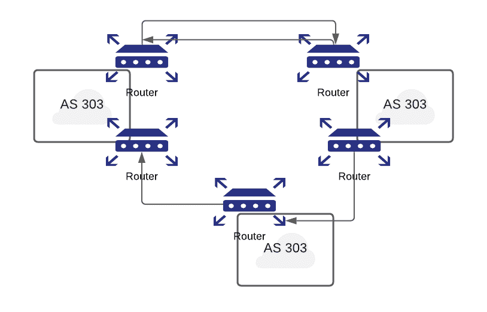

# 第三部分:威胁、攻击和防御

> 原文：<https://linkedin.github.io/school-of-sre/level101/security/threats_attacks_defences/>

## DNS 保护

### 缓存中毒攻击

*   由于 DNS 响应被缓存，因此可以为重复转换提供快速响应。DNS 否定查询也被缓存，例如拼写错误的单词，并且所有缓存的数据定期超时。缓存中毒是域欺骗中的一个问题。该术语用于描述黑客攻击，通过伪造 DNS 映射将网站流量重定向到虚假网站。在这种情况下，攻击者试图在 DNS 中插入一个伪造的 Internet 域地址记录。如果服务器接受了伪造的记录，缓存就会中毒，随后对域地址的请求会用攻击者控制的服务器地址来回答。只要服务器缓存了虚假条目，浏览器或电子邮件服务器就会自动转到被入侵的 DNS 服务器提供的地址。缓存条目的典型生存时间(TTL)是几个小时，因此许多用户有足够的时间受到攻击的影响。

### DNSSEC(安保分机)

*   这些 DNS 问题的长期解决方案是身份验证。如果解析程序无法区分响应中的有效和无效数据，则添加源身份验证，以验证响应中收到的数据是否等于区域管理员输入的数据
*   DNS 安全扩展(DNSSEC)防止数据欺骗和损坏，并提供验证服务器和请求的机制，以及建立真实性和完整性的机制。
*   对 DNS 响应进行身份验证时，每个 DNS 区域都使用私钥对其数据进行签名。建议这种签约提前线下完成。对特定记录的查询返回所请求的资源记录集(RRset)和所请求的资源记录集的签名(RRSIG)。然后，解析器使用公钥对响应进行身份验证，该公钥是通过 DNS 层次结构中的一系列密钥记录预先配置或学习的。
*   DNSSEC 的目标是为没有机密性或 DDoS 保护的 DNS 响应提供认证和完整性。

### 边界网关协议(Border Gateway Protocol)

*   BGP 代表边界网关协议。它是一种在多个自治系统(AS)之间交换路由信息的路由协议
*   自治系统是具有相同网络策略的路由器或网络的集合，通常受单一管理控制。
*   BGP 告诉路由器使用哪一跳到达目的网络。
*   BGP 用于在一个 AS(内部)的路由器之间和多个 AS(外部)之间传递信息。



## BGP 如何工作

*   BGP 负责寻找到目的路由器的路径&它选择的路径应该是最短和最可靠的。
*   这个决定是通过称为链路状态的协议来完成的。使用链路状态协议，每台路由器都会向网络中的所有其它路由器广播其链路和 IP 子网的状态。然后，每台路由器从其它路由器接收信息，构建整个网络的完整拓扑视图。下一跳路由表基于此拓扑视图。
*   链路状态协议使用计算机科学领域的一种著名算法，即 Dijkstra 最短路径算法:
*   我们从路由器开始考虑到所有直接邻居的路径开销。
*   然后选择最短的路径
*   然后，我们重新查看我们可以到达的所有邻居，并用开销信息更新我们的链路状态表。然后，我们继续选择最短路径，直到访问完所有路由器。

## BGP 漏洞

*   通过破坏 BGP 路由表，我们能够影响互联网上的流量流向！这种行为被称为 BGP 劫持。
*   恶意源、意外或路由器将伪造的路由广告信息注入到 BGP 分布式路由数据库中会破坏互联网骨干网的运行。
*   黑洞流量:
*   黑洞路由是一种无处可去的网络路由，即路由表条目，匹配路由前缀的数据包会被丢弃或忽略。黑洞路由只能通过监控丢失的流量来检测。
*   黑洞路由是对许多常见病毒攻击的最佳防御，在这些攻击中，流量从受感染的机器被丢弃到命令和控制主机或从命令和控制主机被丢弃。
*   Youtube 上臭名昭著的 BGP 注入攻击

*   例句:2008 年，巴基斯坦决定通过创建一条通向黑洞的 BGP 路由来屏蔽 YouTube。相反，这些路由信息被传输到香港的一家 ISP，并从那里意外地传播到世界其他地方，这意味着数百万人被路由到这个黑洞，因此无法访问 YouTube。

*   BGP 最大的潜在风险发生在拒绝服务攻击中，这种攻击使路由器被超过其处理能力的数据包淹没。当网络开始承载过量的 BGP 消息，使路由器控制处理器、存储器、路由表过载，并减少可用于数据流量的带宽时，就会发生网络过载和路由器资源耗尽。
*   参考:[https://medium . com/bugbountywriteup/BGP-the-weak-link-in-the-internet-what-is-BGP-and-how-do-hackers-exploit-d 899 a 68 ba 5 bb](https://medium.com/bugbountywriteup/bgp-the-weak-link-in-the-internet-what-is-bgp-and-how-do-hackers-exploit-it-d899a68ba5bb)
*   路由器摆动是另一种类型的攻击。路由波动指的是对 BGP 路由表的重复更改，通常是一分钟几次。高速撤销和重新通告会给路由器带来严重的问题，因为它们会传播路由通告。如果这些路由摆动发生得足够快，例如每秒 30 到 50 次，路由器就会过载，最终会妨碍收敛到有效路由。对互联网用户的潜在影响是消息传递速度变慢，在某些情况下，数据包可能根本无法传递。

BGP 安全性

*   边界网关协议安全部门建议使用 BGP 对等验证，因为这是防止恶意活动的最强有力的机制之一。
*   身份验证机制是互联网协议安全(IPsec)或 BGP MD5。
*   另一种称为前缀限制的方法可以用来避免填充路由表。在这种方法中，路由器应该配置为禁用或终止 BGP 对等会话，并在邻居发送的前缀超过预设数量时向管理员发出警告消息。
*   IETF 目前正在致力于改善这个空间

## 基于网络的攻击

### HTTP 响应分裂攻击

*   如果服务器脚本将用户数据嵌入 HTTP 响应头中，而没有适当的隔离，则可能会发生 HTTP 响应拆分攻击。
*   当脚本在重定向响应的重定向 URL(HTTP 状态代码 3xx)中嵌入用户数据时，或者当脚本在响应设置 cookie 时在 cookie 值或名称中嵌入用户数据时，通常会发生这种情况。
*   HTTP 响应拆分攻击可用于执行 web 缓存中毒和跨站点脚本攻击。
*   HTTP 响应分割是攻击者发送单个 HTTP 请求的能力，该请求迫使 web 服务器形成输出流，然后被目标解释为两个 HTTP 响应而不是一个响应。

### 跨站点请求伪造(CSRF 或 XSRF)

*   跨站点请求伪造攻击欺骗受害者的浏览器向易受攻击的 web 应用程序发出命令。
*   漏洞是由浏览器自动包括用户验证数据、会话 ID、IP 地址、Windows 域凭证等引起的。每一个请求。
*   攻击者通常使用 CSRF 来启动交易，如转移资金、登录/注销用户、关闭帐户、访问敏感数据和更改帐户详细信息。
*   该漏洞是由 web 浏览器引起的，这些浏览器会自动在每个请求中包含凭据，即使请求是由另一个站点上的表单、脚本或图像引起的。CSRF 也可以动态构建为跨站点脚本攻击的有效负载的一部分
*   所有依赖自动凭据的站点都容易受到攻击。流行的浏览器不能防止跨站请求伪造。尽快注销高价值站点可以降低 CSRF 风险。建议高价值网站必须要求客户端在用于执行任何有安全隐患的操作的同一 HTTP 请求中手动提供身份验证数据。限制会话 cookies 的生存期还可以减少被其他恶意站点使用的机会。
*   OWASP 建议网站开发人员在与敏感业务功能相关的 HTTP 请求中包含必需的安全令牌，以减少 CSRF 攻击

### 跨站点脚本(XSS)攻击

*   当动态生成的网页显示未经正确验证的用户输入(如登录信息)时，就会出现跨站点脚本，使得攻击者能够在生成的页面中嵌入恶意脚本，然后在查看该站点的任何用户的计算机上执行该脚本。
*   如果成功，跨站点脚本漏洞可被利用来操纵或窃取 cookies，创建可能被误认为是合法用户的请求，泄露机密信息，或在最终用户系统上执行恶意代码。
*   跨站点脚本(XSS 或 CSS)攻击包括在受害者的浏览器上执行恶意脚本。受害者只是用户的主机，而不是服务器。XSS 是由于基于 web 的应用程序无法验证用户输入而导致的。

### 文档对象模型(DOM) XSS 攻击

*   基于文档对象模型(DOM)的 XSS 不需要 web 服务器接收 XSS 有效负载就能成功攻击。攻击者通过在客户端嵌入数据来滥用运行时。攻击者可以强制客户端(浏览器)使用攻击者控制的部分 DOM 来呈现页面。
*   当呈现页面并由页面处理数据时，通常是由客户端 HTML 嵌入脚本(如 JavaScript)处理，页面代码可能会不安全地将数据嵌入页面本身，从而传递跨站点脚本有效负载。有几个 DOM 对象可以作为向受害者浏览器发送恶意脚本的攻击工具。

### 点击劫持

*   该技术的工作原理是在合法网站内容的掩护下隐藏恶意链接/脚本。
*   网站上的按钮实际上包含隐形链接，由攻击者放置在那里。因此，一个人点击一个他们可以看到的对象，实际上是被骗去访问一个恶意页面或执行一个恶意脚本。
*   当鼠标悬停和点击劫持一起使用时，结果是毁灭性的。脸书用户遭受了点击劫持攻击，这种攻击欺骗人们“喜欢”特定的脸书页面，从而使攻击自 2010 年阵亡将士纪念日以来蔓延开来。
*   目前还没有针对点击劫持的有效防御措施，禁用 JavaScript 是唯一可行的方法

## 数据库攻击和防御

### SQL 注入袭击

*   它利用数据库查询中不正确的输入验证。
*   成功利用此漏洞将允许攻击者访问、修改或删除数据库中的信息。
*   它允许攻击者窃取存储在受影响网站的后端数据库中的敏感信息，这些信息可能包括用户凭据、电子邮件地址、个人信息和信用卡号等

```sh
SELECT USERNAME,PASSWORD from USERS where USERNAME='<username>' AND PASSWORD='<password>';

Here the username & password is the input provided by the user. Suppose an attacker gives the input as " OR '1'='1'" in both fields. Therefore the SQL query will look like:

SELECT USERNAME,PASSWORD from USERS where USERNAME='' OR '1'='1' AND PASSOWRD='' OR '1'='1';

This query results in a true statement & the user gets logged in. This example depicts the bost basic type of SQL injection 
```

### SQL 注入攻击防御

*   可以通过过滤查询以消除恶意语法来保护 SQL 注入，这涉及使用一些工具以便(a)扫描源代码。
*   此外，输入字段应限制为绝对最小值，通常为 7-12 个字符，并验证任何数据，例如，如果用户输入年龄，请确保输入的是最多 3 位数的整数。

## 虚拟专用网络

虚拟专用网络(VPN)是一种通过共享公共基础设施(如互联网)提供安全可靠连接的服务。Cisco 将 VPN 定义为公共网络上专用网络之间的加密连接。迄今为止，有三种类型的 VPN:

*   远程存取
*   站点到站点
*   基于防火墙

## 安全违规行为

尽管采取了最积极的措施来保护计算机免受攻击，但攻击者有时还是会得逞。任何导致违反机密性、完整性或可用性(CIA)安全原则的事件都是安全违规。

### 拒绝服务攻击

*   拒绝服务(DoS)攻击会导致停机或用户无法访问系统。拒绝服务攻击影响了信息系统安全原则的有效性。DoS 攻击是通过占用计算机执行大量不必要的任务来拒绝服务的一种协同尝试。这种过度的活动使系统无法执行合法的操作
*   两种常见的 DoS 攻击类型如下:
*   逻辑攻击—逻辑攻击利用软件缺陷使远程服务器崩溃或严重影响其性能。您可以通过安装最新的补丁程序来保持您的软件最新，从而防止其中的许多攻击。
*   泛洪攻击—泛洪攻击通过向机器发送大量无用的请求来淹没受害计算机的 CPU、内存或网络资源。
*   大多数 DoS 攻击的目标是整个系统架构中的弱点，而不是软件错误或安全缺陷
*   发起数据包泛洪的一种流行技术是 SYN 泛洪。
*   抵御 DoS 攻击的最佳方法之一是使用入侵防御系统(IPS)软件或设备来检测和阻止攻击。

### 分布式拒绝服务攻击

*   DDoS 攻击在范围上不同于常规的 DoS 攻击。在 DDoS 攻击中，攻击者劫持数百甚至数千台互联网计算机，在这些系统上植入自动攻击代理。然后，攻击者指示特工用伪造的信息轰炸目标网站。这会使网站超载，阻止合法的流量。这里的关键是人数上的优势。攻击者通过将攻击分散到多台计算机来造成更大的损害。

### 窃听

*   虽然术语窃听通常与语音电话通信有关，但攻击者也可以使用窃听来拦截数据通信。

*   攻击者可以窃听电话线和数据通信线路。窃听可以是主动的，攻击者对线路进行修改。它也可以是被动的，即未经授权的用户只是收听传输而不改变内容。被动入侵可能包括复制数据以备后续主动攻击。

*   主动窃听的两种方法如下:
*   线间窃听—这种类型的窃听不会改变合法用户发送的消息，但会在合法用户暂停时在通信线路中插入其他消息。
*   捎带式窃听—这种类型的窃听通过破坏通信线路并将消息路由到充当主机的另一台计算机来截取和修改原始消息。

### 秘密的

*   软件开发人员有时会在他们的程序中包含隐藏的访问方法，称为后门。后门让开发人员或支持人员可以轻松访问系统，而不必与安全控制斗争。问题是后门并不总是隐藏的。当攻击者发现后门时，他或她可以利用它绕过现有的安全控制，如密码、加密等。合法用户使用用户 ID 和密码通过前门登录，攻击者使用后门绕过这些正常的访问控制。

## 恶意攻击

### 生日袭击

*   一旦攻击者破坏了哈希密码文件，就会进行生日攻击。生日攻击是一种加密攻击，用于使单向散列的暴力攻击更容易。这是一个基于概率论中生日问题的数学发现。
*   延伸阅读:
*   [https://www . science direct . com/topics/computer-science/birthday-attack](https://www.sciencedirect.com/topics/computer-science/birthday-attack)
*   [https://www.internetsecurity.tips/birthday-attack/](https://www.internetsecurity.tips/birthday-attack/)

### 暴力密码攻击

*   在暴力密码攻击中，攻击者在系统上尝试不同的密码，直到其中一个成功。通常，攻击者使用软件程序来尝试可能的密码、用户 ID 或安全代码的所有可能组合，直到找到匹配项。这种情况迅速而有序地发生。这种类型的攻击被称为暴力密码攻击，因为攻击者只是不停地敲打代码。不涉及任何技巧或秘密行动——只是最终破解代码的蛮力。
*   延伸阅读:
*   [https://owasp.org/www-community/attacks/Brute_force_attack](https://owasp.org/www-community/attacks/Brute_force_attack)
*   [https://owasp . org/www-community/controls/Blocking _ Brute _ Force _ Attacks](https://owasp.org/www-community/controls/Blocking_Brute_Force_Attacks)

### 字典密码攻击

*   字典密码攻击是一种简单的攻击，它依赖于用户错误的密码选择。在字典密码攻击中，一个简单的密码破解程序从字典文件中获取所有单词，并通过输入每个字典条目作为密码来尝试登录。
*   延伸阅读:https://capec.mitre.org/data/definitions/16.html

### 重放攻击

*   重放攻击包括从网络中捕获数据包并重新传输它们以产生未经授权的效果。收到重复的、经过验证的 IP 数据包可能会中断服务或产生一些其他不希望的后果。当攻击者重用旧消息或旧消息的一部分来欺骗系统用户时，可以通过重放攻击来破坏系统。这有助于入侵者获取允许未经授权进入系统的信息。
*   延伸阅读:[https://study . com/academy/lesson/replay-attack-definition-examples-prevention . html](https://study.com/academy/lesson/replay-attack-definition-examples-prevention.html)

### 中间人攻击

*   中间人攻击利用了许多类型网络使用的多跳过程。在这种类型的攻击中，攻击者在将消息传送到预期的目的地之前拦截双方之间的消息。
*   Web 欺骗是一种中间人攻击，在这种攻击中，用户认为与特定的 web 服务器存在安全会话。实际上，安全连接只存在于攻击者，而不存在于 web 服务器。然后，攻击者与 web 服务器建立一个安全的连接，充当一个看不见的中间人。攻击者在用户和 web 服务器之间传递流量。通过这种方式，攻击者可以欺骗用户提供密码、信用卡信息和其他私人数据。
*   延伸阅读:
*   [https://owasp . org/www-community/attacks/Man-in-the-middle _ attack](https://owasp.org/www-community/attacks/Man-in-the-middle_attack)

### 伪装

*   在伪装攻击中，一个用户或计算机伪装成另一个用户或计算机。伪装攻击通常包括其他形式的主动攻击，如 IP 地址欺骗或重放。攻击者可以捕获身份验证序列，然后重放它们，以便再次登录到应用程序或操作系统。例如，攻击者可能会监视发送到脆弱的 web 应用程序的用户名和密码。然后，攻击者可以使用截获的凭据登录到 web 应用程序，并冒充用户。
*   延伸阅读:[https://dl.acm.org/doi/book/10.5555/2521792](https://dl.acm.org/doi/book/10.5555/2521792)https://ieeexplore.ieee.org/document/1653228[T3】](https://ieeexplore.ieee.org/document/1653228)

### 偷听

*   当主机将其网络接口设置为混杂模式并复制经过的数据包以供以后分析时，就会发生窃听或嗅探。混杂模式使网络设备能够在给定的时间内拦截和读取每个网络数据包(当然，在某些情况下),即使数据包的地址与网络设备不匹配。可以附加硬件和软件来监控和分析该段传输介质上的所有数据包，而不会向任何其他用户发出警报。窃听的候选方法包括卫星、无线、移动和其他传输方法。

### 社会工程

*   攻击者经常使用一种叫做社会工程的欺骗技术来获得对 IT 基础设施中资源的访问权。几乎在所有情况下，社会工程都包括欺骗授权用户为未授权用户执行操作。社会工程攻击的成功取决于人们想要提供帮助的基本倾向。

### 指控制电话系统的过程

*   Phone phreaking，或简称 phreaking，是一个俚语，用来描述研究、试验或探索电话系统、电话公司设备和连接到公共电话网络的系统的亚文化群体的活动。窃听是利用电话系统中存在的漏洞和故障的艺术。

### 网络钓鱼

*   网络钓鱼是一种欺诈，攻击者试图诱骗受害者提供个人信息，如信用卡号、密码、出生日期、银行账号、自动柜员机(ATM)pin 和社会安全号码。

### 域名欺诈

*   域欺骗是另一种类型的攻击，它试图通过域欺骗来获取个人或私人财务信息。然而，域欺骗攻击不使用消息来欺骗受害者访问看似合法的欺骗性网站。相反，域欺骗在域名服务器(DNS)上“毒害”域名，这一过程称为 DNS 中毒。结果是，当用户在他或她的地址栏中输入中毒服务器的网址时，该用户会导航到攻击者的站点。用户的浏览器仍然显示正确的网站，这使得域欺骗很难被检测到，因此也更严重。网络钓鱼试图通过电子邮件或即时消息一次欺骗一个人，而域欺骗使骗子能够通过域欺骗一次锁定一大群人。