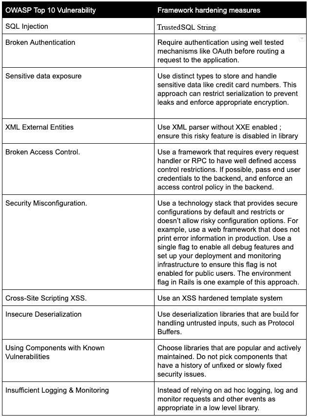

# 第四部分:编写安全代码及更多

> 原文：<https://linkedin.github.io/school-of-sre/level101/security/writing_secure_code/>

减少安全性和可靠性问题的第一步也是最重要的一步是教育开发人员。然而，即使是训练有素的工程师也会犯错误，安全专家可能会编写不安全的代码，sre 可能会忽略可靠性问题。在构建安全可靠的系统时，很难同时考虑和权衡许多因素，尤其是如果您还负责开发软件的话。

## 在编写代码时使用框架来增强安全性和可靠性

*   更好的方法是在通用框架、语言和库中处理安全性和可靠性。理想情况下，库只公开一个接口，使得编写具有常见安全漏洞类别的代码变得不可能。
*   多个应用可以使用每个库或框架。当领域专家修复一个问题时，他们将它从框架支持的所有应用中移除，从而允许这种工程方法更好地扩展。

## 常见的安全漏洞

*   在大型代码库中，尽管一直在努力教育开发人员并引入代码审查，但少数类造成了大多数安全漏洞。OWASP 和 San 发布了常见漏洞类别的列表

## 编写简单的代码

尽量保持你的代码简洁明了。

### 避免多层嵌套

*   多级嵌套是一种常见的反模式，会导致简单的错误。如果错误出现在最常见的代码路径中，单元测试很可能会捕捉到它。然而，单元测试并不总是检查多层嵌套代码中的错误处理路径。该错误可能导致可靠性降低(例如，如果服务在错误处理错误时崩溃)或安全漏洞(如错误处理的授权检查错误)。

### 消除 YAGNI 气味

*   有时，开发人员通过添加将来可能有用的功能来过度设计解决方案，“以防万一”这违背了 YAGNI(你不会需要它)原则，该原则建议只实现你需要的代码。YAGNI 代码增加了不必要的复杂性，因为它需要被记录、测试和维护。
*   总而言之，避免 YAGNI 代码可以提高可靠性，更简单的代码可以减少安全漏洞，减少出错的机会，减少开发人员维护未使用代码的时间。

### 偿还技术债务

*   对于开发人员来说，用 TODO 或 FIXME 注释来标记需要进一步注意的地方是一种常见的做法。从短期来看，这种习惯可以加快最关键功能的交付速度，并允许团队提前完成期限——但是它也会招致技术债务。尽管如此，只要你有一个清晰的偿还这些债务的过程(并分配时间)，这并不一定是一个坏习惯。

### 重构

*   重构是保持代码库干净和简单的最有效的方法。即使是健康的代码库偶尔也需要
*   不管重构背后的原因是什么，你都应该遵循一条黄金法则:永远不要在一次提交代码库中混合重构和功能变更。重构变更通常意义重大，并且可能难以理解。
*   如果提交还包括功能变更，那么作者或评审者可能会忽略错误的风险就更高了。

### 单元测试

*   单元测试可以通过在发布之前查明单个软件组件中的各种错误来提高系统的安全性和可靠性。这种技术包括将软件组件分解成更小的、自包含的、没有外部依赖性的“单元”，然后测试每个单元。

### 模糊测试

*   模糊测试是一种补充前面提到的测试技术的技术。模糊化涉及使用模糊化引擎生成大量候选输入，然后通过模糊化驱动程序传递给模糊化目标。然后模糊器分析系统如何处理输入。由各种软件处理的复杂输入是模糊化的常见目标，例如，文件解析器、压缩算法、网络协议实现和音频编解码器。

### 集成测试

*   集成测试超越了单个单元和抽象，用真实的实现取代了抽象的虚假或废弃的实现，如数据库或网络服务。因此，集成测试使用了更完整的代码路径。因为您必须初始化和配置这些其他依赖项，所以集成测试可能比单元测试更慢、更繁琐——为了执行测试，这种方法结合了真实世界的变量，如服务端到端通信时的网络延迟。当您从测试单个低级代码单元转移到测试它们在组合在一起时如何交互时，最终结果是对系统按预期运行有了更高的信心。

### 最后但并非最不重要

*   代码审查
*   依靠自动化
*   不要签入秘密
*   可验证的构建