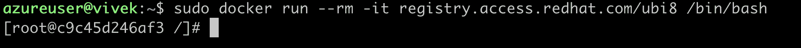

# Linux 中级

> 原文：<https://linkedin.github.io/school-of-sre/level102/linux_intermediate/introduction/>

## 先决条件

*   期望通过了 SRE 学校 [<u>Linux 基础</u>](https://linkedin.github.io/school-of-sre/level101/linux_basics/intro/) 。

## 从本课程中可以期待什么

本课程分为两个部分。在第一部分中，我们将讲述在 SRE 学校课程的早期，我们离开 linux 基础知识的地方，我们将深入探究一些更高级的 Linux 命令和概念。

在第二部分中，我们将讨论如何在日常工作中使用 Bash 脚本，通过任何 SRE 的真实例子的帮助，将自动化和辛劳减少作为 SRE。

## 本课程不包括哪些内容

本课程旨在让你熟悉 Linux 命令、shell 脚本的交集以及 SRE 如何使用它。我们不会讨论 Linux 的内部机制。

## 实验室环境设置

*   在你的系统上安装 docker。[<u>https://docs.docker.com/engine/install/</u>](https://docs.docker.com/engine/install/)

<u>*   我们将使用 RedHat Enterprise Linux (RHEL) 8。</u> 

 <u>

*   我们将运行上述 docker 容器中的大多数命令。

__________________________________________________________________________

## 课程内容

[<u>套餐管理</u>](https://linkedin.github.io/school-of-sre/level102/linux_intermediate/package_management/)

*   [<u>包:</u>](https://linkedin.github.io/school-of-sre/level102/linux_intermediate/package_management/#package)

*   [<u>依赖</u>](https://linkedin.github.io/school-of-sre/level102/linux_intermediate/package_management/#dependencies)

*   [<u>储存库</u>](https://linkedin.github.io/school-of-sre/level102/linux_intermediate/package_management/#repository)

*   [<u>高级和低级包管理工具</u>](https://linkedin.github.io/school-of-sre/level102/linux_intermediate/package_management/#high-level-and-low-level-package-management-tools)

[<u>存储介质</u>](https://linkedin.github.io/school-of-sre/level102/linux_intermediate/storage_media/)

*   [<u>列出已挂载的存储设备</u>](https://linkedin.github.io/school-of-sre/level102/linux_intermediate/storage_media/#listing-the-mounted-storage-devices)

*   [<u>创建文件系统</u>](https://linkedin.github.io/school-of-sre/level102/linux_intermediate/storage_media/#creating-a-filesystem)

*   [<u>安装设备</u>](https://linkedin.github.io/school-of-sre/level102/linux_intermediate/storage_media/#mounting-the-device)

*   [<u>卸载设备</u>](https://linkedin.github.io/school-of-sre/level102/linux_intermediate/storage_media/#unmounting-the-device)

*   [<u>用/etc/fstab 文件变得更简单？</u>T3】](https://linkedin.github.io/school-of-sre/level102/linux_intermediate/storage_media/#making-it-easier-with-etcfstab-file)

*   [<u>检修 FS</u>](https://linkedin.github.io/school-of-sre/level102/linux_intermediate/storage_media/#checking-and-repairing-fs)

*   [<u>突袭</u>](https://linkedin.github.io/school-of-sre/level102/linux_intermediate/storage_media/#raid)

    *   [<u>突袭等级</u>](https://linkedin.github.io/school-of-sre/level102/linux_intermediate/storage_media/#raid-levels)

    *   <u>RAID 0(分条)</u>

    <u>*   [<u>RAID 1(镜像)</u>](https://linkedin.github.io/school-of-sre/level102/linux_intermediate/storage_media/#raid-1mirroring)

        <u>*   [<u>RAID 5(带分布式奇偶校验的条带化)</u>](https://linkedin.github.io/school-of-sre/level102/linux_intermediate/storage_media/#raid-5striping-with-distributed-parity)

        *   [<u>RAID 6(双奇偶校验分条)</u>](https://linkedin.github.io/school-of-sre/level102/linux_intermediate/storage_media/#raid-6striping-with-double-parity)

        *   [<u>RAID 10(RAID 1+0:镜像和分条)</u>](https://linkedin.github.io/school-of-sre/level102/linux_intermediate/storage_media/#raid-10raid-10-mirroring-and-striping)

        *   [<u>命令监视突袭</u>](https://linkedin.github.io/school-of-sre/level102/linux_intermediate/storage_media/#commands-to-monitor-raid)</u></u> 
<u><u>*   [<u>LVM</u>](https://linkedin.github.io/school-of-sre/level102/linux_intermediate/storage_media/#lvm)</u></u> 

 <u><u><u>[<u>归档和备份</u>](https://linkedin.github.io/school-of-sre/level102/linux_intermediate/archiving_backup/)

*   [<u>归档</u>](https://linkedin.github.io/school-of-sre/level102/linux_intermediate/archiving_backup/#archiving)

    *   [<u>gzip</u>](https://linkedin.github.io/school-of-sre/level102/linux_intermediate/archiving_backup/#gzip)

    *   [<u>焦油</u>](https://linkedin.github.io/school-of-sre/level102/linux_intermediate/archiving_backup/#tar)

    *   [<u>用文件和文件夹创建一个归档</u>](https://linkedin.github.io/school-of-sre/level102/linux_intermediate/archiving_backup/#create-an-archive-with-files-and-folder)

    *   [<u>归档中的清单文件</u>](https://linkedin.github.io/school-of-sre/level102/linux_intermediate/archiving_backup/#listing-files-in-the-archive)

    *   [<u>从档案中提取文件</u>](https://linkedin.github.io/school-of-sre/level102/linux_intermediate/archiving_backup/#extract-files-from-the-archive)

*   [<u>备份</u>](https://linkedin.github.io/school-of-sre/level102/linux_intermediate/archiving_backup/#backup)

    *   [<u>增量备份</u>](https://linkedin.github.io/school-of-sre/level102/linux_intermediate/archiving_backup/#incremental-backup)

    *   [<u>差异备份</u>](https://linkedin.github.io/school-of-sre/level102/linux_intermediate/archiving_backup/#differential-backup)

    *   [<u>网络备份</u>](https://linkedin.github.io/school-of-sre/level102/linux_intermediate/archiving_backup/#network-backup)

    *   [<u>云备份</u>](https://linkedin.github.io/school-of-sre/level102/linux_intermediate/archiving_backup/#cloud-backup)

[<u>Vim 简介</u>](https://linkedin.github.io/school-of-sre/level102/linux_intermediate/introvim/)

*   [<u>打开文件并使用插入模式</u>](https://linkedin.github.io/school-of-sre/level102/linux_intermediate/introvim/#opening-a-file-and-using-insert-mode)

*   [<u>保存文件</u>](https://linkedin.github.io/school-of-sre/level102/linux_intermediate/introvim/#saving-a-file)

*   [<u>退出 VIM 编辑器</u>T3】](https://linkedin.github.io/school-of-sre/level102/linux_intermediate/introvim/#exiting-the-vim-editor)

[<u>Bash 脚本</u>](https://linkedin.github.io/school-of-sre/level102/linux_intermediate/bashscripting/)

*   [<u>编写第一个痛击脚本</u>](https://linkedin.github.io/school-of-sre/level102/linux_intermediate/bashscripting/#writing-the-first-bash-script)

*   [<u>接受用户输入并处理变量</u>](https://linkedin.github.io/school-of-sre/level102/linux_intermediate/bashscripting/#taking-user-input-and-working-with-variables)

*   [<u>退出状态</u>](https://linkedin.github.io/school-of-sre/level102/linux_intermediate/bashscripting/#exit-status)

*   [<u>命令行参数和理解 If … else 分支</u>](https://linkedin.github.io/school-of-sre/level102/linux_intermediate/bashscripting/#command-line-arguments-and-understanding-if-..-else-branching)

*   [<u>循环重复做一个任务</u>](https://linkedin.github.io/school-of-sre/level102/linux_intermediate/bashscripting/#looping-over-to-do-a-repeated-task.)

*   [<u>功能</u>](https://linkedin.github.io/school-of-sre/level102/linux_intermediate/bashscripting/#function)

[<u>结论</u>](https://linkedin.github.io/school-of-sre/level102/linux_intermediate/conclusion/)</u></u></u></u>