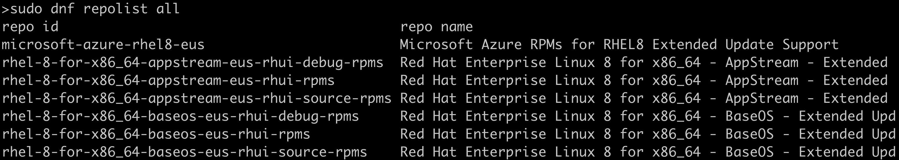

# 包管理

> 原文：<https://linkedin.github.io/school-of-sre/level102/linux_intermediate/package_management/>

## 介绍

任何操作系统的一个主要特征是能够运行其他程序和软件，因此包管理就出现了。软件包管理是一种在任何操作系统上安装和维护软件程序的方法。

## 包裹

在 Linux 的早期，人们必须下载任何软件的源代码，并编译它来安装和运行软件。随着 Linux 领域变得更加成熟，人们知道软件领域是非常动态的，并且开始以包的形式分发软件。软件包文件是文件的压缩集合，包含软件、其依赖项、安装说明和关于软件包的元数据。

## 属国

软件包很少是独立的，它依赖于不同的软件、库和模块。这些子程序以共享库的形式存储和提供，共享库可以服务于多个程序。这些共享资源被称为依赖关系。包管理完成了这项艰难的工作，为用户解决依赖关系并随软件一起安装它们。

## 贮藏室ˌ仓库

存储库是存储所有软件包、更新和依赖项的存储位置。每个存储库可以包含远程服务器上托管的数千个软件包，用于在 linux 系统上安装和更新。我们通常通过运行“ *sudo dnf update”来更新包信息(*通常称为元数据*)。*

尝试使用 *`sudo dnf repolist all`* 来列出所有的库。

我们通常添加存储库来安装来自第三方供应商的软件包。

> dnf 配置-管理器-添加-回购 http://www.example.com/example.repo

## 高级和低级包管理工具

包管理工具主要有两种类型:

> 1.*低级工具*:主要用于安装包文件、移除包文件和升级包文件。
> 
> 2.*高级工具*:除了低级工具，高级工具也做元数据搜索和依赖解析。

| Linux 发行版 | 低级工具 | 高级工具 |
| --- | --- | --- |
| 一种自由操作系统 | dpkg | 容易得到 |
| 软呢帽 | 未完成(did not finish) | 未完成(did not finish) |