# 存储媒体

> 原文：<https://linkedin.github.io/school-of-sre/level102/linux_intermediate/storage_media/>

## 介绍

存储介质是用来存储数据和信息的设备。在处理包括存储设备在内的外部设备时，Linux 有着惊人的能力。存储设备有很多种，物理存储设备如硬盘、虚拟存储设备如 RAID 或 LVM、网络存储等等。

在本节中，我们将学习如何使用任何存储设备，并根据我们的需求对其进行配置。

## 列出已装载的存储设备:

我们可以使用 **`mount`** 命令来列出所有挂载到你电脑上的存储设备。

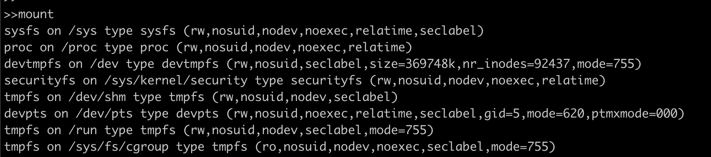

我们看到的上面输出的格式是:

*`device`* 上 *`mount_point`* 下 *`file\_system\_type (options)`*

例如，在第一行中，虚拟设备 *sysfs* 安装在 */sys* 路径中，并且具有一个 *sysfs* 文件系统。现在让我们看看什么是文件系统以及如何创建文件系统。

## 创建文件系统

想象一个磁盘，其中存储在磁盘中的所有数据都是一个大块的形式，没有什么要弄清楚一块数据在哪里开始和结束，哪块数据位于整个数据块的哪个位置，因此文件系统就进入了画面。文件系统(fs)负责任何存储设备上的数据存储、索引和检索。

以下是最常用的文件系统:

| f 型 | 描述 |
| --- | --- |
| 文件分配表(file allocation table) | 文件分配表，最初用于 DOS 和 Microsoft Windows，现在广泛用于便携式 USB 存储 |
| Windows NT 文件系统(NT File System) | (新技术文件系统)用于微软基于 Windows 的操作系统 |
| 外面的（exterior 的简写） | 为 Linux 系统设计的扩展文件系统。 |
| ext4 | 第四个扩展文件系统是日志文件系统，通常由 Linux 内核使用。 |
| 超精结构(hyperfine structure) | 分层文件系统，在 Mac OS 8.1 上引入 HFS+之前一直使用。 |
| HFS+ | 支持文件系统日志记录，支持系统崩溃后的数据恢复。 |
| 网络文件系统 | 最初来自 Sun Microsystems 的网络文件系统是基于 UNIX 的网络中的标准。 |

我们将尝试使用 [*<u>mkfs</u>*](https://man7.org/linux/man-pages/man8/mkfs.8.html) 创建一个 *ext4* 文件系统，它是 linux 原生 fs。

Discalimer:在空磁盘上运行该命令，因为这将清除现有数据。

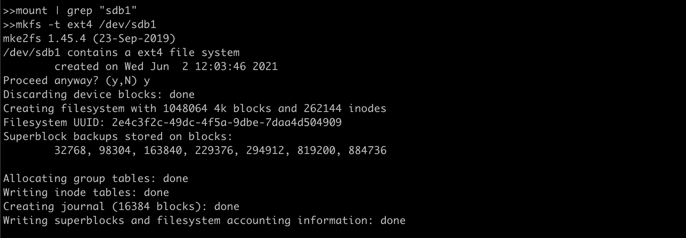

在这里，设备 */dev/sdb1* 被格式化，其文件系统被更改为 *ext4* 。

## 安装设备:

在 Linux 系统中，所有的文件都是以(/)为根的树形结构排列的。挂载一个文件系统仅仅意味着让 Linux 目录树中的某个点可以访问这个文件系统。

我们需要一个挂载点(位置)来挂载上面格式化的设备。

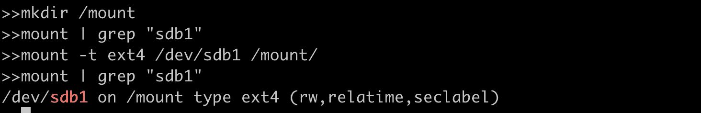

我们创建了一个挂载点 */mount* ，并使用 *[<u>mount</u>](https://man7.org/linux/man-pages/man8/mount.8.html)* 命令来附加文件系统。这里的 *-t* 标志指定了什么是 fs 类型，之后是 */dev/sdb1* (设备名)和/mount(我们之前创建的挂载点)。

## 卸载设备:

现在让我们来看看如何卸载设备，如果我们有可移动存储介质，并希望安装到另一台主机上，这同样重要。我们使用 [***<u>卸载</u>***](https://man7.org/linux/man-pages/man8/umount.8.html) 来卸载设备。

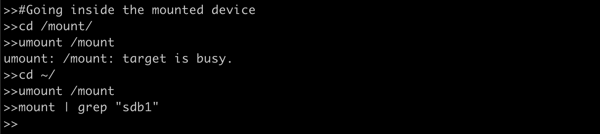

我们的第一次尝试没有卸载/sdb1，因为我们在存储设备内部，并且它正在被使用。一旦我们伸缩主目录，我们就能够成功地卸载设备。

## 使用/etc/fstab 文件会更容易吗？

在我们的生产环境中，我们的服务器可能有许多需要装载的存储设备，每次重新启动系统时使用命令装载每个设备是不可行的。为了减轻这一负担，我们可以利用 Linux 系统上的 ***`/etc/fstab`*** 中常见的名为“fstab”的配置表。

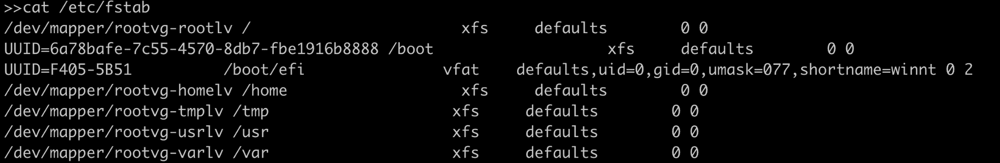

在这里的第一行中，我们将 */dev/mapper/rootvg-rootlv(存储设备*)挂载在 */(根挂载点)上，它具有 xfs 文件系统类型*，后跟选项。

我们可以运行 *`mount -a`* 来重新载入修改后的这个文件。

## 检查和修理 FS

文件系统在任何硬件故障、电源故障的情况下都会遇到问题，有时是由于不正确的关机。Linux 通常在启动时检查并修复损坏的磁盘。我们还可以使用命令[***<u>fsck</u>***](https://man7.org/linux/man-pages/man8/fsck.8.html)手动检查文件系统的损坏。

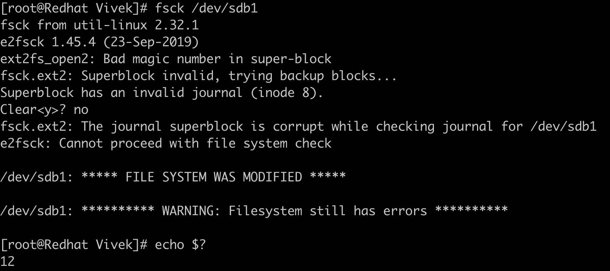

我们可以使用 *`fsck -y /dev/sdb1`* 修复同一个文件系统。

每种文件系统错误都附有错误代码，并返回活动错误的总和。

| 错误代码 | 描述 |
| --- | --- |
| Zero | 没有错误 |
| one | 文件系统错误已更正 |
| Two | 系统应该重新启动 |
| four | 未纠正的文件系统错误 |
| eight | 操作错误 |
| Sixteen | 用法或语法错误 |
| Thirty-two | 用户请求取消检查 |
| One hundred and twenty-eight | 共享库错误 |

在上面的 fs 检查中，我们得到了返回代码 12，这是错误代码 8(操作错误)和 4(未纠正的 FS 错误)的总和。

## 袭击

RAID 或“独立磁盘冗余阵列”是一种跨多个磁盘分布 I/O 以实现更高性能和数据冗余的技术。RAID 能够提高整体磁盘性能，并在磁盘出现故障时仍然存在。软件 RAID 使用计算机的 CPU 来执行 RAID 操作，而硬件 RAID 使用磁盘控制器上的专用处理器来管理磁盘。RAID 的三个基本功能是镜像、条带化和奇偶校验。

## RAID 级别

下一节讨论了常用的 RAID 级别。关于所有 RAID 等级的信息，请参考 [<u>这里</u>](https://en.wikipedia.org/wiki/RAID) 。

### RAID 0(条带化)

分条是将数据拆分成“块”并写入阵列中所有磁盘的方法。通过将数据分布在多个驱动器上，这意味着多个磁盘可以访问文件，从而提高了读/写速度。阵列中的第一个磁盘不会重复使用，直到等量的数据写入阵列中的其他每个磁盘。

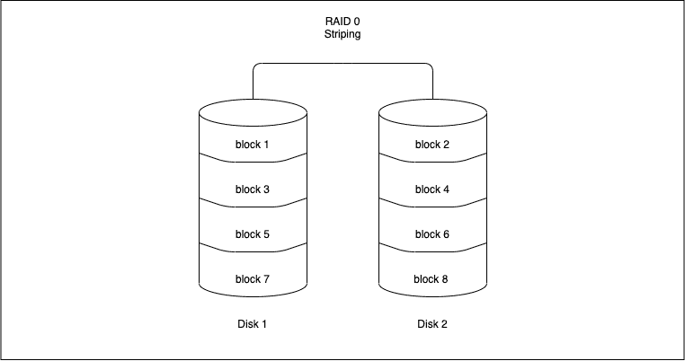

优势

*   这很容易实现。

*   避免了由于来自同一磁盘的 I/O 操作而导致的瓶颈，从而提高了此类操作的性能。

不足之处

*   它不提供任何冗余。如果任何一个磁盘出现故障，整个磁盘的数据都会丢失，并且无法恢复。

用例

RAID 0 可用于需要高速读取非关键数据的系统，例如视频/音频编辑站或游戏环境。

### RAID 1(镜像)

镜像将数据副本写入阵列中的每个磁盘。这意味着数据的写入次数与阵列中的磁盘数一样多。它将所有数据的精确副本存储在单独的一个或多个磁盘上。正如预期的那样，与单个磁盘相比，这将导致较慢的写入性能。另一方面，读取操作可以并行进行，从而提高读取性能。

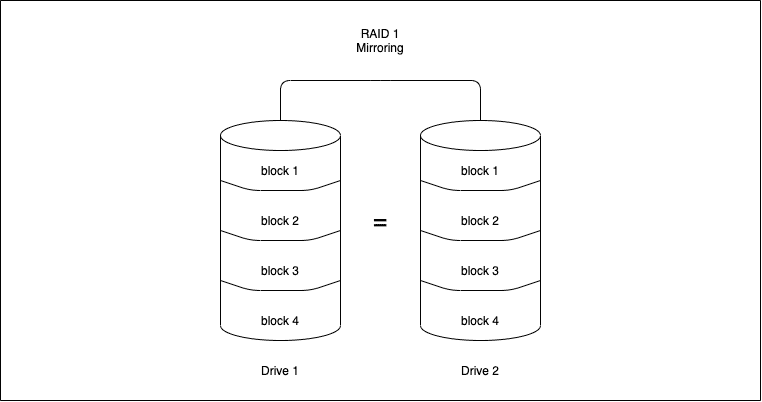

优势

*   RAID 1 提供了比 RAID 0 或单个磁盘更好的读取性能。

*   它可以承受多个磁盘故障，而不需要特殊的数据恢复算法

不足之处

*   由于数据复制，有效存储容量只有磁盘数量的一半，因此成本很高。

用例

要求低停机时间但对写入性能有轻微影响的应用。

### RAID 4(带专用奇偶校验的条带化)

RAID 4 works 使用块级条带化(根据应用和要存储的数据，可以将数据条带化为各种大小的块)和用于存储奇偶校验信息的专用驱动器。每次将数据写入阵列磁盘时，都会通过算法生成奇偶校验信息。使用奇偶校验位是将校验和添加到数据中的一种方式，可以使目标设备确定数据是否已被正确接收。如果驱动器出现故障，可以反转算法，并根据剩余数据和奇偶校验信息生成缺失数据。

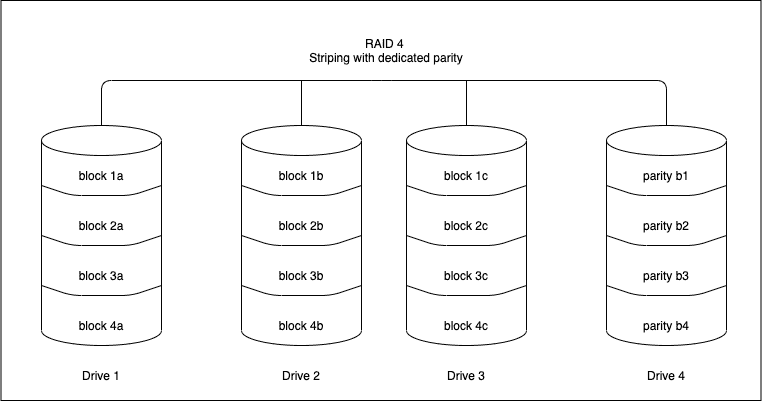

优势

*   RAID 4 阵列中的每个驱动器都独立运行，因此 I/O 请求并行发生，性能比以前的 RAID 级别更快。

*   它可以承受多个磁盘故障，而不需要特殊的数据恢复算法

不足之处

*   安装至少需要 3 张磁盘。

*   它需要硬件支持奇偶校验计算。

*   写入速度很慢，因为奇偶校验依赖于单个磁盘驱动器，并为每个 I/O 会话修改奇偶校验块。

用例

处理非常大的文件的操作—当使用顺序读写数据过程时

### RAID 5(带分布式奇偶校验的条带化)

RAID 5 类似于 RAID 4，只是奇偶校验信息分布在阵列中的所有驱动器上。这有助于减少每次写入操作期间将奇偶校验信息写入单个驱动器时固有的瓶颈。RAID 5 是最常见的安全 RAID 级别。

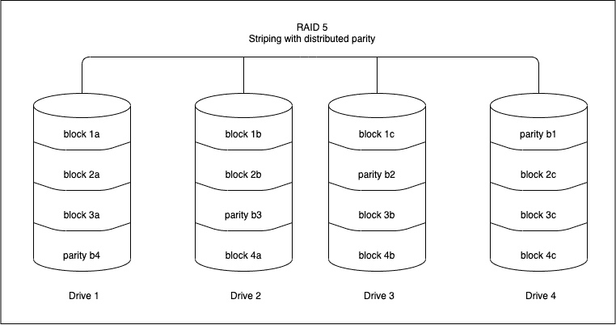

优势

*   与由于奇偶校验的计算而有点慢的写数据事务相比，读数据事务很快。

*   因为存储控制器会在新驱动器上重建数据，所以即使在驱动器出现故障以及更换故障硬盘期间，数据仍可访问。

不足之处

*   RAID 5 最少需要 3 个驱动器，最多可支持 16 个驱动器

*   它需要硬件支持奇偶校验计算。

*   两个以上的驱动器故障会导致数据丢失。

用例

文件存储和应用服务器，如电子邮件、通用存储服务器等。

### RAID 6(带双奇偶校验的条带化)

RAID 6 类似于 RAID 5，具有双重分布式奇偶校验的额外优势，可提供多达两个故障驱动器的容错能力。

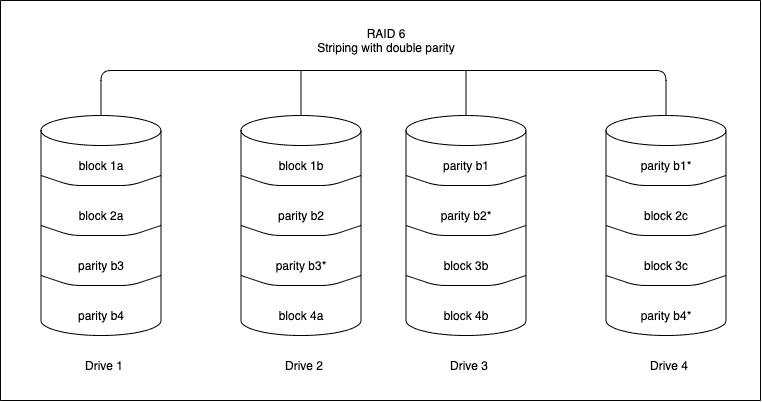

优势

*   读取数据事务速度很快。

*   这提供了多达 2 个故障驱动器的容错能力。

*   RAID 6 比 RAID 5 更有弹性。

不足之处

*   由于双重奇偶校验，写数据事务很慢。

*   由于结构复杂，重建 RAID 阵列需要较长的时间。

用例

办公自动化、在线客户服务和需要极高可用性的应用。

### RAID 10(RAID 1+0:镜像和条带化)

RAID 10 是 RAID 0 和 RAID 1 的组合。这意味着镜像和分条都在一个 RAID 阵列中。

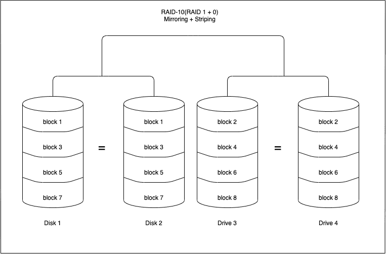

优势

*   重建 RAID 阵列的速度很快。

*   读写操作性能良好。

不足之处

*   就像 RAID 1 一样，只有一半的驱动器容量可用。

*   实施 RAID 10 的成本可能很高。

用例

具有敏感信息的事务数据库，需要高性能和高数据安全性。

## 监视 RAID 的命令

命令`cat /proc/mdstat`将给出软件 RAID 的状态。让我们检查命令的输出:

```sh
Personalities : [raid1]

md0 : active raid1 sdb1[2] sda1[0]

10476544 blocks super 1.1 [2/2] [UU]

bitmap: 0/1 pages [0KB], 65536KB chunk

md1 : active raid1 sdb2[2] sda2[0]

10476544 blocks super 1.1 [2/2] [UU]

bitmap: 1/1 pages [4KB], 65536KB chunk

md2 : active raid1 sdb3[2]

41909248 blocks super 1.1 [2/1] [_U]

bitmap: 1/1 pages [4KB], 65536KB chunk 
```

“个性”为我们提供了 raid 配置的 raid 级别。在上面的例子中，raid 配置为`RAID 1\. md0 : active raid1 sdb1[2] sda1[0]`告诉我们在 sdb1(即设备 2)和 sda1(即设备 0)之间有一个 raid 1 的活动 RAID。非活动阵列通常意味着其中一个磁盘出现故障。上例中的 Md2 显示我们有`41909248 blocks super 1.1 [2/1] [_U]`，这意味着在这个特定的 raid 中有一个磁盘出现故障。

命令`mdadm --detail /dev/<raid-array>`给出了关于该特定阵列的详细信息。

```sh
sudo mdadm --detail /dev/md0

/dev/md0:

Version : 1.1

Creation Time : Fri Nov 17 11:49:20 2019

Raid Level : raid1

Array Size : 10476544 (9.99 GiB 10.32 GB)

Used Dev Size : 10476544 (9.99 GiB 10.32 GB)

Raid Devices : 2

Total Devices : 2

Persistence : Superblock is persistent

Intent Bitmap : Internal

Update Time : Sun Dec 2 01:00:53 2019

State : clean

Active Devices : 2

Working Devices : 2

Failed Devices : 0

Spare Devices : 0

UUID : xxxxxxx:yyyyyy:zzzzzz:ffffff

Events : 987

Number Major Minor RaidDevice State

0 8 1 0 active sync /dev/sda1

1 8 49 1 active sync /dev/sdb1 
```

在上述示例中，如果磁盘丢失，raid 的状态将为“脏”,活动设备和工作设备将减少为一个。其中一个条目(/dev/sda1 或/dev/sdb1，具体取决于丢失的磁盘)会将其 RaidDevice 更改为故障。

## LVM

LVM 代表逻辑卷管理。在上面的部分中，我们看到了如何以传统方式创建 FS 并根据我们的需求使用单个磁盘，但是使用 LVM，我们可以在存储分配方面实现更大的灵活性，例如，我们可以将三个 2TB 的磁盘拼接成一个 6TB 的单个分区，或者我们可以将另一个 4TB 的物理磁盘连接到服务器，并将该磁盘添加到逻辑卷组，使其总容量达到 10TB。

参考了解更多关于 https://www.redhat.com/sysadmin/lvm-vs-partitioning:[](https://www.redhat.com/sysadmin/lvm-vs-partitioning)