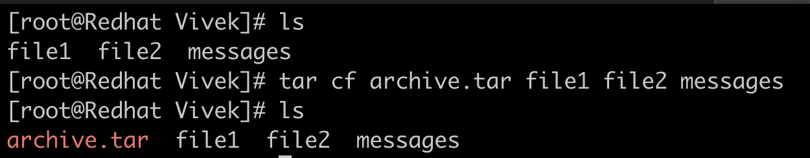
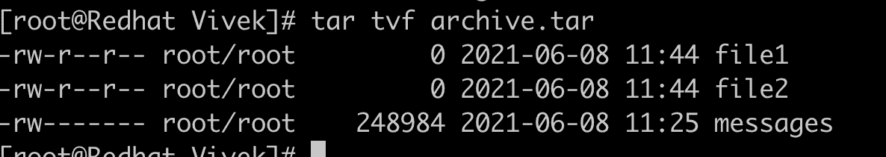
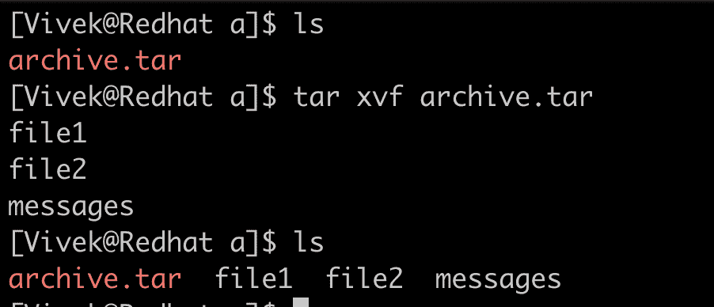
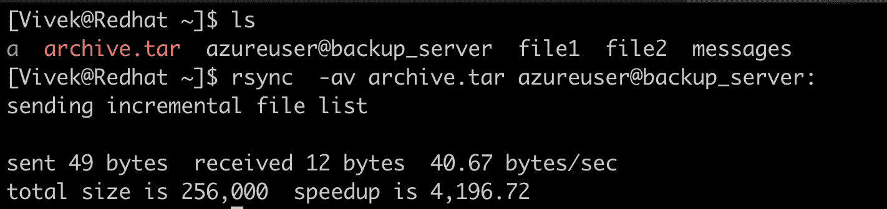

# 存档和备份

> 原文：<https://linkedin.github.io/school-of-sre/level102/linux_intermediate/archiving_backup/>

## 介绍

SREs 要确保的一件事是服务一直在运行(至少 99.99%的时间)，但是运行这些服务的每台服务器生成的数据量是巨大的。这些数据可以是日志、数据库中的用户数据或任何其他类型的元数据。因此，为了数据安全，我们需要及时压缩、归档、轮换和备份数据，并确保我们不会耗尽空间。

## 归档

我们通常会将不再需要但主要出于合规性目的而保留的数据归档。这有助于将数据存储为压缩格式，节省大量空间。下一节是为了熟悉归档工具和命令。

## gzip

gzip 是一个用来 [<u>压缩</u>](https://en.wikipedia.org/wiki/Data_compression) 一个或多个文件的程序，它用原始文件的压缩版本替换原始文件。

在这里，我们可以看到*消息*日志文件被压缩到原来大小的五分之一，并替换为 messages.gz。我们可以使用 [*<u>gunzip</u>*](https://linux.die.net/man/1/gunzip) 命令解压缩这个文件。

## 水手

*tar* 程序是一个将文件和目录归档到单个文件中的工具(通常称为 tarball)。该工具通常用于在将文件传输到长期备份服务器之前准备文件存档。 *tar* 不会替换现有的文件和文件夹，而是创建一个扩展名为*的新文件。焦油*。它提供了许多标志供选择存档

| 旗帜 | 描述 |
| --- | --- |
| -丙 | 创建存档 |
| ［加在以-u 结尾的法语词源的名词之后构成复数］ | 提取存档文件 |
| -f | 用给定的文件名创建档案 |
| 相当于-ED | 显示或列出存档文件中的文件 |
| -你 | 归档并添加到现有的归档文件中 |
| -v | 显示详细信息 |
| ［构成动植物的古名或拉丁化的现代名］ | 连接存档的文件 |
| -z | 使用 gzip 压缩 tar 文件 |
| -j | 使用 bzip2 压缩 tar 文件 |
| -W | 验证存档文件 |
| -r | 更新或添加已存在的文件或目录。焦油文件 |

### 创建包含文件和文件夹存档

标志`c`用于创建档案，其中`f`是文件名。

### 列出归档中的文件

我们可以使用标志`t`来列出归档文件包含的内容。

### 从存档中提取文件

我们可以使用标志`x`来取消归档。

## 支持

备份是拷贝/复制现有数据的过程，该备份可用于在数据丢失的情况下恢复数据集。当数据在日常工作中并不需要，但可以作为事实的来源和未来的合规性原因时，数据备份也变得至关重要。不同类型的备份包括:

### 增量备份

增量备份是对自上次备份以来的数据进行备份，这降低了数据冗余和存储效率。

### 差异备份

有时我们的数据会不断修改/更新。在这种情况下，我们对自上次备份以来发生的更改进行备份，称为差异备份。

### 网络备份

网络备份是指在客户端-服务器模式下，通过网络将数据从源发送到备份目标。该备份目标可以是集中式的，也可以是分散式的。分散备份对于灾难恢复场景非常有用。

`rsync`是一个 linux 命令，通过网络将文件从一个服务器同步到目标服务器。

*rsync* 的语法类似于`rsync \[options\] <source> <destination>`。我们可以在“*目的地”*中的`:`(冒号)后指定的路径上找到文件。如果未指定任何内容，默认路径是用于备份的用户的主目录。`/home/azureuser`既然如此。您可以使用`man rsync`命令为 rsync 寻找不同的选项。

### 云备份

有各种第三方为云提供数据备份。这些云备份比本地机器或任何没有 RAID 配置的服务器上的存储备份可靠得多，因为这些提供商管理数据冗余、数据恢复以及数据安全性。两个最广泛使用的云备份选项是 Azure backup(来自微软)和 Amazon Glacier backup(来自 AWS)。