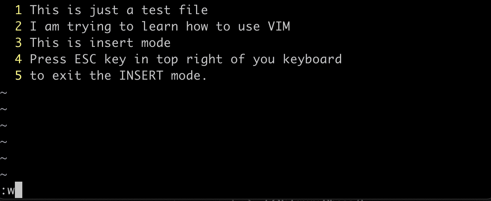

# Vim 简介

> 原文：<https://linkedin.github.io/school-of-sre/level102/linux_intermediate/introvim/>

## 介绍

作为一个 SRE，我们会多次登录到服务器，对配置文件进行修改，编辑和修改脚本，编辑器是 Vim，它很方便，几乎在所有的 linux 发行版中都可以使用。Vim 是一个开源的免费命令行编辑器，被广泛接受和使用。我们将看到如何使用 vim 创建和编辑文件的一些基础知识。这些知识将帮助我们理解下一节，脚本。

## 打开文件并使用插入模式

我们用 *`vim filename`* 命令打开一个 *`filename`* 文件。终端会打开一个编辑器，但是一旦你开始写，它就不起作用了。这是因为我们在 vim 中没有处于“插入”模式。

按下 ***`i`*** ，进入插入模式，开始书写。

按下 ***i*** 后，你会在左下方看到“插入”。您可以使用* `ESC`键回到正常模式。

## 保存文件

在插入模式下插入文本后，按键盘上的 ESC(escape)键退出。按`:`(冒号 shift+；)并按下 ***`w`*** 并按回车键，您输入的文本将被写入文件。

## 退出 VIM 编辑器

对于初学者来说，退出 vim 会变得很有挑战性。有多种方法可以退出 Vim，比如不保存工作退出，保存工作退出。

退出插入模式并按下 ***`:`*** (冒号)后，尝试以下命令。

| Vim 命令 | 描述 |
| --- | --- |
| **:q** | 退出文件，但如果文件有未保存的更改，则不会退出 |
| **:wq** | 写入(保存)并退出文件。 |
| **:问！** | 退出，不保存更改。 |

这是我们在下一节 bash 脚本中需要的基础。你可以随时访问教程了解更多。要快速练习 vim 命令，请访问: