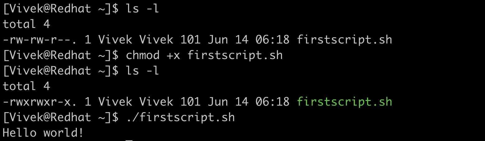
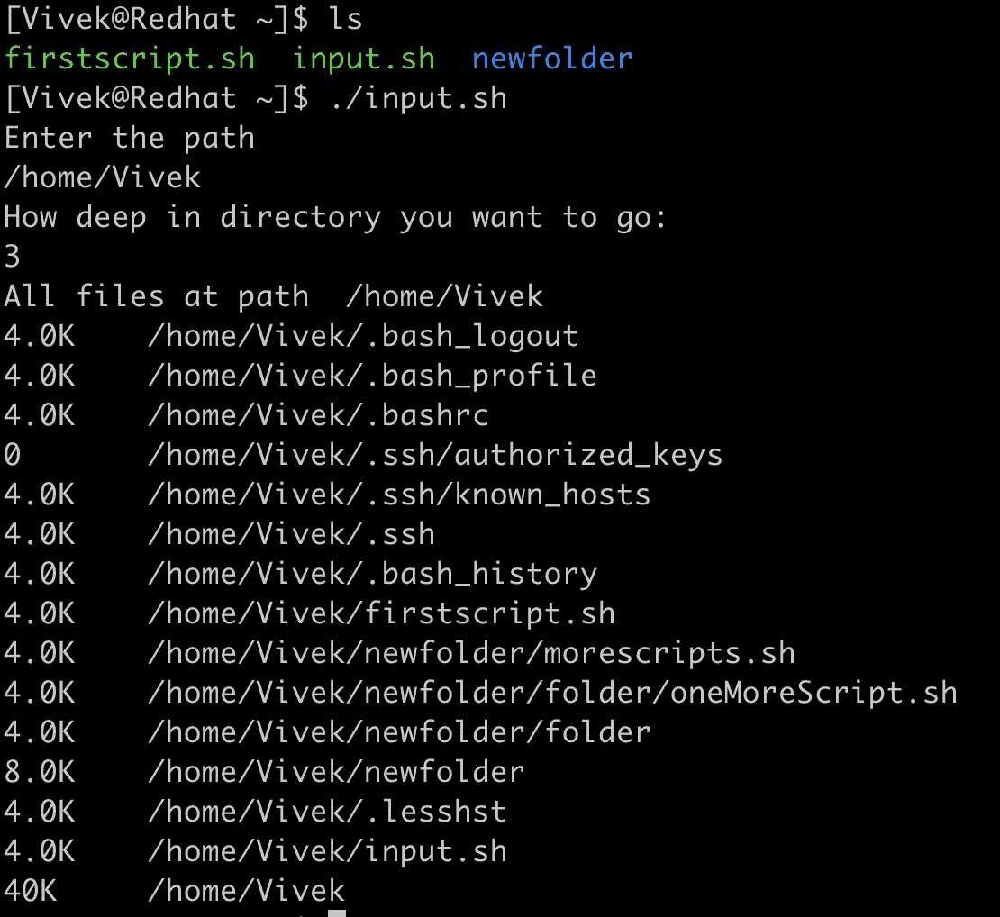
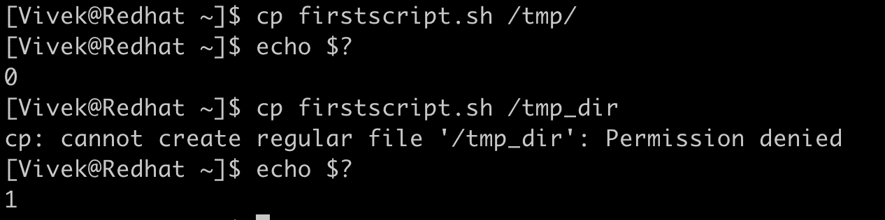
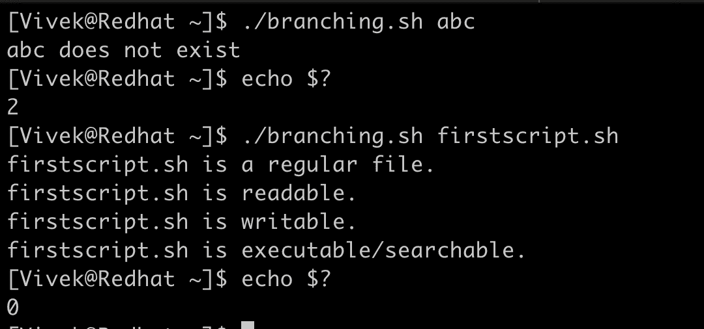
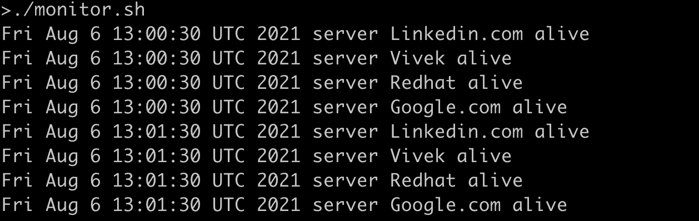
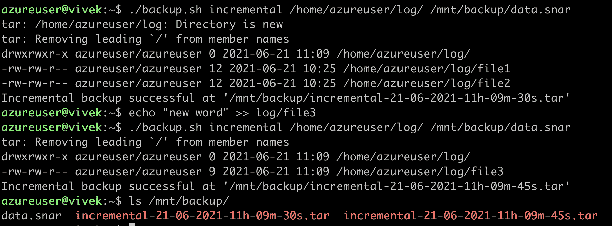

# Bash 脚本

> 原文：<https://linkedin.github.io/school-of-sre/level102/linux_intermediate/bashscripting/>

## 介绍

作为一名 SRE，Linux 系统是我们日常工作的核心，bash 脚本也是如此。它是一种脚本语言，由 Linux Bash 解释器运行。到目前为止，我们已经介绍了许多主要在命令行上的功能，现在我们将使用命令行作为解释器来编写程序，这将简化我们作为 SRE 的日常工作。

## 编写第一个 bash 脚本:

我们将从一个简单的程序开始，我们将在整个过程中使用 Vim 作为编辑器。

```sh
#!/bin/bash

# This if my first bash script
# Line starting with # is commented

echo "Hello world!" 
```

以“#”开头的脚本的第一行叫做 she-bang。这只是让系统在执行脚本时使用哪个解释器。

任何以“#”开头的行(除了#！)在脚本中被称为注释，在执行脚本时会被解释器忽略。第 6 行显示了我们将要运行的“echo”命令。

我们将这个脚本保存为“firstscript.sh ”,并使用`chmod`使脚本可执行。



下一件事是用显式路径运行脚本。我们可以看到期望的“Hello World！”作为输出。

## 接受用户输入并使用变量:

使用`read`命令获取标准输入，并在 bash 中使用变量。

```sh
#!/bin/bash

#We will take standard input
#Will list all files at the path
#We will concate variable and string

echo "Enter the path"
read path

echo "How deep in directory you want to go:"
read depth

echo "All files at path " $path

du -d $depth -all -h $path 
```

我们正在读取变量" *path* 和变量" *depth* 中的 path，以列出该深度的文件和目录。我们用变量连接字符串。我们总是使用`$`(美元符号)来引用它包含的值。



我们将这些变量传递给`du`命令，列出该路径中直到所需深度的所有文件和目录。

## 退出状态:

每个命令和脚本在执行完毕后，都会向系统返回一个 0 到 255 之间的整数，这称为退出状态。“0”表示命令成功，而非零返回代码通常表示各种错误。



我们使用`$?`特殊的 shell 变量来获取最后执行的脚本或命令的退出状态。

## 命令行参数和理解 If … else 分支:

向脚本传递一些值的另一种方法是使用命令行参数。通常 bash 中的命令行参数是通过$后跟索引来访问的。第 0 个索引表示文件本身，`$1`表示第一个参数，依此类推。我们使用`$#`来检查传递给脚本的参数的数量。

在编程语言中做决定是它不可或缺的一部分，为了处理不同的情况，我们使用 if … else 语句或它的一些嵌套变体。

下面的脚本在一个脚本中使用了多个概念。该脚本的目的是获取文件的一些属性。

第 4 到 7 行是 bash 中“if 语句”的标准示例。语法解释如下:

```sh
If [ condition ]; then

If_block_to_execute

else

else_block_to_execute

fi 
```

fi 将关闭 if … else 块。我们正在比较参数的计数($#)是否等于 1。如果没有，我们只提示一个参数，并以状态代码 1 退出脚本(不成功)。一个或多个 if 语句可以在没有 else 语句的情况下存在，但反之亦然没有任何意义。

运算符-ne 用于比较两个整数，读作“integer1 *不等于* integer 2”。其他比较运算符有:

| 操作 | 描述 |
| --- | --- |
| 在 1 -eq 中在 2 中 | 检查第一个数字是否等于第二个数字 |
| 在 1-ge # 2 中 | 检查第一个数字是否大于或等于第二个数字 |
| 在 1 -gt num2 中 | 检查第一个数字是否大于第二个数字 |
| **num1 -le num2** | 检查第一个数字是否小于或等于第二个数字 |
| 在 1 -lt num2 中 | 检查第一个数字是否小于第二个数字 |

```sh
#!/bin/bash
# This script evaluate the status of a file

if [ $# -ne 1 ]; then
    echo "Please pass one file name as argument"
    exit 1
fi

FILE=$1
if [ -e "$FILE" ]; then
    if [ -f "$FILE" ]; then
        echo "$FILE is a regular file."
    fi
    if [ -d "$FILE" ]; then
        echo "$FILE is a directory."
    fi
    if [ -r "$FILE" ]; then
        echo "$FILE is readable."
    fi
    if [ -w "$FILE" ]; then
        echo "$FILE is writable."
    fi
    if [ -x "$FILE" ]; then
        echo "$FILE is executable/searchable."
    fi
else
    echo "$FILE does not exist"
    exit 2
fi

exit 0 
```

有很多文件表达式来评估文件，比如在 bash 脚本中，如果作为参数传递的文件存在，第 10 行中的"-e "返回 true，否则返回 false。以下是一些广泛使用的文件表达式:

| 文件操作 | 描述 |
| --- | --- |
| **-e 文件** | 文件存在 |
| **-d 文件** | 文件存在并且是目录 |
| **-f 文件** | 文件存在并且是常规文件 |
| **-L 文件** | 文件存在并且是符号链接 |
| **-r 文件** | 文件存在并且具有可读权限 |
| **-w 文件** | 文件存在并且具有可写权限 |
| **-x 文件** | 文件存在并且具有可执行权限 |
| **-s 文件** | 文件存在，并且大小大于零 |
| **-S 文件** | 文件存在，并且是网络套接字。 |



找不到文件时，退出状态为 2。如果找到该文件，它会打印出它保存的属性，退出状态为 0(成功)。

## 循环执行重复的任务。

我们通常会遇到重复性很强的任务，循环可以帮助我们以更正式的方式对这些重复性的任务进行编码。我们可以在 bash 中使用不同类型的循环语句:

| 环 | 句法 |
| --- | --- |
| 在…期间 | 【表情】

做

【while _ block _ to _ execute】

做了 |
| 为 | 对于 1，2，3 中的变量..n

做

【for _ block _ to _ execute】

完成 |
| 直到 | 【表情】

做

【直到 _ 阻止 _ 执行】

做好 |

```sh
#!/bin/bash
#Script to monitor the server

hosts=`cat host_list`

while true
do
    for i in $hosts
    do
        h="$i"
        ping -c 1 -q "$h" &>/dev/null
        if [ $? -eq 0 ]
        then
            echo `date` "server $h alive"
        else
            echo `date` "server $h is dead"
        fi
    done
    sleep 60
done 
```

监控服务器是成为 SRE 的一个重要部分。文件“host_list”包含我们要监控的主机列表。

我们使用了一个无限的“while”循环，每 60 秒休眠一次。对于 host_list 中的每台主机，我们都希望 ping 该主机，并检查 ping 是否成功及其退出状态，如果成功，我们就说服务器是活动的或者它是死的。



脚本的输出显示它每分钟都在运行，时间戳为。

## 功能

开发人员总是试图以模块化的方式开发他们的应用/程序，这样他们就不必每次在任何地方都编写相同的代码来执行类似的任务。函数帮助我们实现这一点。

我们通常用一些参数来调用函数，并根据这些参数来期望结果。

我们在前面的部分中讨论了备份过程，我们将尝试使用下面的脚本来自动化该过程，并熟悉一些更多的概念，如字符串比较、函数和逻辑 and 和 OR 操作。

在下面的代码中,“log_backup”是一个在被调用之前不会被执行的函数。

首先执行第 37 行，我们将检查传递给脚本的参数数量。

有许多逻辑运算符，如 AND、OR、XOR 等。

| 逻辑算子 | 标志 |
| --- | --- |
| 和 | && |
| 运筹学 | &#124; |
| 不 | ！ |

向脚本“backup.sh”传递错误的参数将提示正确的用法。我们必须传递我们是想要目录的增量备份还是完整备份，以及我们想要备份的目录的路径。如果我们需要增量备份，我们将增加一个参数作为元文件，用于存储以前备份文件的信息。(通常元文件是。snar 扩展)。

```sh
#!/bin/bash
#Scripts to take incremental and full backup

backup_dir="/mnt/backup/"
time_stamp="`date +%d-%m-%Y-%Hh-%Mm-%Ss`"

log_backup(){
    if [ $# -lt 2 ]; then
        echo "Usage: ./backup.sh [backup_type] [log_path]"
        exit 1;
    fi
    if [ $1 == "incremental" ]; then
        if [ $# -ne 3 ]; then
            echo "Usage: ./backup.sh [backup_type] [log_path] [meta_file]"
            exit 3;
        fi
        tar --create --listed-incremental=$3 --verbose --verbose --file="${backup_dir}incremental-${time_stamp}.tar" $2
        if [ $? -eq 0 ]; then
            echo "Incremental backup succesful at '${backup_dir}incremental-${time_stamp}.tar'"
        else
            echo "Incremental Backup Failure"
        fi

    elif [ $1 == "full" ];then
        tar cf "${backup_dir}fullbackup-${time_stamp}.tar" $2
        if [ $? -eq 0 ];then
            echo "Full backup successful at '${backup_dir}fullbackup-${time_stamp}.tar'"
        else
            echo "Full Backup Failure"
        fi
    else
        echo "Unknown parameter passed"
        echo "Usage: ./backup.sh [incremental|full] [log_path]"
        exit 2;
    fi
}

if [ $# -lt 2 ] || [ $# -gt 3 ];then
    echo "Usage: ./backup.sh [incremental|full] [log_path]"
    exit 1
elif [ $# -eq 2 ];then
    log_backup $1 $2
elif [ $# -eq 3 ];then
    log_backup $1 $2 $3
fi
exit 0 
```

传递增量备份的所有 3 个参数将在“/mnt/backup/”处进行增量备份，每个归档都有连接到每个文件的时间戳。



函数内部传递的参数可以通过索引后面的`$`来访问。第 0 个索引指的是函数本身，

`$1`到第一个论证，以此类推。我们使用`#$`来检查传递给函数的参数数量。

一旦我们传递了字符串“incremental”或“full ”,它就会在函数内部进行比较，并执行特定的块。下面是一些可以在字符串上执行的操作。

| 字符串操作 | 描述 |
| --- | --- |
| string1 == string2 | 如果 string1 等于 string 2，则返回 true，否则返回 false。 |
| string1！= string2 | 如果字符串不等于字符串 2，则返回 true，否则返回 false。 |
| string1 ~= regex | 如果 string1 与扩展正则表达式匹配，则返回 true。 |
| -z 字符串 | 如果字符串长度为零，则返回 true，否则返回 false。 |
| -n 字符串 | 如果字符串长度不为零，则返回 true，否则返回 false。 |