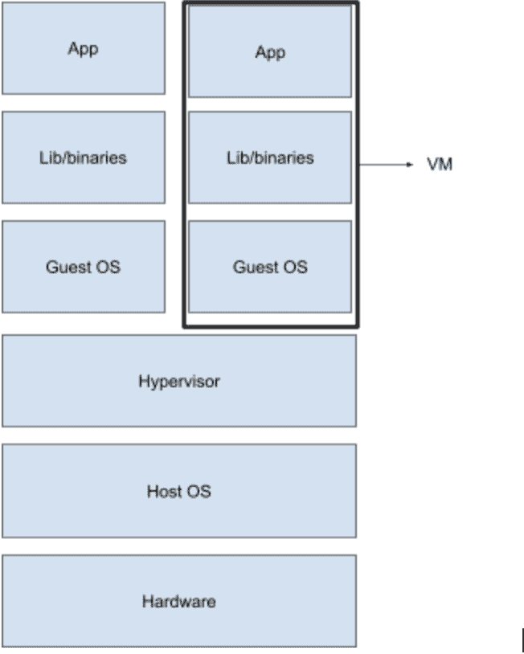
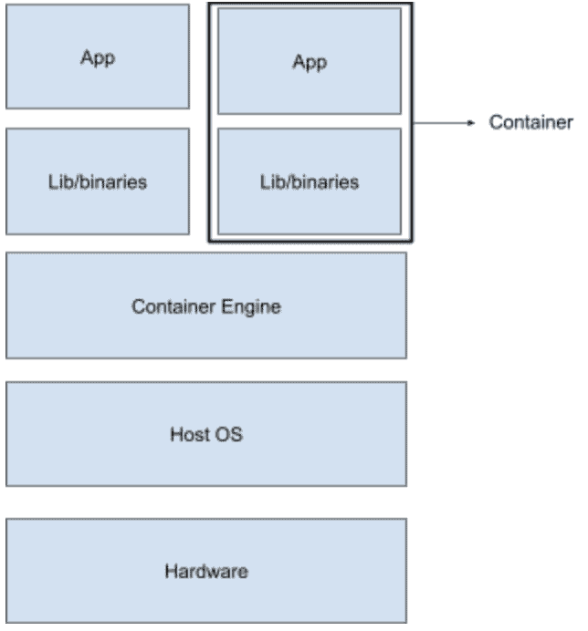
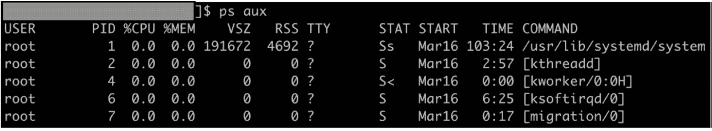
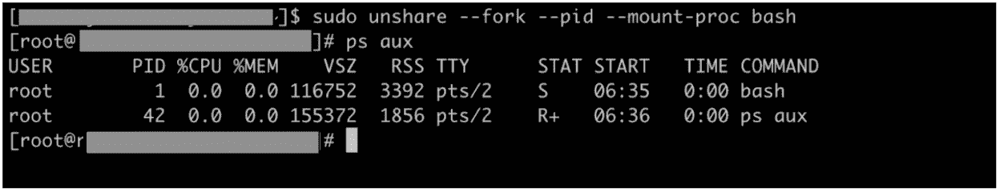
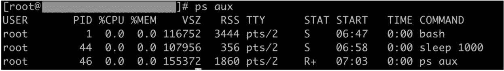
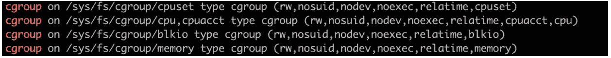
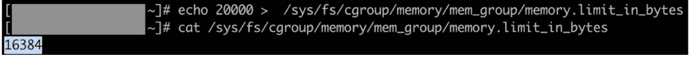

# 容器介绍

> 原文：<https://linkedin.github.io/school-of-sre/level102/containerization_and_orchestration/intro_to_containers/>

## 什么是容器

下面是一个流行的容器引擎 Docker 对容器的流行定义:

> 容器是一个标准的软件单元，它将代码及其所有依赖项打包，以便应用能够快速可靠地从一个计算环境运行到另一个计算环境

我们来分析一下。容器是与整个运行时环境捆绑在一起的代码。这包括运行应用所需的系统库、二进制文件和配置文件。

## 为什么是容器

您可能想知道为什么我们需要将您的应用与其依赖项打包在一起。这就是定义的第二部分，

> ...因此，应用可以快速可靠地从一个计算环境运行到另一个计算环境。

开发人员通常在他们的开发环境(或本地机器)中编写代码，在将代码投入生产之前，在一个或两个测试环境中进行测试。理想情况下，为了在推向生产之前可靠地测试应用，我们需要所有这些环境都统一到一个 tee(底层操作系统、系统库等)。

当然，这种理想很难实现，尤其是当我们混合使用本地(完全控制)和云基础架构提供商(在硬件控制和安全选项方面更具限制性)时，这种情况在今天更为常见。

这就是为什么我们不仅需要打包代码，还需要打包依赖项；以便您的应用能够可靠地运行，而不管它运行在哪个基础结构或环境上。

我们可以在一台主机上运行几个容器。由于容器的实现方式，每个容器在同一个主机中都有自己的隔离环境。这意味着一个单一的应用可以被分解成微服务并打包到容器中。每个微服务都在隔离环境中的主机上运行。这是使用容器的另一个原因:*关注点分离*。

提供隔离的环境不会让一个容器中的一个应用的故障影响到另一个。这被称为*故障隔离*。由于容器中进程的有限可见性，隔离还提供了增加安全性的额外好处。

由于大多数容器化解决方案的实施方式，我们还可以选择限制容器内运行的应用消耗的资源量。这叫做*资源限制*。Will 将在 cgroups 一节中更详细地讨论这个特性。

## 虚拟机和容器的区别

让我们稍微跑题一下，进入一些历史。在上一节中，我们讨论了容器如何帮助我们实现关注点的分离。在广泛使用容器之前，虚拟化用于在同一主机上的隔离环境中运行应用(在某些情况下，今天仍在使用)。

简单来说，虚拟化就是我们将软件与运行该软件的操作系统副本打包在一起。这个包称为虚拟机(VM)。捆绑在虚拟机中的操作系统映像称为来宾操作系统。一个名为 Hypervisor 的组件位于来宾操作系统和主机操作系统之间，负责促进来宾操作系统对底层操作系统硬件的访问。您可以在此了解有关虚拟机管理程序[的更多信息。](https://searchservervirtualization.techtarget.com/definition/bare-metal-hypervisor)

与在一台主机上运行多个容器类似，多台虚拟机可以在一台主机上运行，这样，就可以在一台单独的虚拟机上运行应用(或每个微服务),并实现关注点的分离。

这里主要关注虚拟机和容器的大小。虚拟机带有客户操作系统的副本，因此与容器相比重量更大。如果您对虚拟机和容器的比较更感兴趣，您可以查看来自 [Backblaze](https://www.backblaze.com/blog/vm-vs-containers/) 和 [NetApp](https://blog.netapp.com/blogs/containers-vs-vms/) 的这些文章。

虽然可以使用虚拟机管理程序(例如 CentOS 7 上的 Windows 10 虚拟机)在具有不兼容内核的主机上运行操作系统，但在内核可以共享的情况下(例如 CentOS 7 上的 Ubuntu)，由于大小因素，容器优于虚拟机。共享内核，正如您将在后面看到的，也为容器提供了许多优于虚拟机的性能优势，比如更快的启动。让我们看看容器如何工作的图表。

比较这两个图，我们注意到两件事:

*   容器没有单独的(客户)操作系统

*   容器引擎是容器和主机操作系统之间的中介。它用于促进主机操作系统上容器的生命周期(然而，这不是必需的)。

下一节将详细解释容器如何与主机共享相同的操作系统(准确地说是内核),同时为应用的运行提供隔离的环境。

## 容器是如何实现的

我们已经讨论了容器如何与虚拟机不同，与主机操作系统共享相同的内核，并为应用运行提供隔离的环境。这是在没有在主机操作系统上运行客户操作系统的开销的情况下实现的，这要归功于 linux 内核的两个特性:cgroups 和内核名称空间。

既然我们已经触及了容器的内部，那么从技术上更准确地描述它们是什么是合适的。容器是一个 linux 进程或一组 linux 进程，它被限制在- **对容器外进程的可见性**(使用名称空间实现)——**它可以使用的资源数量**(使用 cgroups 实现)以及- **可以从容器进行的系统调用**。如果有兴趣了解更多信息，请参考 [seccomp](https://docs.docker.com/engine/security/seccomp/) 。

这些限制使得容器化的应用与运行在同一主机上的其他进程保持隔离。

现在让我们更详细地讨论一下名称空间和 cgroup。

## 名称空间

容器内部流程的可见性应该被限制在容器内部。这就是 linux 名称空间的作用。这个想法是命名空间中的进程不能影响那些它不能“看到”的进程。共享单个命名空间的进程具有对它们所在的命名空间唯一的身份、服务和/或接口。以下是 linux 中的名称空间列表:

*   *挂载*

共享一个挂载名称空间的进程组共享一组单独的、私有的挂载点和文件系统视图。对这些命名空间挂载点的任何修改在命名空间之外都是不可见的。例如，装载命名空间中的/var 可能与主机中的/var 不同。

*   *PID*

pid 命名空间中的进程具有仅在命名空间中唯一的进程 id。一个进程可以是它自己的 pid 名称空间中的根进程(pid 1 ),并且在它下面有整个进程树。

*   *网络*

每个网络名称空间都有自己的网络设备实例，可以用单独的网络地址进行配置。同一网络命名空间中的进程可以有自己的端口和路由表。

*   *用户*

用户名称空间可以有自己的用户和组 id。主机中使用非特权用户的进程可能在用户名称空间中拥有根用户身份。

*   *Cgroup*

允许创建只能在 cgroup 命名空间中使用的 cgroup。下一节将更详细地介绍 Cgroups。

*   *UTS*

这个名称空间有自己的主机名和域名 IPC。每个 IPC 名称空间都有自己的 System V 和 POSIX 消息队列。

尽管看起来很复杂，但在 linux 中创建名称空间非常简单。让我们看一个创建 PID 名称空间的快速演示。你需要一个基于 linux 的操作系统，并得到 sudoers 的许可。

### 演示:名称空间

*   首先，我们检查哪些进程正在主机系统中运行(输出因系统而异)。注意 pid 1 的过程。

*   让我们用 unshare 命令创建一个 PID 名称空间，并在名称空间中创建一个 bash 进程

您可以看到`ps aux`(它本身是在如此创建的 PID 名称空间中启动的进程)只能看到它自己的名称空间中的进程。因此，输出显示**只有两个进程**在名称空间内运行。还要注意，名称空间中的根进程(pid 1)不是 init，而是我们在创建名称空间时指定的 bash shell。

*   让我们在相同的名称空间中创建另一个进程，它在后台休眠 1000 秒。在我的例子中，睡眠进程的 pid 是 PID 名称空间中的 44 **。**

*   在单独的终端上，检查从主机看到的睡眠进程的进程 id。

请注意 pid 的差异(主机中为 23844，名称空间中为 44)，尽管两者都指同一进程(开始时间和所有其他属性都相同)。

也可以嵌套命名空间，即从另一个 pid 命名空间创建一个 pid 命名空间。尝试使用`sudo nsenter -t 23844 --pid -r bash`重新输入名称空间，并在其中创建另一个 pid 名称空间。做起来应该很好玩！

## Cgroups

可以将 cgroup 定义为一组进程，对这些进程的资源使用进行计量和监控。资源可以是内存页面、磁盘 i/o、CPU 等。事实上，cgroups 是根据对哪个资源施加限制以及违反限制时采取的操作的性质来分类的。

cgroup 中跟踪资源利用并控制 cgroup 中进程行为的组件称为资源子系统或资源控制器。

根据 RHEL 的[对 cgroups](https://access.redhat.com/documentation/en-us/red_hat_enterprise_linux/6/html/resource_management_guide/ch01) 的介绍，下面是一组资源控制器及其功能:

*   *blkio* —该子系统对物理驱动器(磁盘、固态硬盘或 USB)等块设备的输入/输出访问进行限制。
*   *cpu* —该子系统使用调度程序为 cgroup 进程提供对 cpu 的访问。cpuacct —该子系统生成关于 cgroup 中进程使用的 CPU 资源的自动报告。
*   *cpuset* —该子系统将单个 CPU(在多核系统上)和内存节点分配给 cgroup 中的进程。
*   *设备* —该子系统允许或拒绝 cgroup 中的进程访问设备。
*   *冻结* —该子系统暂停或恢复 cgroup 中的进程。
*   *内存* —该子系统为 cgroup 中的进程设置内存使用限制，并自动报告这些进程使用的内存资源。

对于每个资源控制器，Cgroups 遵循一个分层的树状结构，即每个控制器都有一个 cgroup。层次结构中的每个 cgroup 从其父 cgroup 继承某些属性(如限制)。

让我们用 memory cgroups 来尝试一个快速演示，让我们的头脑理解上面的想法。您将需要一个基于 linux 的操作系统(这里是 RedHat ),并具有 sudo 权限。

### 演示:cgroups

*   让我们从检查您的机器上是否安装了 cgroup 工具开始。执行`mount | grep "^cgroup"`。如果您安装了这些工具，您将看到如下输出:

如果没有，用`sudo yum install libcgroup-tools -y`安装工具。

*   现在，我们创建一个名为 mem_group 的内存 cgroup，用“root”作为 cgroup 的所有者。执行的命令`sudo cgcreate -a root -g memory:mem_group`。验证是否创建了 cgroup。

`/sys/fs/cgroup/<cgroup type>`是伪文件系统，其中新创建的 cgroup 被添加为子组。

*   Memory cgroup 对 cgroup 中进程的内存使用进行限制。让我们看看 mem_group 的限制是什么。用于检查内存限制的文件是 memory.limit_in_bytes( [更多信息请点击这里](https://www.kernel.org/doc/Documentation/cgroup-v1/memory.txt)，如果你感兴趣的话)。

*   请注意，mem_group 继承了其父 cgroup 的限制

*   现在，为了演示的目的，让我们将内存使用限制减少到 20KB(实际限制四舍五入到最接近的 2 的幂)。

这个限制太低了，因此大多数附加到 mem_group 的进程应该被 OOM 杀死。

*   创建一个新的 shell 并将其附加到 cgroup。我们需要 sudo 权限。

进程如预期的那样被 OOM 杀死。您可以使用 dmesg 日志(mm_fault_error)来确认这一点。

如果你想在 cgroups 上尝试一个更深入的练习，可以看看 Geeks 为 Geeks 提供的教程。

让我们再次回到容器。容器与底层主机操作系统共享同一个内核，并为其中的应用提供一个隔离的环境。Cgroups 有助于管理容器内进程使用的资源，而 namespaces 有助于将一个容器中的网络堆栈、PID、用户、组 id 和挂载点与同一主机上运行的另一个容器隔离开来。

当然，容器还有更多真正使其功能完整的组件，但这些讨论超出了本模块的范围。

## 容器发动机

容器引擎简化了在主机上创建和管理容器的过程。怎么会？

*   容器创建工作流通常从容器图像开始。容器映像是目标应用的打包的、可移植的版本，捆绑了它运行所需的所有依赖项。
*   这些容器映像要么可以在主机(容器主机)上从以前的构建中获得，要么需要从远程映像存储库中获取。有时，容器引擎可能需要从一组指令中构建容器映像。
*   最后，一旦获取/构建了容器映像，容器引擎就会解包映像，并根据映像规范为应用创建一个隔离的环境。
*   容器映像中的文件随后被挂载到隔离环境中，以使应用在容器中启动并运行。

有几种容器引擎可用，如 LXC RKT 的 Docker(首批容器引擎之一)，它们需要不同的图像格式(LXD 的 Docker)。OCI (Open Container Initiative)是由 Docker 发起的一个合作项目，旨在跨供应商标准化容器运行时规范和图像格式。如果你对这个项目感兴趣，OCI 的 FAQ 部分是一个很好的起点。我们将在下一节的[中重点介绍 Docker。](https://linkedin.github.io/school-of-sre/level102/containerization_and_orchestration/containerization_with_docker/)