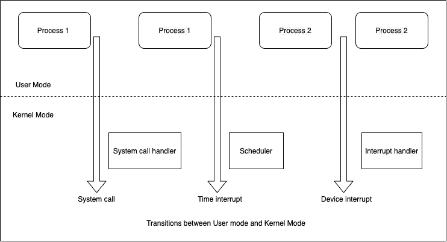

# 系统调用

> 原文：<https://linkedin.github.io/school-of-sre/level102/system_calls_and_signals/system_calls/>

## 介绍

系统调用是进入内核的受控入口点，允许进程请求内核代表进程执行某些操作。内核通过系统调用应用编程接口(API)使程序可以访问一系列服务。应用开发人员通常不能直接访问系统调用，但是可以通过这个 API 访问它们。例如，这些服务包括创建新进程、执行 I/O 和创建进程间通信管道。系统调用集是固定的。每个系统调用都有一个唯一的编号。不同系统调用的列表可以在[这里](https://man7.org/linux/man-pages/man2/syscall.2.html)找到。

系统调用将处理器状态从用户模式更改为内核模式，因此 CPU 可以访问受保护的内核内存。每个系统调用可以具有一组参数，这些参数指定要从用户空间(即，进程的虚拟地址空间)传输到内核空间的信息，反之亦然。从编程的角度来看，调用系统调用看起来很像调用 C 函数。

## 系统调用的类型

主要有 5 种不同的系统调用。它们是:

*   流程控制:这些系统调用用于处理与流程相关的任务，如流程创建、终止等。
*   文件管理:这些系统调用用于文件操作，比如读/写文件。
*   设备管理:这些系统调用用于处理设备，比如读取/写入设备缓冲区。
*   信息维护:这些系统调用处理信息及其在操作系统和用户程序之间的传输。
*   通信:这些系统调用对于进程间通信非常有用。它们还用于创建和删除通信连接。

| 系统调用的类型 | Linux 中的例子 |
| --- | --- |
| 过程控制 | fork()，exit()，wait() |
| 文件管理 | 打开()，读取()，写入() |
| 设备管理 | ioctl()，read()，write() |
| 信息维护 | getpid()，alarm()，sleep() |
| 沟通 | pipe()、shmget()、mmap() |

## 用户模式、内核模式及其转换

现代处理器架构通常允许 CPU 在至少两种不同的模式下运行:用户模式和内核模式。相应地，虚拟内存区域可以被标记为用户空间或内核空间的一部分。当在用户模式下运行时，CPU 只能访问标记为在用户空间中的内存；试图访问内核空间中的内存会导致硬件异常。

在任何给定的时间，进程可能在用户模式或内核模式下执行。可以执行的指令类型取决于模式，这是在硬件级别强制执行的。CPU 模式(也称为处理器模式、CPU 状态、CPU 特权级别)是一些计算机体系结构的中央处理单元的操作模式，其对由 CPU 运行的某些进程可以执行的操作的类型和范围进行限制。内核本身不是进程，而是进程管理器。内核模型假设需要内核服务的进程使用称为系统调用的特定编程结构。

当程序在用户模式下执行时，它不能直接访问内核数据结构或内核程序。然而，当应用在内核模式下执行时，这些限制不再适用。程序通常在用户模式下执行，只有在请求内核提供的服务时才切换到内核模式。如果应用需要访问系统上的硬件资源(如外设、内存、磁盘)，它必须发出一个系统调用，这将导致从用户模式到内核模式的上下文切换。当从/向文件等读取/写入时，遵循该过程。在内核模式下运行的只是系统调用本身，而不是应用代码。当系统调用完成时，进程返回到用户模式，并使用反向上下文切换返回返回值。除了系统调用，内核例程也可以通过以下方式激活:

*   执行该进程的 CPU 发出异常信号，这是一种异常情况，如无效指令。内核代表引发异常的进程处理异常。
*   外围设备向 CPU 发出一个中断信号，通知它一个事件，如请求注意、状态改变或 I/O 操作完成。每个中断信号都由一个称为中断处理程序的内核程序处理。由于外围设备相对于 CPU 异步运行，中断会在不可预知的时间发生。
*   执行内核线程。因为它运行在内核模式，相应的程序必须被认为是内核的一部分。



在上图中，用户模式下的进程 1 发出一个系统调用，之后进程切换到内核模式，系统调用得到服务。然后，进程 1 继续在用户模式下执行，直到定时器中断发生，并且调度程序在内核模式下被激活。发生进程切换，进程 2 在用户模式下开始执行，直到硬件设备发出中断。作为中断的结果，进程 2 切换到内核模式并处理该中断。

## *write()* 系统调用的工作方式

系统调用 *write()* 将数据写入一个打开的文件。

```sh
# include <unistd.h>

ssize_t write(int fd, void *buffer, size_t count); 
```

*buffer* 是要写入的数据的地址； *count* 是从缓冲区写入的字节数；并且 *fd* 是指数据将被写入的文件的文件描述符。

*write()* 调用从缓冲区向由 *fd* 引用的打开文件写入多达*计数*字节。成功时， *write()* 调用返回实际写入的字节数，可能小于*计数*，出错时返回-1。当对磁盘文件执行 I/O 时，从 *write()* 成功返回并不保证数据已经传输到磁盘，因为内核执行磁盘 I/O 缓冲是为了减少磁盘活动并加快 *write()* 调用。它只是在用户空间缓冲区和内核缓冲区缓存中的缓冲区之间复制数据。稍后，内核会将其缓冲区写入(刷新)到磁盘。

如果在此期间，另一个进程试图读取文件的这些字节，那么内核会自动从缓冲区缓存中提供数据，而不是从文件(过时的内容)中提供数据。这种设计的目的是让 *write()* 更快，因为它们不需要等待(缓慢的)磁盘操作。这种设计也很有效，因为它减少了内核必须执行的磁盘传输次数。

## 用 strace 在 Linux 中调试

strace 是一个用来跟踪用户进程和 Linux 内核之间转换的工具。为了使用该工具，我们需要通过运行以下命令来确保它已安装在系统中:

```sh
$ rpm -qa | grep -i strace

strace-4.12-9.el7.x86_64 
```

如果上述命令没有给出任何输出，您可以通过以下方式安装该工具:

`$ yum install strace`

作为标准 C 库一部分的函数被称为库函数。这些函数的用途非常广泛，包括打开文件、将时间转换为人类可读的格式以及比较两个字符串等任务。一些库函数位于系统调用之上。通常，库函数被设计成提供一个比底层系统调用更友好的接口。例如， *printf()* 函数提供输出格式化和数据缓冲，而 *write()* 系统调用只输出一个字节块。Linux 上最常用的标准 C 库实现是 GNU C 库 [glibc](http://www.gnu.org/software/libc/) 。

C 编程语言提供了 *printf()* ，让用户以多种不同的格式编写数据。因此，printf()作为一个函数将您的数据转换成格式化的字节序列，并调用 *write()* 将这些字节写入输出。让我们看看当使用 *strace* 命令:`strace printf %s “Hello world”`执行 *printf()* 语句时会发生什么

```sh
 ~]$ strace printf %s "Hello world"
execve("/usr/bin/printf", ["printf", "%s", "Hello world"], [/* 47 vars */]) = 0
brk(NULL)                               = 0x90d000
mmap(NULL, 4096, PROT_READ|PROT_WRITE, MAP_PRIVATE|MAP_ANONYMOUS, -1, 0) = 0x7f8fc672f000
access("/etc/ld.so.preload", R_OK)      = -1 ENOENT (No such file or directory)
open("/etc/ld.so.cache", O_RDONLY|O_CLOEXEC) = 3
fstat(3, {st_mode=S_IFREG|0644, st_size=98854, ...}) = 0
mmap(NULL, 98854, PROT_READ, MAP_PRIVATE, 3, 0) = 0x7f8fc6716000
close(3)                                = 0
open("/lib64/libc.so.6", O_RDONLY|O_CLOEXEC) = 3
read(3, "\177ELF\2\1\1\3\0\0\0\0\0\0\0\0\3\0>\0\1\0\0\0\20&\2\0\0\0\0\0"..., 832) = 832
fstat(3, {st_mode=S_IFREG|0755, st_size=2156160, ...}) = 0
mmap(NULL, 3985888, PROT_READ|PROT_EXEC, MAP_PRIVATE|MAP_DENYWRITE, 3, 0) = 0x7f8fc6141000
mprotect(0x7f8fc6304000, 2097152, PROT_NONE) = 0
mmap(0x7f8fc6504000, 24576, PROT_READ|PROT_WRITE, MAP_PRIVATE|MAP_FIXED|MAP_DENYWRITE, 3, 0x1c3000) = 0x7f8fc6504000
mmap(0x7f8fc650a000, 16864, PROT_READ|PROT_WRITE, MAP_PRIVATE|MAP_FIXED|MAP_ANONYMOUS, -1, 0) = 0x7f8fc650a000
close(3)                                = 0
mmap(NULL, 4096, PROT_READ|PROT_WRITE, MAP_PRIVATE|MAP_ANONYMOUS, -1, 0) = 0x7f8fc6715000
mmap(NULL, 8192, PROT_READ|PROT_WRITE, MAP_PRIVATE|MAP_ANONYMOUS, -1, 0) = 0x7f8fc6713000
arch_prctl(ARCH_SET_FS, 0x7f8fc6713740) = 0
mprotect(0x7f8fc6504000, 16384, PROT_READ) = 0
mprotect(0x60a000, 4096, PROT_READ)     = 0
mprotect(0x7f8fc6730000, 4096, PROT_READ) = 0
munmap(0x7f8fc6716000, 98854)           = 0
brk(NULL)                               = 0x90d000
brk(0x92e000)                           = 0x92e000
brk(NULL)                               = 0x92e000
open("/usr/lib/locale/locale-archive", O_RDONLY|O_CLOEXEC) = 3
fstat(3, {st_mode=S_IFREG|0644, st_size=106075056, ...}) = 0
mmap(NULL, 106075056, PROT_READ, MAP_PRIVATE, 3, 0) = 0x7f8fbfc17000
close(3)                                = 0
open("/usr/share/locale/locale.alias", O_RDONLY|O_CLOEXEC) = 3
fstat(3, {st_mode=S_IFREG|0644, st_size=2502, ...}) = 0
mmap(NULL, 4096, PROT_READ|PROT_WRITE, MAP_PRIVATE|MAP_ANONYMOUS, -1, 0) = 0x7f8fc672e000
read(3, "# Locale name alias data base.\n#"..., 4096) = 2502
read(3, "", 4096)                       = 0
close(3)                                = 0
munmap(0x7f8fc672e000, 4096)            = 0
open("/usr/lib/locale/UTF-8/LC_CTYPE", O_RDONLY|O_CLOEXEC) = -1 ENOENT (No such file or directory)
fstat(1, {st_mode=S_IFCHR|0620, st_rdev=makedev(136, 1), ...}) = 0
mmap(NULL, 4096, PROT_READ|PROT_WRITE, MAP_PRIVATE|MAP_ANONYMOUS, -1, 0) = 0x7f8fc672e000
write(1, "Hello world", 11Hello world)             = 11
close(1)                                = 0
munmap(0x7f8fc672e000, 4096)            = 0
close(2)                                = 0
exit_group(0)                           = ?
+++ exited with 0 +++ 
```

> execve("/usr/bin/printf "，["printf "，" %s "，" Hello world"]，[/ *47 vars* /]) = 0

第一个系统调用是 *execve()* ，它做了三件事:

*   操作系统(OS)停止(父进程的)复制进程。
*   OS 加载新程序(本例中: *printf()* )，并启动新程序。
*   *execve()* 用从 *printf* 可执行文件加载的新内容替换当前进程内存堆栈的定义部分。

这一行的第一个单词 execve 是正在执行的系统调用的名称。第一个参数必须是二进制可执行文件或脚本的路径。第二个是传递给新程序的参数字符串数组。按照惯例，这些字符串的第一个应该包含与正在执行的文件相关联的文件名。第三个参数必须是环境变量。等号后面的数字(在本例中是 0)是 execve 系统调用返回的值，表示调用成功。

> open("/usr/lib/locale/UTF-8/LC _ CTYPE "，O_RDONLY|O_CLOEXEC) = -1 ENOENT(没有这样的文件或目录)

在这一行，程序试图*打开()*文件*/usr/lib/locale/UTF-8/LC _ CTYPE*。然而，系统调用失败(状态为-1 ),并显示描述性错误消息*没有这样的文件或目录*,因为文件未找到(e not)。

> brk(NULL) = 0x90d000
> 
> brk(0x92e000) = 0x92e000
> 
> brk(NULL) = 0x92e000

系统调用 *brk()* 用于增加或减少进程的数据段。它返回该进程的数据段将要结束的新地址。

> open("/lib64/libc.so.6 "，O_RDONLY|O_CLOEXEC) = 3
> 
> 阅读(3，" \ 177 elf \ 2 \ 1 \ 1 \ 3 \ 0 \ 0 \ 0 \ 0 \ 0 \ 0 \ 3 \ 0 > \ 0 \ 1 \ 0 \ 0 \ 0 \ 20 & \ 2 \ 0 \ 0 \ 0 \ 0 "..., 832) = 832

在上面几行控制台输出中，我们看到一个成功的 *open()* 调用，随后是 *read()* 系统调用。

在 *open()* 中，第一个参数是您想要使用的文件的路径，第二个参数定义了权限。在本例中，O_RDONLY 表示文件是只读的，而 [O_CLOEXEC](https://man7.org/linux/man-pages/man2/open.2.html) 为打开的文件启用 close-on-exec 标志。这有助于避免多线程程序中的竞争情况，即一个线程与另一个线程同时打开文件描述符。3 表示用于打开文件的文件描述符。因为 fd 0，1，2 已经被 stdin，stdout 和 stderr 占用了。因此，第一个未使用的文件描述符在文件描述符表中是 3。

如果*打开()*

在 *read()* 中，第一个参数是文件描述符，它是 3(文件是由 *open()* 使用这个文件描述符打开的)。第二个参数是从中读取数据的缓冲区，第三个参数是缓冲区的长度。返回值是 832，这是读取的字节数。

> close(3) = 0

内核使用关闭系统调用来关闭文件描述符。对于大多数文件系统，程序使用关闭系统调用来终止对文件系统中文件的访问。=符号后的 0 表示系统调用成功。

> 写(1，“你好世界”，11 你好世界)= 11

在上一节中，我们描述了 *write()* 系统调用及其参数。每当我们在视频屏幕上看到任何输出，它都来自名为/dev/tty 的文件，并通过 fd 1 写入屏幕上的 stdout。第一个参数是文件描述符，第二个参数是包含要写入的信息的缓冲区，最后一个参数包含字符数。如果成功，将返回写入的字节数(零表示未写入任何内容)，在本例中为 11。

> +++用 0 ++退出

这表明程序成功退出，退出代码为 0。在 Linux 程序中，退出代码 0 通常表示成功执行和终止。

你不需要记住所有的系统调用或者它们做了什么，因为你可以在需要的时候参考文档。在运行 man 命令之前，请确保安装了以下软件包:

```sh
$ rpm -qa | grep -i man-pages

man-pages-3.53-5.el7.noarch 
```

使用系统调用名运行下面的`man`命令，查看该系统调用的文档(例如，execve):

`man 2 execve`

除了系统调用，strace 还可以用来检测程序正在访问的文件。在上面的跟踪中，我们有一个系统调用 *open("/lib64/libc.so.6 "，O_RDONLY|O_CLOEXEC) = 3* ，它打开 libc 共享对象/lib64/libc.so.6，这是各种标准函数的 C 实现。在这个文件中，我们看到了打印 *Hello World* 所需的 *printf()* 定义。

Strace 也可以用来检查一个程序是否被挂起或卡住。当我们有了跟踪，我们也可以观察程序在哪个操作上被卡住了。此外，当我们进行跟踪时，我们还可以找到错误(如果有的话)来指出程序挂起/停滞的原因。Strace 可以非常有助于找到程序运行缓慢背后的原因。

尽管 strace 有上述的用途，但是如果你在生产环境中运行跟踪，strace 不是一个好的选择。它引入了大量的开销。根据 Red Hat 的高级软件工程师阿纳尔多·卡瓦略·德·梅洛进行的性能测试，使用 strace 跟踪的过程运行速度慢了 173 倍，这对生产环境来说是灾难性的。