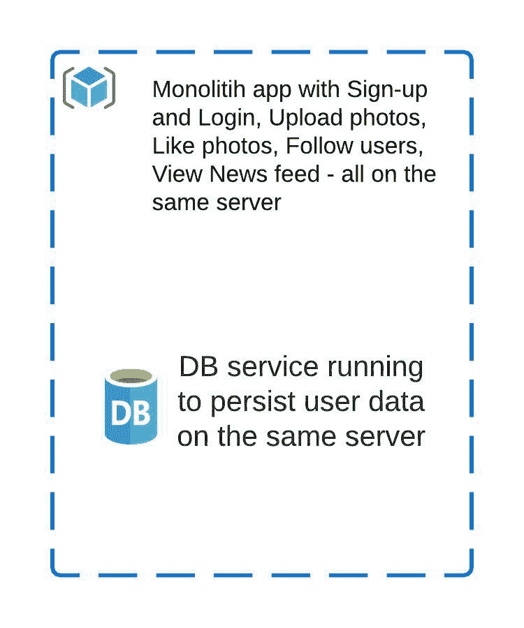

# 系统设计

> 原文：<https://linkedin.github.io/school-of-sre/level102/system_design/intro/>

## 先决条件

*   [SRE 学院-系统设计-第一阶段](https://linkedin.github.io/school-of-sre/level101/systems_design/intro/)

## 从本课程中可以期待什么

目的是使读者能够理解设计良好的系统的构建模块，评估现有的系统，了解权衡，提出自己的设计，并探索实现这样一个系统的各种工具。在本模块的第一阶段，我们讨论了系统设计的基础，包括可扩展性、可用性和可靠性等概念。在这一阶段，我们将继续在这些基础上继续努力。

Throughout the course, there are callout sections that appear like this, and talk about things that are closely related to the system design process, but don’t form a part of the system itself. They also have information about some common issues that crop up in system design. Watch out for them.

## 本课程不包括哪些内容

虽然本课程涵盖了系统设计的许多方面，但并未涵盖最基本的概念。对于这类题目，建议先过一遍前提。

总的来说，本模块不会深入实际实施该架构——我们不会讨论选择托管/云提供商或编排设置或 CI/CD 系统。相反，我们试图把重点放在需要进入系统设计的基本考虑上。

## 课程内容

*   [简介](https://linkedin.github.io/school-of-sre/level102/system_design/intro/)
*   [大型系统设计](https://linkedin.github.io/school-of-sre/level102/system_design/large-system-design/)
*   [缩放](https://linkedin.github.io/school-of-sre/level102/system_design/scaling/)
*   [扩展到数据中心之外](https://linkedin.github.io/school-of-sre/level102/system_design/scaling-beyond-the-datacenter/)
*   [弹性设计模式](https://linkedin.github.io/school-of-sre/level102/system_design/resiliency/)
*   [结论](https://linkedin.github.io/school-of-sre/level102/system_design/conclusion/)

## 介绍

在本课程的前一阶段，我们讨论了如何构建基本的照片共享应用。我们对该应用的基本要求是

1.  它应该适用于相当多的用户
2.  避免出现任何问题时出现服务故障/集群崩溃

换句话说，我们想要建立一个可用的、可伸缩的和容错的系统。我们将继续设计该应用，并在设计过程中涵盖其他概念。

照片共享应用是一个 web 应用，它将处理从用户注册、登录、上传、feed 生成、用户交互以及与上传内容的交互的所有事情。还有一个数据库来存储这些信息。在最简单的设计中，web 应用和数据库可以在同一台服务器上运行。回想一下第一阶段的初始设计。

在此基础上，我们将讨论系统设计中的性能元素——设置正确的性能测量指标并使用它们来驱动我们的设计决策，使用缓存、内容交付网络(cdn)等来提高性能。我们还将通过一些系统设计模式——适度降级、超时和断路器——来讨论如何进行弹性设计。

#### 费用

System design considerations like availability, scalability cannot exist in isolation. When operating outside the lab, we have other considerations / the existing considerations take on a different hue. One such consideration is cost. Real world systems almost always have budget constraints. System design, implementation and continued operation needs to have predictable costs per unit output. The output is usually the business problem you are trying to solve. Striking a balance between the two is very important.

#### 了解您系统的功能

A well designed system requires understanding the building blocks intimately in terms of their capabilities. Not all components are created equal, and understanding what a single component can do is very important - for e.g., in the photo upload application it is important to know what a single database instance is capable of, in terms of read or write transactions per second and what would be a reasonable expectation be. This helps in building systems that are appropriately weighted - and will eliminate obvious sources of bottlenecks.

On a lower level, even understanding the capabilities of the underlying hardware (or a VM instance if you are on cloud) is important. For eg., all disks don’t perform the same, and all disks don’t perform the same per dollar. If we are planning to have an API that is expected to return a response in 100ms under normal circumstances, then it is important to know how much of it will be spent in which parts of the system. The following link will help in getting a sense of each component’s performance, all the way from the CPU cache to the network link to our end user.

[Numbers every programmer should know](https://colin-scott.github.io/personal_website/research/interactive_latency.html)