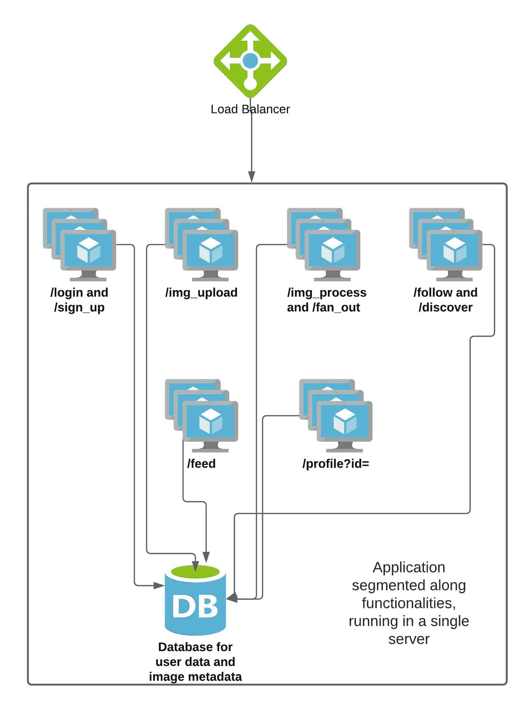

# 大型系统设计

> 原文：<https://linkedin.github.io/school-of-sre/level102/system_design/large-system-design/>

设计一个系统通常从抽象开始——我们有需要一起工作的大型功能块，并且被抽象成前端、后端和数据库层。然而，到了实施这一制度的时候，特别是作为一个 SRE 人，我们别无选择，只能具体问题具体考虑。服务器具有固定数量的内存、存储容量和处理能力。因此，我们需要考虑我们系统的现实期望，评估需求，将它们转化为系统每个组件(如网络、存储和计算)的具体需求。几乎所有的大型系统都是这样构建的。谷歌的人已经将这种设计系统的方法正式化为“非抽象大系统设计”(NALSD)。根据谷歌网站可靠性工作手册，

> 实际上，NALSD 结合了容量规划、组件隔离和适度系统降级等元素，这些元素对于高可用性生产系统至关重要

我们将使用类似的方法来构建我们的系统。

## 应用要求

让我们用更具体的术语来定义我们的应用需求，即特定的功能:

我们的照片分享应用必须让用户

*   注册成为会员，并登录到应用

*   上传照片，并可选地添加描述和标签位置和/或人

*   关注平台上的其他用户

*   查看由他们关注的其他用户的照片组成的源

*   查看他们自己的个人资料页面，并管理他们关注的人

让我们定义对应用性能的期望，以获得更好的用户体验。我们还需要定义系统的健康状况。SLIs 和 SLOs 帮助我们做到了这一点。

## SLIs 和 SLOs

谷歌 SRE 的书将服务水平指标(SLI)定义为“对所提供的服务水平的某个方面的一个精心定义的量化测量”对于我们的应用，我们可以定义多个 sli。一个指标可以是加载照片共享应用提要的响应时间。选择正确的 sli 集合非常重要，因为它们本质上帮助我们使用具体的数据来定义系统整体的健康状况。应用的 sli 由服务所有者与 SREs 协商后定义。

服务水平目标(SLO)被定义为“由 SLI 测量的服务水平的目标值或值范围”。SLO 是我们通过定义 SLI 边界来锚定最佳用户体验的一种方式。如果我们的应用需要很长时间来加载提要，用户可能不会经常打开它。因此，SLO 的一个例子是，至少 99%的用户应该在 1 秒钟内看到他们的提要被加载。

既然我们已经定义了 SLIs 和 SLO，那么让我们根据特定的 SLI 和 SLO 级别来定义应用的可伸缩性、可靠性和性能特征。

## 根据 SLIs 和 SLO 定义应用需求

以下是对我们的应用的一些期望:

*   一旦用户成功上传图像，它应该可以访问用户和他们的追随者 100%的时间，除非用户选择删除。

*   至少有 50000 个不同的访问者应该能够在任何给定的时间访问该网站，并查看他们的饲料。

*   99%的用户应该能够在不到 1 秒的时间内查看他们的提要。

*   上传一张新图片后，它应该会在 15 分钟内出现在用户关注者的反馈中。

*   用户应该能够上传潜在的成千上万的图像。(只要他们没有滥用服务)

由于我们的最终目的是学习系统设计，我们将任意限制系统的功能。这将有助于我们看到我们的目标，并保持我们的重点。

定义了我们系统的功能和期望之后，让我们快速勾画出一个初始设计。



到目前为止，所有的功能都驻留在一台服务器上，该服务器拥有所有这些功能的端点。我们将尝试构建一个满足我们的 SLO 的系统，能够服务 50k 个并发用户和大约一百万个用户。在这个尝试的过程中，我们将讨论一系列的概念，其中一些我们已经在本课程的第一阶段看到过。

#### 警告

Note that the numbers we have picked in the following sections are completely arbitrary. They have been chosen to demonstrate thinking about system design in a non-abstract manner. They have not been benchmarked, and bear no real world resemblance. Do not use them in any real world systems that you may be designing. You should come up with your own numbers, using the guiding principles we have relied upon here.

## 估计资源需求

**单机**

如果我们希望在一台服务器上运行应用，我们需要在这台服务器上执行图表中的所有上述功能。让我们进行一些计算，找出我们将需要什么样的资源。

首先，我们需要存储关于用户、他们的上传、追随者信息和任何其他元数据的数据。我们将选择一个关系数据库来存储这些信息，比如 MySQL。请注意，我们在这里也可以选择使用 NOSQL 解决方案。这将需要一个类似的方法来计算需求。让我们像这样表示用户:

```sh
UserID(int)
UserName(varchar)
DisplayName(varchar)
YearOfBirth(year)
Email(varchar) 
```

照片可以这样表示:

```sh
PhotoID(int)
PhotoHash(varchar)
Uploadtime(datetime)
Location(varchar)
OptionalFlag(varchar) 
```

追随者可以这样表示:

```sh
Follower(int)
Followee(int) 
```

让我们快速估算一下总共一亿用户所需的存储。单个用户将需要 4B + 32B + 32B + 4B + 32B = 104 字节。一亿用户将需要 10.4 GB 的存储。一张照片将需要大约 4B + 20B + 4B + 32B + 4B = 64 字节的存储空间来存储与该照片相关的元数据。假设一天上传 100 万张照片，我们每天需要大约 64 MB 的存储空间，仅用于元数据。对于照片存储本身，假设平均照片大小为 300KB，我们每天将需要大约 300GB。

打开我们的应用的单个访问者在登录应用时只需点击我们的/get_feed 端点。让我们快速计算一下满足这一要求所需的资源。假设初始提要加载了 5 个图像(平均大小为 300 KB ),然后进行惰性加载以无限滚动，我们将需要为用户的初始调用发送大约 1.5 兆字节的图像。使用 1000 Mbps*网络链接到服务器，在网络链接饱和之前，我们只能同时发送大约(1000/8)/1.5 或大约 83 个用户加载提要。如果我们需要每秒为 50k 个并发用户提供服务，假设我们在一秒钟内发送完所有 5 个图像，则每发送 5 个图像需要 1.5*50000*8 = 600000 Mbps 的网络吞吐量。如果我们从磁盘中读取所有数据，我们可能会在接近这个流量之前就达到磁盘吞吐量极限。

因此，为了满足我们的应用要求，我们需要一台服务器，它具有大约 310GB 的存储空间来存储一天的数据库和图像，大约 600 Gbps 的链路来同时为 50k 个用户提供服务，以及执行所有这些操作所需的 CPU。显然不是单个服务器的任务。

请注意，我们已经严格限制了存储在数据库中的信息。我们可能需要存储多一个数量级的信息。

虽然我们显然没有任何真实世界的服务器具有我们上面计算的资源，但是这个练习为我们提供了一些关于资源成本的有价值的数据点。有了这些信息，让我们通过系统设计来扩展我们的系统，使我们尽可能接近应用的目标。

*现代服务器甚至有数千兆位的链路，但如此庞大的服务器不太可能单独为我们的应用服务。现代云提供商的虚拟机也拥有数千兆的带宽，但它们通常在达到一定限制后会受到限制。

## 参考资料:

1.  [SQL vs NoSQL 数据库](https://www.mongodb.com/nosql-explained/nosql-vs-sql)
2.  [引入非抽象大系统设计](https://sre.google/workbook/non-abstract-design/)