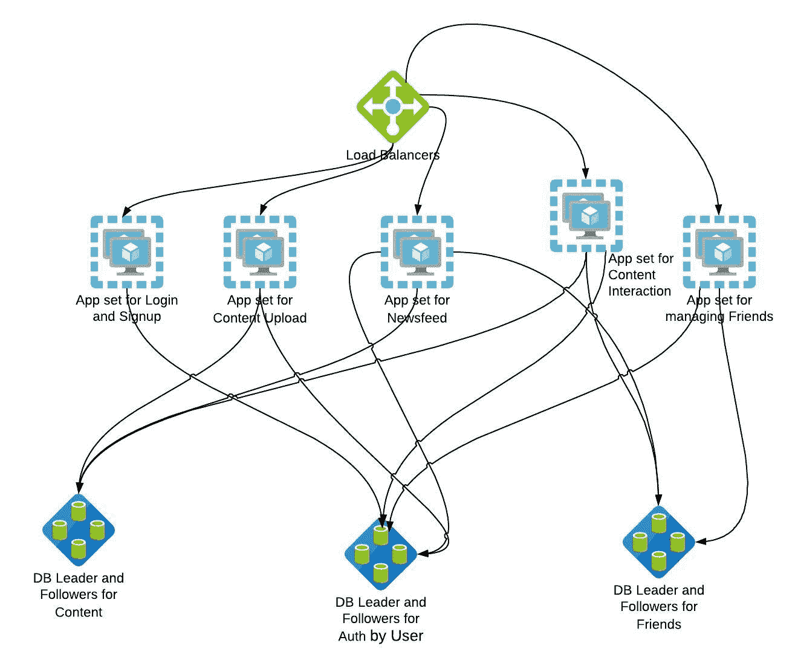

# 扩缩容

> 原文：<https://linkedin.github.io/school-of-sre/level102/system_design/scaling/>

在本课程的第一阶段，我们已经看到了 AKF [scale cube](https://akfpartners.com/growth-blog/scale-cube) 以及它如何帮助细分服务、定义微服务和扩展整体应用。我们将使用类似的策略来扩展我们的应用——同时使用上一节中的估计，这样我们就可以有一个数据驱动的设计，而不是任意选择扩展模式。

## 拆分应用

考虑到我们的应用可能产生的巨大流量，以及内存和 CPU 方面的相关资源需求，让我们将应用分成更小的块。最简单的方法之一就是沿着端点划分应用，并将它们作为独立的实例。实际上，这个决定可能会稍微复杂一点，最终可能会有多个端点从同一个实例运行。

图像可以存储在一个可以独立扩展的[对象存储库](https://en.wikipedia.org/wiki/Object_storage)中，而不是放在应用或数据库所在的服务器上。这将减少服务器的资源需求。

## 有状态服务与无状态服务

A stateless process or service doesn’t rely on stored data of it’s past invocations. A stateful service on the other hand stores its state in a datastore, and typically uses the state on every call or transaction. In some cases, there are options for us to design services in such a way that certain components can be made stateless and this helps in multiple ways. Applications can be containerized easily if they are stateless. Containerized applications are also easier to scale. Stateful services require you to scale the datastore with the state as well. However, containerizing databases or scaling databases is out of the scope of this module.

经过这样的工作负载分配后，最终的设计可能如下所示。

您可能会注意到该图也有多个数据库。我们将在接下来的分片部分看到更多的内容。

既然我们已经将应用分割成了更小的服务，我们需要考虑扩展每个端点的容量。流行的帕累托原理指出“80%的结果来自 20%的原因”。稍微修改一下，我们可以说 80%的流量将用于 20%的图像。上传的图片数量与用户看到的图片数量之间也有类似的偏差。用户更有可能每天查看图片，而不是上传新图片。

在我们的简单设计中，生成包含最初 5 张图片的 feed 页面只需要从该用户关注的其他用户中选择 5 张最近上传的图片。虽然我们可以从数据库中动态获取图像，并在用户登录后即时生成页面，但如果大量用户选择同时登录并加载他们的提要，我们可能很快就会淹没数据库。这里我们可以做两件事，一件是缓存，另一件是提前生成用户提要。

一个拥有 100 万追随者的用户可能会导致数十万次调用 DB，只是为了获取用户上传的最新 photoID。这可能会很快压倒任何数据库，并有可能导致数据库本身崩溃。

## 分片

解决数据库限制问题的一种方法是扩大数据库读写。分片是扩展数据库写入的一种方式，其中数据库将被分割成多个部分，驻留在运行于不同机器上的不同数据库实例中。正如我们在本模块的第 1 阶段中看到的那样，通过使用读取副本，可以类似地扩展数据库读取。

与普通用户上传的图片数量相比，产生的浏览量将是巨大的。在这种情况下，我们应该缓存用户上传的 photoIDs，在不必执行潜在的昂贵的 DB 调用的情况下返回。

让我们考虑应用中另一个名为`/get_user_details`的端点。它只是返回一个用户点击另一个用户的名字时看到的页面。该端点将返回用户创建的帖子列表。通常，对该端点的调用将涉及应用与 DB 的对话，获取用户所有帖子的列表并返回结果。如果某人的个人资料被查看了数千次，这意味着有数千次对数据库的调用——这可能会导致热键和热分区之类的问题。与所有其他系统一样，负载的增加可能会导致响应时间恶化，从而导致不一致和潜在的糟糕用户体验。这里一个简单的解决方案是一个缓存层——它可以返回包含文章的用户配置文件，而不必每次都调用数据库。

## 贮藏

缓存用于临时存储可能会被再次访问(通常是重复访问)的数据。当在高速缓存中找到所请求的数据时，它被称为“高速缓存命中”。“缓存未命中”是明显的补充。定位良好的缓存可以大大减少查询响应时间，并提高系统的可伸缩性。缓存可以放置在用户和应用之间的多个级别。在第 1 阶段，我们看到了如何使用缓存/cdn 为应用的静态资源提供服务，从而加快响应速度，减轻应用服务器的负担。让我们看看缓存可以发挥作用的更多情况。

### 内存缓存:

在内存缓存中，要缓存的信息保存在服务器的主内存中，检索速度比驻留在磁盘上的数据库快得多。我们缓存任意文本(可以是 HTML 片段，也可以是 JSON 对象)并快速取回。内存中缓存是添加 fast cache 层的最快方式，也可以选择保留到磁盘。

While caching can aid significantly in scaling up and improving performance, there are situations where cache is suddenly not in place. It might be that the cache was accidentally wiped, leading to all the queries falling through to the DB layer, often multiple calls for the same piece of information. It is important to be aware of this potential ‘thundering herd’ problem and design your system accordingly.

**缓存代理:**

有些情况下，您可能希望缓存整个网页/您需要响应请求的其他上游资源的响应。也有这样的情况，你想让你的上游告诉你缓存什么，缓存多长时间。在这种情况下，拥有一个理解缓存相关 HTTP 头的缓存解决方案可能是一个好主意。我们用例的一个例子是，当用户在我们的应用中搜索一个特定的术语时——如果对一个用户或术语的搜索足够频繁，那么在一段时间内缓存响应可能比每次都重新执行搜索更有效。

让我们回顾一下其中一个目标——至少有 50000 个独立访问者应该能够在任何给定的时间访问网站并查看他们的提要。随着缓存的实现，我们消除了一个潜在的瓶颈——数据库。我们还将整体结构分解成更小的块，提供单独的服务。离我们的目标又近了一步，就是简单地横向扩展订阅源查看所需的服务，并将它们放在负载平衡器之后。请回忆一下本模块第 1 阶段中讨论的扩展概念。

## 缓存管理

While caching sounds like a simple, easy solution for a hard problem, an even harder problem is to manage the cache efficiently. Like most things in your system, the cache layer is not infinite. Effective cache management means removing things from the cache at the right time, to ensure the cache hit rate remains high. There are many strategies to invalidate cache after a certain time period or below certain usage thresholds. It is important to keep an eye on cache-hit rate and fine tune your caching strategy accordingly.

## 参考

1.  有许多可用的对象存储解决方案。 [Minio](https://github.com/minio/minio) 是一种自托管解决方案。也有供应商特定的云解决方案，如 [Azure Blob storage](https://docs.microsoft.com/en-us/azure/storage/blobs/storage-blobs-introduction) 和[亚马逊 S3](https://docs.aws.amazon.com/AmazonS3/latest/userguide/Welcome.html) 。
2.  微服务架构风格- [Azure 架构指南](https://docs.microsoft.com/en-us/azure/architecture/guide/architecture-styles/microservices)
3.  内存缓存解决方案有很多。一些最受欢迎的包括 [redis](https://redis.io) 和 [memcached](https://memcached.org) 。云供应商也有他们的托管缓存解决方案。
4.  一些最流行的代理包括 [squid](https://www.squid-cache.org) 和 [Apache 流量服务器](https://trafficserver.apache.org)
5.  雷兽问题——insta gram[如何解决](https://instagram-engineering.com/thundering-herds-promises-82191c8af57d)。