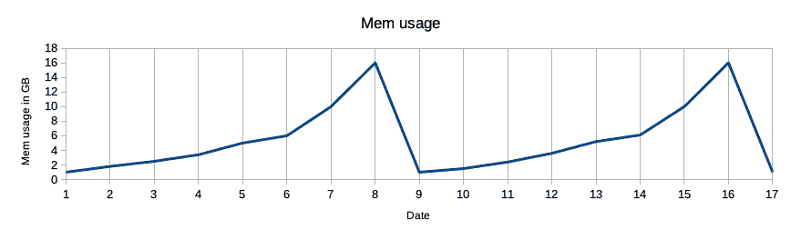
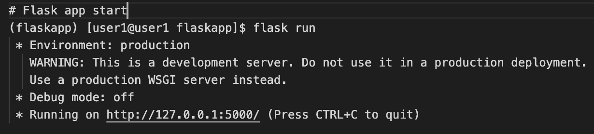
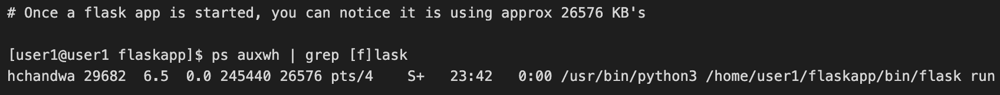
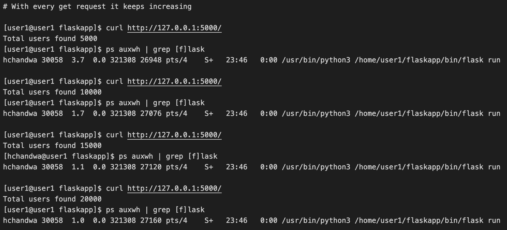
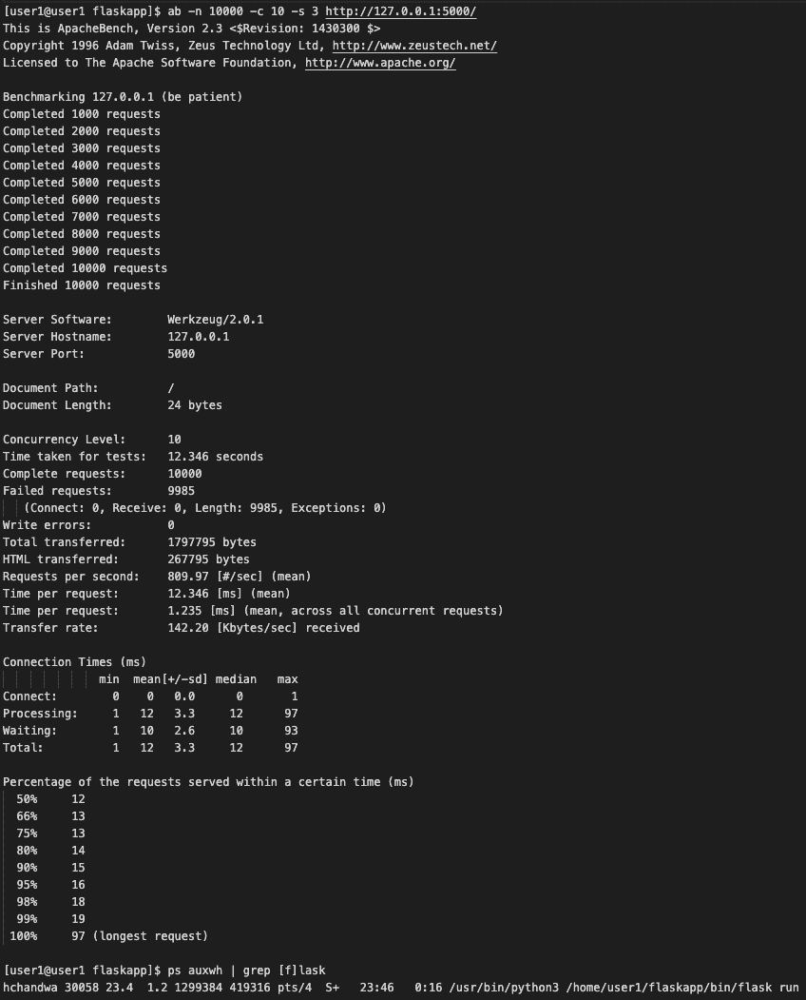
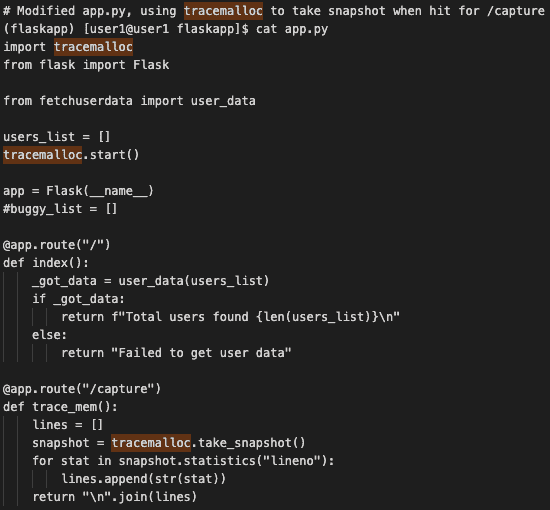
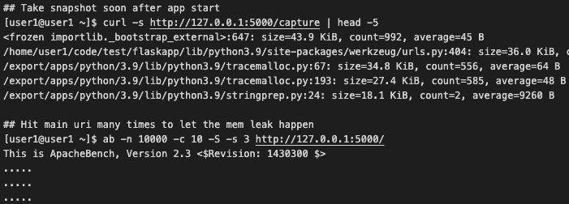
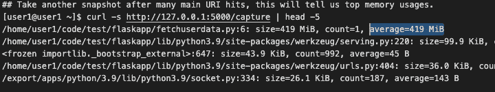

# 故障排除示例

> 原文：<https://linkedin.github.io/school-of-sre/level102/system_troubleshooting_and_performance/troubleshooting-example/>

在本节中，我们将看到一个问题的示例，并尝试对其进行故障排除，最后分享了几个著名的故障排除故事，这些故事是 LinkedIn 工程师早些时候分享的。

### 示例-内存泄漏:

通常情况下，内存泄漏问题会被忽视，直到服务在运行一段时间(几天、几周甚至几个月)后变得无响应，直到服务重新启动或修复错误，在这种情况下，服务内存使用量将在指标图中以递增的顺序反映出来，类似于下图。

内存泄漏是应用对内存分配的管理不善，不需要的内存没有被释放，在一段时间内，对象继续堆积在内存中，导致服务崩溃。一般来说，这种未释放的对象会被[垃圾收集器](https://en.wikipedia.org/wiki/Garbage_collection_(computer_science))自动分类，但有时会因为一个错误而失败。调试有助于判断应用存储内存的使用情况。然后，您开始跟踪并根据使用情况过滤所有内容。如果您发现对象没有被使用，但是被引用了，您可以通过删除它们来消除它们，以避免内存泄漏。在 python 应用的情况下，它带有内置的特性，如 [tracemalloc](https://docs.python.org/3/library/tracemalloc.html) 。这个模块可以帮助确定对象首先被分配到哪里。几乎每种语言都有一套工具/库(内置的或外部的),可以帮助发现内存问题。类似地，对于 Java，有一个著名的内存泄漏检测工具叫做 [Java VisualVM](http://visualvm.java.net/intro.html) 。

让我们看看一个基于虚拟 flask 的 web 应用如何存在内存泄漏错误，随着每个请求，它的内存使用量不断增加，以及我们如何使用 tracemalloc 来捕获泄漏。

假设-:创建了一个 python 虚拟环境，其中安装了 flask。

**一个有 bug 的裸最小烧瓶代码，阅读评论了解更多信息** 

**启动烧瓶 app** 

**启动时，其内存使用量约为 26576 kb，即约 26MB** 

现在，随着每个后续的 GET 请求，我们可以注意到进程内存的使用继续缓慢增加。 

现在让我们尝试 10000 个请求，看看内存使用是否会大幅增加。为了满足大量的请求，我们使用了一个名为[“ab”](https://httpd.apache.org/docs/2.4/programs/ab.html)的 Apache 基准测试工具。在 10000 次点击后，我们可以注意到 flask app 的内存使用量跃升了近 15 倍，即从最初的 **26576 KB 到 419316 KB，即从大约 26 MB 到 419 MB** ，对于这样一个小的 webapp 来说，这是一个巨大的飞跃。

让我们试着使用 python [tracemalloc](https://docs.python.org/3/library/tracemalloc.html) 模块来理解应用的内存分配。 Tracemalloc 在某个特定点拍摄内存快照，并对其执行各种统计。

在我们的 app.py 文件中添加最少的代码，fetchuserdata.py 文件没有变化，它将允许我们在命中/捕获 uri 时捕获 tracemalloc 快照。

**在重新启动 app.py (flask run)** 之后，我们将-首先点击 http://127.0.0.1:5000/capture -然后点击 http://127.0.0.1:5000/ 10000 次，以便发生内存泄漏。-最后再打 http://127.0.0.1:5000/capture 拍个快照就知道哪一行分配最多了。

在最后的快照中，我们注意到了发生大部分分配的确切模块和行号。即 fetchuserdata.py，第 6 行，在 10000 次点击之后，它拥有 419 MB 的内存。

**总结**

上面的例子显示了一个 bug 如何导致内存泄漏，以及我们如何使用 [tracemalloc](https://docs.python.org/3/library/tracemalloc.html) 来了解它在哪里。在现实世界中，应用要比上面的虚拟例子复杂得多，您必须明白，由于 tracemalloc 本身的开销，使用 tracemalloc 可能会在一定程度上降低应用的性能。请注意它在生产环境中的使用。

如果你有兴趣深入挖掘 Python 对象内存分配内部机制和调试内存泄漏，可以看看 PyCon India 2019 上 [Sanket Patel](https://www.linkedin.com/in/sanketplus/) 的一个有趣的演讲，[调试 Python Flask 中的内存泄漏| Python 对象内存分配内部机制](https://www.youtube.com/watch?v=s9kAghWpzoE)