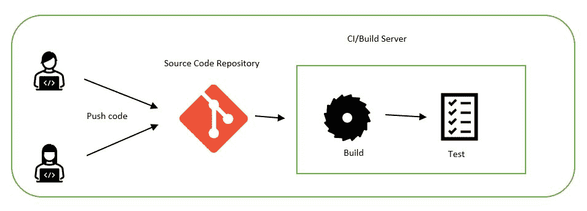

# 持续集成

> 原文：<https://linkedin.github.io/school-of-sre/level102/continuous_integration_and_continuous_delivery/continuous_integration_build_pipeline/>

CI 是一种软件开发实践，其中团队成员经常集成他们的工作。每个集成都由一个自动化构建(包括测试)来验证，以尽可能快地检测集成错误。

持续集成要求所有的代码变更都保存在一个单一的代码存储库中，所有的成员都可以定期地将变更推送到他们的特性分支。代码变更必须与代码的其余部分快速集成，自动构建应该发生并反馈给成员以尽早解决它们。

应该有一个 CI 服务器，当成员推送代码时，它可以立即触发构建。构建通常包括编译代码并将其转换为可执行文件，如 jar 或 dll 等。叫做包。它还必须用代码覆盖率执行[单元测试](https://en.wikipedia.org/wiki/Unit_testing)。可选地，构建过程可以有额外的阶段，例如静态代码分析和漏洞检查等。

[詹金斯](https://www.jenkins.io/)、[竹](https://confluence.atlassian.com/bamboo/understanding-the-bamboo-ci-server-289277285.html)、[特拉维斯 CI](https://travis-ci.org/) 、 [GitLab](https://about.gitlab.com/) 、[蔚蓝 DevOps](https://azure.microsoft.com/en-in/services/devops/) 等。是少数流行的 CI 工具。这些工具提供了各种插件和集成，如 [ant](https://ant.apache.org/) 、 [maven](https://maven.apache.org/) 等。用于建筑和包，以及 Junit、selenium 等。用于执行单元测试。[sonar cube](https://www.sonarqube.org/)可用于静态代码分析和代码安全。

*图 1:持续集成管道*

*图 2:持续集成过程*