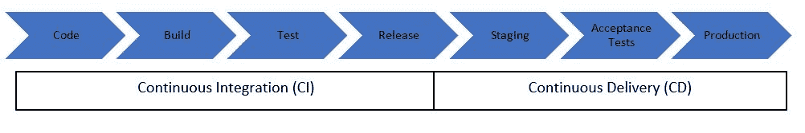

# 持续交付和部署

> 原文：<https://linkedin.github.io/school-of-sre/level102/continuous_integration_and_continuous_delivery/continuous_delivery_release_pipeline/>

*持续交付意味着在非生产环境中更频繁地部署应用构建，如 [SIT、UAT、INT](https://medium.com/@buttertechn/qa-testing-what-is-dev-sit-uat-prod-ac97965ce4f) 并自动执行集成测试和验收测试。*

 *在 CD 中，测试是在集成应用上执行的，而不是在基于微服务的应用的情况下在单个微服务上执行的。测试必须包括所有可能包含 UI 测试的功能测试和验收测试。构建本质上必须是不可变的，也就是说，必须在包括生产环境在内的所有环境中部署相同的包。

在执行额外的验收测试(如性能测试等)后，通常需要手动部署到生产环境中。因此，全自动部署到生产环境被称为 ***连续部署*** (而***CD——连续交付*** 不会自动部署到生产)。连续部署必须有一个[特性切换](https://martinfowler.com/articles/feature-toggles.html)，这样就可以在不需要重新部署代码的情况下关闭一个特性。

通常，部署涉及多个生产环境，例如在[蓝绿色环境](https://www.linkedin.com/pulse/using-blue-green-deployments-reduce-downtime-nessan-harpur)中，应用首先部署到蓝色环境，然后部署到绿色环境，因此不需要停机。

*图 3:连续输送管道**